[English](../README.md) | [Russian](../README-ru.md) 

[hobdrive.com](http://hobdrive.com/) | [support@hobdrive.com](mailto:support@hobdrive.com)

# HobDrive User's Manual

HobDrive is a software complex working with your vehicle via standard OBD-II adapter and giving you the functionality of a powerful trip computer on your Windows (Windows Phone 8 / WinCE / WinMobile), Android or Car PC (Linux/XP/Vista/7).

## Table of Contents

1. [HobDrive Features](#hobdrive-features)
2. [Interface Basics](#interface-basics)
3. [Before Start](#before-start)
   - [Connect Your Vehicle](#connect-your-vehicle)
   - [Settings Screen](#settings-screen)
   - [Vehicle Settings Screen](#vehicle-settings-screen)
   - [System Settings Screen](#system-settings-screen)
     - [Version and Updates Tab](#version-and-updates-tab)
     - [Theme Tab](#theme-tab)
     - [Language Tab](#language-tab)
     - [Units Tab](#units-tab)
4. [HobDrive Usage](#hobdrive-usage)
   - [General Screen](#general-screen)
   - [Trip Computer Screen](#trip-computer-screen)
   - [Fuel Consumption Details Screen](#fuel-consumption-details-screen)
   - [Fuel Details Screen](#fuel-details-screen)
   - [Extra Screens](#extra-screens)
     - [Fueling and Events Screen](#fueling-and-events-screen)
     - [Vehicle Records Management](#vehicle-records-management)
     - [Diagnostics Screen](#diagnostics-screen)
     - [HUD Mode](#hud-mode)
     - [Fuel Trims Screen](#fuel-trims-screen)
     - [More Sensors Screen](#more-sensors-screen)
     - [Lambda Sensors Screen](#lambda-sensors-screen)
     - [Toyota Sensors Screen](#toyota-sensors-screen)
     - [Sensor List Screen](#sensor-list-screen)
     - [Zero to 60 Miles](#zero-to-60-miles)
     - [Quarter Time](#quarter-time)
     - [Brake Time](#brake-time)
5. [Customization of the Sensors](#customization-of-the-sensors)
6. [Vehicle Calibration](#vehicle-calibration)
   - [Parameter Calibration](#parameter-calibration)
7. [Beta-functionality](#beta-functionality)
8. [Typical Issues](#typical-issues)
9. [Hardware Requirements (Windows)](#hardware-requirements-windows)
10. [Hardware Requirements (Android)](#hardware-requirements-android)
11. [Optional Requirements](#optional-requirements)
12. [Installation and Setup Requirements](#installation-and-setup-requirements)
    - [Installation to Windows Mobile/CE Systems](#installation-to-windows-mobile-ce-systems)

# HobDrive Features

- Functional, flexible and powerful User Interface beats classic trip computer devices in ease of use and features.
- Full integration into your multimedia car system.
- A single information hub - no need for extra hardware devices, sensors or displays.
- Unique analysis and statistic collection features.

## Interface Basics

_Speed Navigation Bar_

_Screen title_

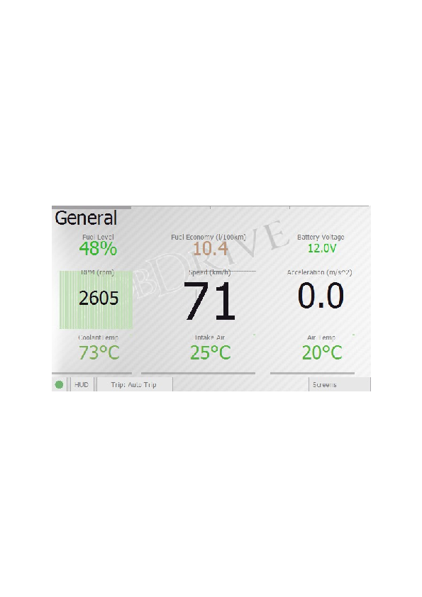

_ELM Connection status_

_HUD Mode activation_

_Trips and tracking intervals_

_Extra screens and settings_

HobDrive is controlled by tapping the touch-screen elements and screen controls or by touching and scrolling (panning) the elements for browsing and accessing the information outside of the current screen.

You may change the four main screens with different actions:

- Flicking (pressing, holding, panning)
- Tapping the respective segment of the speed navigation bar
- Using joystick keys (if available)

Tapping on the "Screen" tap button gives you access to the extra controls:

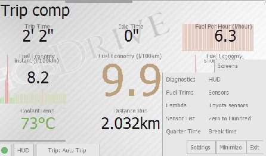

These are:

- Temporary hide HobDrive
- Exit HobDrive
- Entering the "Settings" tab
- Selecting and activation of extra screens

## Before Start

### Connect Your Vehicle

The very first thing you must do after installing hobDrive is setting it up to find and link with your OBD-II ELM adapter and vehicle.

During the first run hobDrive will ask you to choose ELM adapter's serial port or Bluetooth address (in case of Bluetooth ELM).

You may always open this screen later by going Screens ➧ Settings ➧ OBD Port Settings.

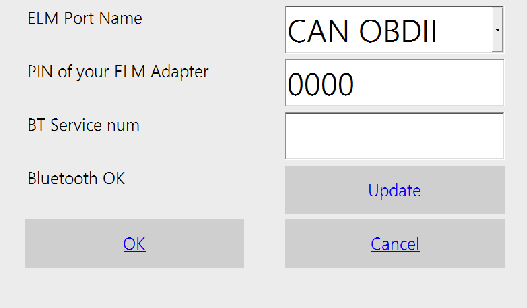

_Restart Bluetooth scan_

**ELM327-USB**

For USB-ELM OBD-II adapter you have to find and select the COM port number it is attached to. Please notice Android now does not support this.

**ELM327-Bluetooth**

For Bluetooth - ELM adapter you have to choose its name from the list. PIN code screen is used for entering PIN code for adapter link (found in adapter documentation). On some WinCE devices you have to add adapter to "trusted" list, and enter PIN code in system bluetooth dialog.

On Android and Windows Phone devices you should always first pair your ELM in system bluetooth dialog, and only then choose it in hobdrive.

**ELM327-WiFi**

To connect ELM327 WiFi adapter you should first setup WiFi network with your adapter (read adapter's manual for that). Some devices require manual TCP/IP configuration for that. Next, you should choose/enter an IP address of your adapter:

**Android/Windows Phone:** 192.168.0.10:35000

**Windows CE:** tcp://192.168.0.10:35000

After you choose the correct device to connect and press the OK button, the status should change to Yellow (the hobDrive link information should show the status string INIT - initialization), followed by Green OK signal indicating successful hobDrive connection.

Red indicator and ERROR message means you have adapter or car connection problems. See the Typical Issues section of the Manual.

Bluetooth "fail" status may mean that your device does not support full Bluetooth stack required by hobDrive, or that you did not enable BT stack (you need to enable it manually in the system manager).

Some devices with widcomm stack require you to link the smartphone/navigator to the ELM adapter prior to linking hobDrive to the ELM adapter from the hobDrive configuration dialog.

The additional parameter "ELM Connection Delay" is used for problem ELM adapters which can not operate at high speeds and often "break off" the connection. Please find optimal link interruption timing.

### Settings Screen

After successful connection you may configure extra parameters by activating the Settings screen. This gives you the access to the following screens: "OBD Port Settings", "Vehicle Settings", "System Settings", "Network", "Theme", "Language", "Units", "About".

### Vehicle Settings Screen

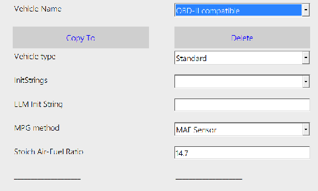

This screen allows you to choose a specific type of vehicle to work with.

- **Name:** Name of your vehicle's profile.
- **Copy, Delete**: Commands to clone, rename or remove the current profile. You can't remove the last profile.
- **Load from Template**: Select one of the ready-made and tested profiles by vehicle models.
- **Share**: Upload your current profile to our website (after processing it will be available to other users)
- **Vehicle Type**: Type of the vehicle and link parameters.
- **Standard -** suits fine for majority OBD2 vehicles. For some manufacturers, hobDrive supports special connection modes. Some models (like Toyota, Ford) offer more sensors in this mode. Some models can only work with their specific profile (like VAZ Yanvar, Mikas, Bosch ECU, Nissan Custom, etc.)
- **Init String template, Init String**: These fields allow to enter extra OBD parameters for setting up the adapter-car link. Template list includes standard Init commands for right-hand drive cars and for some partially OBD2 compatible vehicles (Like Japan Domestic Market, Asia market). For the majority of OBD2 cars this field can be left blank.
- **Fuel Consumption:** method used for fuel consumption calculations:

- **MAF Sensor:** This is the default case, suitable for most **gasoline** vehicles. Fuel calculation is done via MAF (Mass Air Flow) sensor**.**
- **MAP Sensor:** Fuel calculation is done using MAP (Manifold Absolute Pressure) sensor. This method requires calibration (see Vehicle calibration)
- **Injector Sensor:** Fuel calculation is based on a injector timing sensor, available in many Toyota and toyota-derived vehicles (scion, lexus, etc). This method requires calibration (see Vehicle calibration).
- **EngineLoad sensor:** Fuel calculation is based on engine load sensor. Provides rough approximation, used mainly for **diesel** engines. This method requires calibration (see Vehicle calibration).
- **Built-in sensor**: Fuel calculation based on the vehicle's internal hourly consumption sensor (present, for example, in vehicles with Yanvar, Mikas ECU).

If you are unsure which method is best for your vehicle, start one-by-one from the top of the list and monitor the "Liters per Hour" sensor in out-of-gear mode.

If you own Toyota car and «**Injector Sensor**» option does show fuel consumption, this method is preferable.

For diesel vehicles, only the **Engine Load** method calculates adequate readings.

Each option has its own calibration parameters. Empty fields mean default values, which must be calibrated for more precise calculation (see Vehicle calibration section for details).

All other parameters are optional and could be used to tuneup the hobDrive operation:

- **Weight:** Total vehicle weight in kilograms. Used only in estimated power and efficiency calculations. Default value - 1300kg.
- **Tank Volume**: Used when calculating estimated fuel level in tank. Always specified in liters. Default 40L.

- **Speed correction factor**: Allows to tuneup speed and odometer values. Required if your car equipped with nonstandard tires, or if your speed counter is incorrect. Vehicle odometer could give incorrect readings, too. If possible, use GPS for speed and mileage calculation.  
    Default value is "1".

**Example:** if speedometer shows 57, but you're actually going 60, then the Speed Correction parameter should be set to 1.05. But the odometer can also be wrong (for example, thinking you're driving when you're actually spinning in a snowbank). If possible, it's better to measure mileage by GPS. Speed accuracy can also be checked via GPS.

Discrepancies with reality within 1% are acceptable, but discrepancies up to 10% are possible. This can happen if you have non-standard tires, for example. HobDrive cannot count mileage and consumption when not connected to the car. If HobDrive starts with a delay, or there are frequent connection resets (due to hardware problems, for example), then discrepancies in odometer readings will accumulate.

This practically does not affect statistics, since with each new refueling you synchronize the readings.
- **Maximum idle speed**: Speed value for vehicle in idling mode or in traffic jam.  
    Default value is "5" km\\h (3 mph).
- **Hot engine temperature**: Temperature, when engine is considered "warmed-up". Used in mileage sensors for calculation of warmup price and MPG on warmed up engine.  
    Default value "60°C" (140 F).
- **Trip autoreset interval**: The time period after which turning on the car would mean a new trip and the reset of the hobDrive's "Auto-trip" calculation interval.  
    Default value - "600 sec" (10 minutes).
- **Trim Fuel Economy on engine conditions**: You can enable more precise calculation of consumed fuel by using the information on the "engine braking" status. In this state, external conditions (the sharp slowdown, downshifting, chop deceleration) force the car ECU to cut off fuel supply to the engine. If such state occurs, the sensor for "Fuel per hour" consumption will be switched to "0".

You can find out the volume of fuel corrected in this way at any time by touching the "fuel per hour" sensor.

_Attention:_ on some vehicles this state may be read incorrectly; you will have to confirm the correct operation of the sensor manually.

Default setting is off.

- **Trim Fuel Economy by LTFT value**: HobDrive uses the LTFT (long term fuel trim) value to correct the fuel consumption rate. Can be used only on certain cars equipped with MAF/MAP methods. Can be used on Toyota Prius and similar cars to correct bio-ethanol fuel consumption.

Default setting is off.

- **Trim Fuel Economy by Lambda value:** HobDrive uses Lambda value - Air-Fuel ratio for the car. The value may differ from the benchmark AFR. Setting the parameter may improve the precision of fuel consumption calculations. Can be used with MAF/MAP methods.

Default setting is off.

- **Idle Speed (Instant consumption):** The speed considered as idling mode for calculation of instant and short-term consumption. Evens out the readings of respective sensors.

Default setting is off.

- **Reset Instant consumption On Idle:** If set, instant and short-term consumption values will be zeroed on every stop/start of the car. Provides more precise estimates on instant consumption for acceleration/deceleration.
- **Max Antifreeze Temperature**: Temperature value after which hobDrive will issue an audio and visual overheating warning. Default - 95 degrees.
- **Max Fuel Correction**: Maximum value of the long-term fuel trim parameter, after which hobDrive will issue a warning about mixture inefficiency. Default - 11%.

### System Settings Screen

This screen allows to change system hobDrive options. Touch any option label to get a detailed explanation of what this option does.

Any change requires restart of the hobDrive.

#### Version and Updates Tab

Setting up automatic software update options.

If on, hobDrive will check for updates once a week (depending on the license). You may disable this and perform only manual checks.

When "Beta Channel" option is enabled, the program will check for the presence of beta versions and offer to update to them. Updating to beta versions is recommended only for experienced users.

#### Theme Tab

Visual theme selection screen.

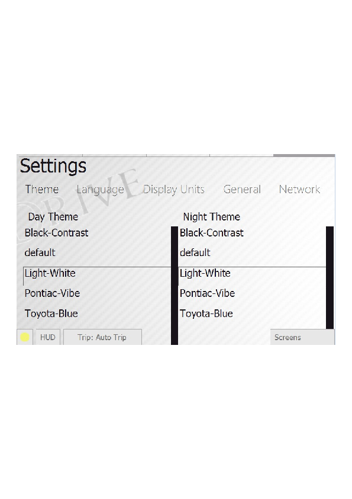

Themes are split into groups for day and night driving. Day/night switching is automatic, and pre-defined (by default - 7am and 8pm).

Light themes are preferable for bright sunny day and reduce light glares, also improving the readability of the screen.

Dark themes are better to use at night.

During long night rides it is recommended to enable HUD mode with a dark theme, since in this mode the brightness is minimal and your eyes are better adopted to road conditions.

On changing the theme a small hobDrive delay is possible.

#### Language Tab

In this section you may choose the interface language.

When changing, a small delay is possible.

Note: On Android systems, the language is determined automatically.

#### Units Tab

Here you may choose to work either with European or US imperial units.

## HobDrive Usage

**Attention! A vehicle is a source of increased danger.** Be careful and do not get distracted while driving by working with the program and detailed data analysis. We are not responsible for any accidents or injuries caused by using this program.

All accumulated data in the program is saved - you can always view it in detail after the trip, after stopping.

HobDrive, in addition to displaying data, constantly monitors the engine condition and warns of possible malfunctions. When a problem occurs, you will hear a warning sound signal and visual indicator. See the "Diagnostics" section for a more detailed description.

### General Screen

Screen with common vehicle sensors.

All sensors are read sequentially, reading speed depends on the performance of your ELM adapter and target device. Delay of 1-2 seconds is often normal.

By clicking on the status popup panel (circle at bottom left), you will see:

- Detailed OBD2 and GPS connection status.
- "Reconnect" button - for forced connection attempt
- "Fast Reading Mode" option. When this option is enabled, hobDrive disables calculation of derived data (consumption, mileage, etc.) and updates only the data visible on the current screen at maximum speed. The mode can be used for diagnostics when sensor polling speed is important.

All OBD2 sensor values are transferred from ECU (Engine Control Unit) to the hobDrive. They may not be absolutely correct, some may even be entirely incorrect. This is not hobDrive's limitation but rather particular features of your vehicle's ECU.

Different hobDrive sensors have different update interval. For instance RPM updated most often, while antifreeze temperature sensor normally updated once every 10 seconds.

Detailed sensors description:

- **Speed:** Current vehicle's speed. The readings are taken from the car sensors and normally equal to your speed meter readings. The reading could differ from the real GPS-measured speed due to vehicle errors. For correction of speed meter readings please see Vehicle calibration section.
- **Acceleration:** instant acceleration, shows how fast you are gaining speed or slowing down. Shown in meters per square second.
- **RPM:** Current RPM of vehicle engine.
- **Fuel level:** Estimated fuel level in the tank. Calibration is required prior to using the sensor. See .
- **Fuel economy:** Fuel economy in liters per 100km or in Miles Per Gallon. Calculated for current trip or for a given time interval (see the Trip Computer screen). This is the key parameter defining the efficiency of your vehicle.
- **Current:** Voltage of the vehicle systems. Can be used to assess the performance of the generator or battery discharge level. May differ from the actual battery voltage, because in fact shows the OBD-II connector voltage.
- **Antifreeze temperature:** Current antifreeze (and engine) temperature. The key parameter for assessing engine warm-up level.
- **Intake temperature:** Air temperature at the combustion chamber inlet. Usually close to ambient temperature but may differ to either side depending on the mode of operation.
- **Ambient temperature:** Ambient air temperature. Could be unavailable on some of vehicles.

Various sensors use the most appropriate formatting for graphical display of their status. On sensors with background graphics (like speed), you can see a couple of small labels - these are the current minimum and maximum achieved values.

### Trip Computer Screen

The screen gives you the key values on your current trip or other selected time interval, enabling evaluation of overall trip efficiency and cost, as well as instant consumption values. Most of the parameters are displayed for the currently selected time interval (current trip by default).

- **Trip Time:** Time spent in vehicle with ignition on.
- **Idle Time:** Time in traffic jams, at traffic light, etc. Very slow moving (less than 5 km/h by default) is also treated as idling.
- **Fuel per hour:** Instant fuel consumption per time unit. Common values for out-of-gear engine is 0.5 - 1.5 liters per hour depending on the engine. This parameter allows to monitor the engine operation mode and the impact of extra load (such as air conditioning) on fuel consumption.
- **Instant fuel economy:** MPG for the last few seconds. Helps in assessment of vehicle fuel efficiency dynamics. May be very different from the stated fuel efficiency of the vehicle.
- **Fuel economy:** Average trip (selected period) MPG. This is a key parameter showing overall performance and fuel efficiency of your car. Displayed in liters per 100 km. Calculated as (fuel consumed) % (distance passed) \* 100.
- **Short term fuel economy:** fuel efficiency for the last few minutes. Provides an option to track the efficiency of your driving short-term. May differ from the total consumption readings depending on driving mode over the past few minutes.
- **Antifreeze temperature:** As one of most important readings, this value is replicated from the Main screen.
- **Distance Run:** Total mileage for the trip (the current time period analyzed). See the Vehicle calibration for information on setting this parameter (if different from values shown on integrated odometer).
- **Fuel Consumed:** Total amount of fuel consumed on current trip (selected period), in liters.

On pressing the "Trip" tab hobDrive gives you a selection of possible tracking intervals. After the new selection all sensors will change their values to reflect the data stored for the new interval.

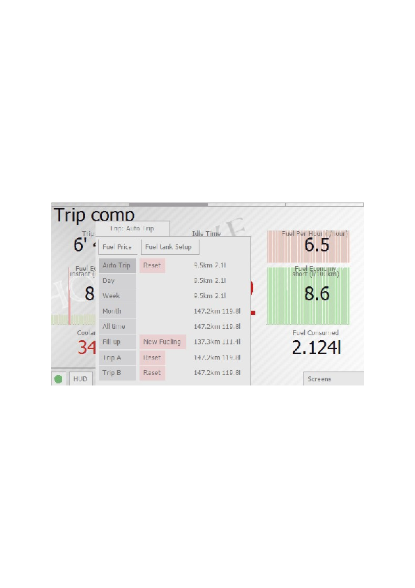

Available trip intervals:

- **Auto Trip:** Current trip. Selected automatically as soon as minimum interval between ignition off/on is reached (10 minutes by default).
- **Day:** Aggregated data for today. Zeroed at midnight; helps to assess daily consumption.
- **Week:** Aggregated data for current week. Zeroed at Sunday midnight; helps to assess weekly consumption.
- **Month:** Aggregated data for current month.
- **All time:** Total aggregated data.
- **Fill up:** Data for current fillup; hobDrive resets this as soon as you enter a new fueling record by pressing the "New fillup" button. See Fuel Details screen for more details on fuel tracking.
- **Trip A, Trip B:** Data collected for two manually entered trips. Allows you to track some custom trips.

Manual reset is possible for values of "Auto Trip" and «Trip A, Trip B" modes.

### Fuel Consumption Details Screen

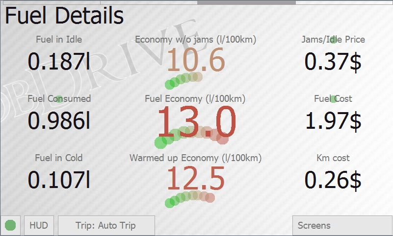

This screen gives you detailed information on fuel consumption.

Displayed values include:

- Fuel consumed in idling (jams, stops),
- Fuel economy excluding idling (jams, stops)
- Cost of jams and idling
- Cost of fuel consumed for the trip
- Fuel consumption for engine warm-up (to 60 degrees)
- Fuel consumption on warmed-up engine
- Gasoline cost per kilometer

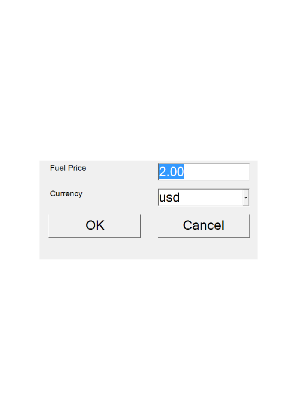

Green-shaded sensors may be tuned up for extra precision.

Pressing the price sensor will open screen with current fuel price per liter and currency selector.

### Fuel Details Screen

This screen gives you detailed information on fuel in tank.

**Estimated level of fuel** and **fuel volume** are calculated using the entered information on fueling and consumption data.

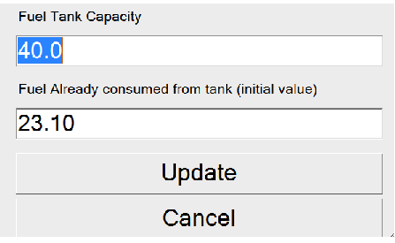

Pressing one of the fuel level sensors opens up a calibration dialog for fuel tank. On first program usage you must enter the volume of your tank, and (approximate) volume of already consumed fuel.

From here on, hobDrive automatically compute fuel volume. To keep the calculations correct you must record the fueling data. On every fueling you must enter a new fueling record by choosing "Trip" → "New fueling ". In the dialog box you should enter:

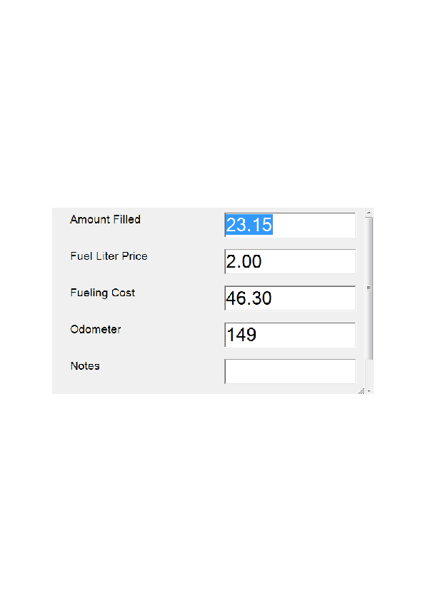

- Fuel volume (in liters)
- Fuel price per liter
- Total fuel price (updated automatically)
- Odometer readings
- Notices (name of the filling station, comments, etc.)

The hobDrive uses these records to give you stats on fueling cost per station, total cost of vehicle ownership, total cost per kilometer, etc.

This screen also shows the estimated **mileage the car will run on the remaining fuel** and the **time left for continuous movement of the car on the remaining fuel**.

The "**Next fuel station**" parameter estimates approximate time till the next filling. The assessment is calculated using weekly consumption average and the current fuel level.

The **Maximum Temperature** and **Maximum Speed** parameters keep the data of maximum respective value.

The **Average Speed** parameter is calculated for the currently selected time interval, taking into account all idling time.

Some cars transmit the real fuel level indicator from the ECU. This sensor is called **ECUFuelLevel.**

In hobDrive, the "real" indicator is not used, but is overridden by the calculated one, based on manually entered data and fuel consumption data.

You can display the readings of the native fuel level sensor: in the default-landscape.layout file, change FuelLevel to **ECUFuelLevel**. If this sensor shows nothing for you, then your car does not support displaying the real fuel level in the tank.

### Extra Screens

Beside the described above key parameters, hobDrive provides a number of optional screens for more detailed fine-tuning.

To activate these, choose Screens tab and then select the required screen:

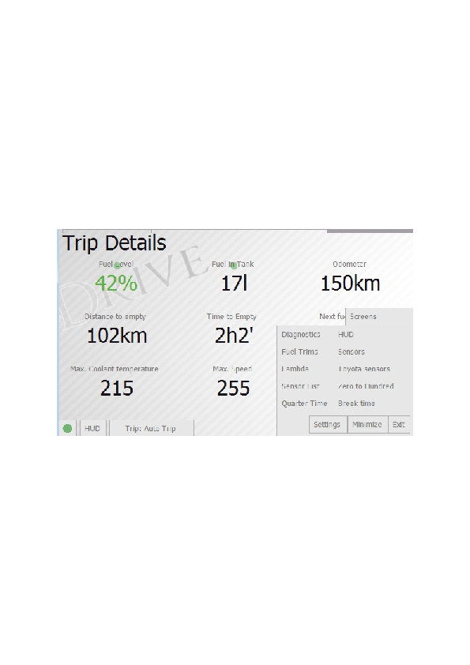

### Fueling and Events Screen

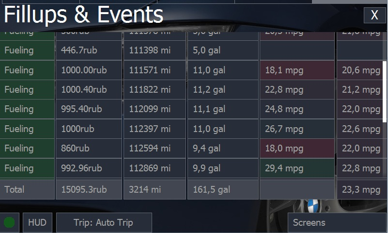

The screen is used for the analysis of information on filling stations and hobDrive-stored events.

Data on filling stations and maintenance records are entered in the appropriate screens activated from the "Trip" tab:

The table shows the following fields:

- **Category**: Event category. On pressing any category the records are filtered to display only the selected category.
- **Cost**: The sum spent on the event or on filling.
- **Odometer**: Odometer reading at the time of record entry.
- **Filled**: For records per filling station - total liters filled.
- **Instant, Total Consumption**: Two calculated fields showing the estimated fuel consumption. Instant Consumption shows fuel consumption since the last refueling. Correctly calculated only with full-tank filling. Total Consumption - a fuel consumption for entire life-cycle of the system.
- **Tags, notes:** arbitrary data you can add to a record.
- **Date:** the date of the event.

The last displayed entry is a line with totals: the total mileage, the total amount of money spent, the total fuel consumption per gas station.

### Vehicle Records Management

For each refueling, select "Actions" → "New Refueling", and in the dialog you need to enter data about the fuel filled:

- Amount of fuel filled
- Fuel price per liter
- Total fuel cost (updated automatically)
- Odometer readings
- Notes (gas station name, comments, etc.)
- Method for correcting odometer readings

HobDrive can compare its own estimated odometer values with the actual readings from your vehicle (entered by you).

HobDrive uses the difference between odometers to compensate for the time it wasn't running and during which it lost readings. It can do this automatically or "In Dialog" by manually entering the missed trip. The "Fix" option is just correcting the odometer value without entering lost fuel/mileage. This may be needed if, for example, there is a discrepancy in speed/mileage readings between HobDrive and the ECU on your vehicle.

Entering missed trips allows compensating for data not accounted for by HobDrive and more accurately calculating real fuel consumption.

Using refueling records, HobDrive allows you to estimate your fuel costs per gas station, estimate the total cost of vehicle ownership, total cost per kilometer of mileage, etc.

By pressing the "New Record" button, you can enter an arbitrary vehicle maintenance record.

The "Missed Trip" action allows you to make a correction to the program's calculated data by adding a trip that wasn't accounted for for some reason (for example, when you forgot to turn on HobDrive).

In the dialog you need to independently enter the current odometer reading. After this, hobDrive will calculate the approximate amount of fuel consumed (you can correct it yourself). When saving, this data will be added to your current calculated data.

In vehicles with a fuel level sensor working through the ECU, hobDrive will automatically enter this value in the dialog.

If your vehicle provides readings of the "real" odometer, this data will also be automatically entered in the fields, you just need to check them.

### Diagnostics Screen

This screen gives you a MIL code reading functionality.

Upon activation it reads and describes the Check Engine codes:

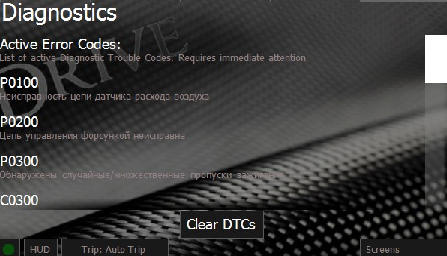

Active error codes need immediate attention and diagnostics.

Pending error codes are potential errors that may trigger at a later point.

Tapping Clear DTCs button will reset all the current DTC codes. Prior to deletion please make sure you don't need this information anymore as deleting the codes will remove the "Freeze Frame" data, which could be useful in diagnostics during car servicing.

Please be aware that deleting the error from the list does not solve the problem itself, therefore the error will probably reappear later.

On some vehicles for complete reset of error codes you should restart the car ignition.

### HUD Mode

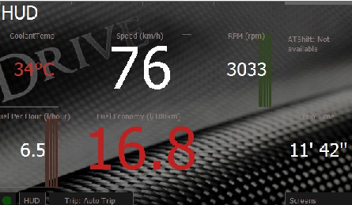HUD mode is a special layout to be used with windscreen projection.

You may activate the mirrored HUD mode by pressing the HUD button.

This mode disables all extra control elements and theme elements.

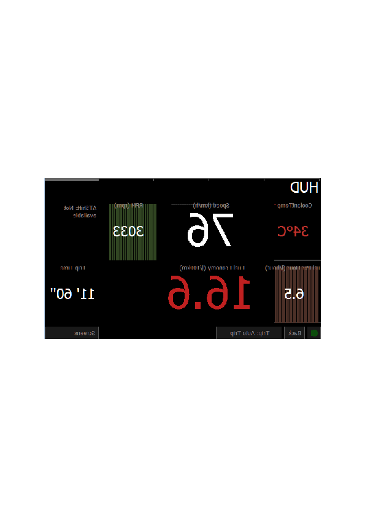If you place the you smartphone or navigation unit on a panel, it'll reflect the data to the windscreen, enabling you to read all the data reflected.

This mode provides enhanced comfort on long night journeys, since even with the night themes the display is usually very bright in the darkness, which distracts the eye from the road.

On many cars, simple reflection on the windscreen would "double" or even "triple" the image, but eyes adapt very fast; the blurred background provides a comfortable perception of information, without distracting the driver.

To return back, click the Back button.

### Fuel Trims Screen

STFT and LTFT fuel trims are the parameters that define engine efficiency in using the air-fuel mix.

For old or unclean engines their absolute value may be high (20per cent and more). This could trigger error codes.

Fuel trims within several per cent margin indicate normal engine operation.

### More Sensors Screen

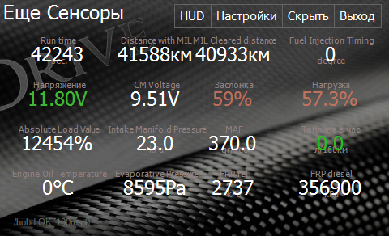

This screen gives you some detailed sensors which could be of interest to professional servicing teams.

### Lambda Sensors Screen

Shows the readings of oxygen sensors (depending on the car less than four values are possible).

### Toyota Sensors Screen

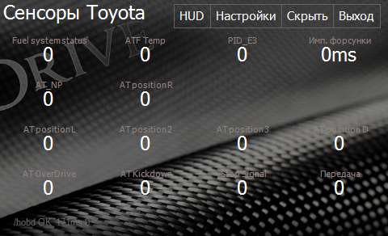

Screen with Toyota specific sensors.

### Sensor List Screen

Screen with all available sensors and their descriptions. Tapping any of the sensors will activate its reading. Tap once again to deactivate the sensor.

### Zero to 60 Miles

This screen is used to measure vehicle efficiency in 0-100 km/h acceleration.  
The measurement starts automatically when you start driving.  
Depending on the refresh rate of movement sensors, the end result may not be entirely accurate.

### Quarter Time

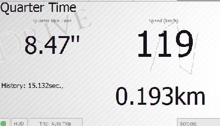

Measuring the time needed for passing quarter-mile distance (402 m).

### Brake Time

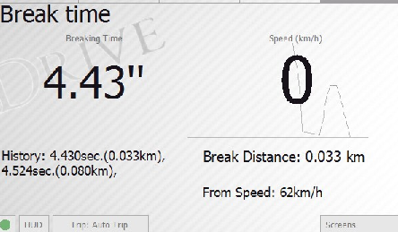

The measurement of braking time and distance at a certain speed. Helps to estimate the efficiency of the braking system, and to experiment with braking styles in dangerous road conditions.

## Customization of the Sensors

Calibration mode is activated via «Screens» → «Settings» → «Edit sensors layout».

After activation, pressing any sensor on any screen will get you a configuration dialogue.

The dialogue mode is used for setting the widget type (text, bar graph, circular graph, chart) and its various parameters.

Each parameter has a description which can be activated by pressing the parameter label (left). Typical parameter values can be either selected from drop-down lists or entered manually.

## Vehicle Calibration

Fuel Economy calculation method calibration is required for more precise MPG calculations or when hobdrive shows incorrect fuel economy values.

First, make sure distance and speed values are calculated correctly (f.e. by comparing short trip distance in hobdrive and in car's builtin odometer or GPS device). Sometimes speed calibration is required because of nonstandard tires size or speed value mistakes. Speed (and distance) play important role in fuel economy calculations, as well as total fuel consumed value.

For fuel consumption calibration, first know your real fuel economy: using full tank method, enter fueling records for a couple of full tanks and hobdrive will show your average fuel economy on "Events and Fillups" screen.

Then, you should compare these numbers with what you get on main hobdrive screen, applying the difference coefficient into appropriate method's coefficient field.

### Parameter Calibration

The simplest way to adjust coefficients and precise fuel consumption calibration is to compare HobDrive readings with real fuel consumption from the tank.

To calculate real fuel consumption from the tank, you need to enter refueling records with accurate amounts of liters filled and odometer readings. After two refuelings, HobDrive will be able to calculate real fuel consumption from the tank. You can see it on the "Events and Refuelings" screen. If there is enough data and the consumption values are adequate, they can be used for calibration.

The obtained value should be compared with the consumption readings on the "Trip Computer" screen for a relatively long interval: "refueling", "month", "all time", and based on the discrepancies, correct your parameter (AFR, VE, or "injector performance").

For example, with a real consumption reading of 12 L/100km, HobDrive shows consumption for the month of 11 L/100km.

This means that when using the MAF method, you need to multiply the current AFR by (12/11 = 1.09). When using MAP, you likewise need to multiply the current VE by 1.09. When using Injector, the injector performance is corrected (multiplied by 1.09).

When using EngineLoad, in the simplest case, you need to similarly change the "Load Fuel Consumption Coefficient".

The obtained value should be compared with the consumption readings on the "Trip Computer" screen for a relatively long interval: "refueling", "month", "all time", and based on the discrepancies, correct your parameter (AFR, VE, or "injector performance").

For example, with a real consumption reading of 12 L/100km, HobDrive shows consumption for the month of 11 L/100km.

This means that when using the MAF method, you need to multiply the current AFR by (12/11 = 1.09). When using MAP, you likewise need to multiply the current VE by 1.09. When using Injector, the injector performance is corrected (multiplied by 1.09).

When using EngineLoad, in the simplest case, you need to similarly change the "Load Fuel Consumption Coefficient".

Another quick way to select a correction coefficient is to look at fuel consumption in liters/hour on a warmed-up engine at idle speed. For many gasoline engines, it should be equal to half the engine volume. For example, if hobDrive shows 1 liter per hour and you have a 1.6L engine, then idle consumption should be 0.8 liters per hour. New VE value = 95 * 0.8/1 = 76.

It may also be worth calibrating speed - since mileage is calculated from it, and therefore consumption also depends on it.

**Attention!** All non-integer parameters are entered with a dot as the decimal separator.

Calibration for «**MAF Sensor**»

- **Air-Fuel ratio (AFR) calibration:** One of the key values, shows the ratio between air and fuel in the combustion chambers.  
    The default value is «14.7»

Examples for different fuels:

Air:Fuel (AFR)

| Fuel Type | AFR Ratio |
|-----------|-----------|
| Unleaded gasoline | 14.7:1 |
| Propane (LPG) | 15.5:1 |
| Methane (CNG) | 17.2:1 |
| Diesel fuel | 14.6:1 |
| Methanol (methyl alcohol) | 6.4:1 |
| Ethanol (ethyl alcohol) | 9.0:1 |

Calibration for «**MAP Sensor**»

- **Air-Fuel ratio (AFR) calibration:** Same as the previous.
- **Engine volume**: Engine volume in liters.  
    The default value is «1.8» liters.
- **Volumetric Efficiency (VE)**: Calibration constant for assessing the mix in engine combustion chambers.  
    The default value is «95» percent.

Calibration for «**Injector Sensor**»

- **Number of Cylinders**: number of cylinders in the engine.  
    The default value is «4» cylinders.
- **Injector performance**: Amount of fuel (ml/minute) injected per injector. Historically, only half of the real value must be entered.  
    The default value is «134.23» ml/min (for real performance of 268 ml/min).

Calibration for «**EngineLoad Sensor**»

- **Engine Load MPG Coefficient**: Global calibration constant.  
    The default value is «1»
- **RPM Curve for EngineLoad:** Used for detailed MPG tuneup. The value is a group of comma-separated numbers. Each number means MPG value at a specific RPM (RPM in range from 0 to 10,000). The RPM step is determined by the count of numbers in the parameter line (for 10 numbers RPM step would be 1,000).  
    The default value is  
    «0.025, 0.025, 0.10, 0.20, 0.3, 0.4, 0.3, 0.3, 0.3, 0.3»  
    Each number is a multiplier for the MPG EngineLoad value at the specific RPM.  
    For instance, RPM 2000 and EngineLoad of 40% mean consumption rate of 0.10\*40 = 4 liters/hour

## Beta-functionality

Part of the hobDrive functionality is still in active development and is being tested. You can experiment with it (we give no guarantees whatsoever).

**Logging the sensor data to the file.**  
Set up via «user.track» file.  
The contents of the file can be exported from the default configuration - «default.track» file.

The file lists the sensors used to record data. By default, only cumulative sensors data is recorded.  
 Data is written to the "track" folder in binary format and can be converted to Excel spreadsheets with «track2csv.exe» utility found here:  
**<https://github.com/cail/hobd/raw/master/lib/Track2CSV.exe>**

You need to run this program with the full path parameter to the "track" folder:

- In explorer, drag the "track" folder from the "hobdrive" folder to the track2csv.exe program icon
- After running, the program will convert all log files in the track folder to csv format - which can be opened in Excel or another spreadsheet.

## Typical Issues

- **HobDrive cannot connect to the vehicle**

You should distinguish between problems connecting to the ELM adapter (the indicator lights up red immediately, with a corresponding error message), and problems connecting the adapter to the vehicle (in this case, messages are usually issued: BUS INIT ERROR, UNABLE TO CONNECT).

Reasons for inability to connect to the adapter should be sought in incorrectly entered/not entered adapter pin code, hardware problems with the adapter or device.

When unable to connect to the vehicle: check that it is OBD2 compatible. If your vehicle is not OBD2, it or its ECU must be explicitly listed in the list supported by HobDrive (for example, Toyota JDM - right-hand drive Toyotas, Delphi mt20u - Cherry Tiggo, Yanvar, Bosch - for VAZ vehicles, etc.)

- **Unstable operation, frequent disconnections**

For USB adapters operating from mobile devices, a typical problem is lack of power.

Bluetooth ELM adapters operating through USB-BT dongles often suffer from poor quality of the latter.

## Hardware Requirements (Windows)

- Operating systems: WindowsCE, WindowsMobile, Windows xp/vista/7
- .net3.5 environment
- 64Mb RAM
- 500MHz CPU
- Touch-screen with 320x240 minimum resolution
- OBD-II ELM327 compatible Bluetooth/USB/Serial adapter
- Bluetooth chipset (or USB-Bluetooth adapter) with standard Microsoft bluetooth stack (for Bluetooth ELM327 adapters)
- USB-Serial driver for virtual COM port (for USB ELM327 adapters)

## Hardware Requirements (Android)

- Android 4.x and higher
- 512Mb RAM
- Bluetooth or WiFi

## Optional Requirements

- Internet access: auto updates[\[1\]](#footnote-1), reporting statistics data to the external web-service[\[2\]](#footnote-2).
- GPS chipset: position tracking, trip tracking[\[3\]](#footnote-3).

## Installation and Setup Requirements

Installation on Windows Mobile smartphones or PocketPC is done in the standard way - through a CAB file.

Installation on Android systems - through application stores or directly via APK file.

### Installation to Windows Mobile/CE Systems

The application requires netcf3.5 environment; if it is not on your smartphone, you can install it yourself (<http://www.microsoft.com/downloads/en/details.aspx?FamilyID=e3821449-3c6b-42f1-9fd9-0041345b3385&displaylang=en>).

Alternatively you can use a special 'standalone' hobDrive distribution. This version is distributed as a ZIP file, and includes a pre-installed software environment. All you need to do is unzip the archive onto your memory card.

### Installation on PNA (GPS navigators) and 2din car audio systems

For installation onto built-in WinCE devices, your device OS must be able to run external applications from a memory card. Unpack the HobDrive to the memory card and use the OS to specify the path to the executable file hobdrive.exe

In many operating systems this function is called «navigation software path» or similar.

Information on setting up and linking ELM adapter is accessible in "Help" section of the site: <http://hobdrive.com/faq>

### Installation on Personal Computer (carputer, car pc)

For hobDrive to work on a personal computer (carputer, touchpad, etc.), the only requirement is an installed fresh .net framework. Usually on modern Windows it is already installed by default. On Linux systems, it is necessary to install the "mono" environment and run HobDrive with the command "mono hobdrive.exe".

The serial port is required to connect the USB/COM-based OBD-II adapter.

Since hobDrive can work with Bluetooth devices directly, setting up Bluetooth communication via virtual COM port is not required.

- Available depending on licensing form [↑](#footnote-ref-1)

- Not available - in closed testing [↑](#footnote-ref-2)

- Not available - in development [↑](#footnote-ref-3)
