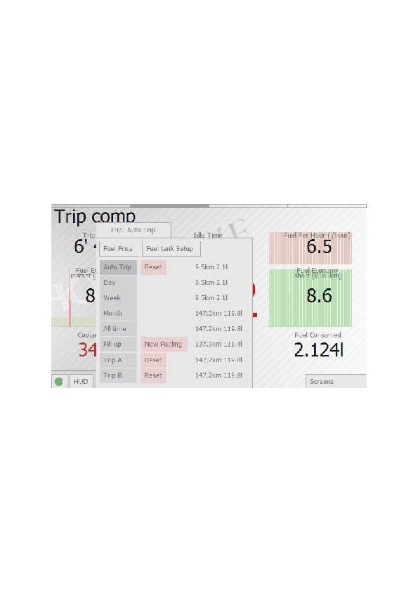

[English](../README.md) | [Russian](../README-ru.md)

[hobdrive.com](http://hobdrive.com/) | [support@hobdrive.com](mailto:support@hobdrive.com)

# HobDrive User's Manual

HobDrive is an onboard computer and diagnostic platform for your vehicle. It works through an OBD-II adapter and the device's GPS / sensors. This version of the manual focuses on modern mobile platforms: Android and iOS, including CarPlay.

## Table of Contents
{:.no_toc}
* TOC
{:toc}

## Documentation Structure

This manual is now the **overview layer**: it provides the basic setup flow and a mental model of the screens.

Detailed technical topics were moved into separate knowledge base articles:

- Connection, profiles, compatibility: [Ready-made vehicle profiles](profiles.md), [Problematic ELM327 adapters](bad-elms.md), [ABS/SRS and custom ECU diagnostics](custom-ecus.md).
- Fuel economy and calibration: [Fuel consumption methods and coefficients](fuel-methods.md), [Fuel economy: questions and answers](fuel-questions.md), [Speed reading differences](speed-diff.md), [Voltage correction](voltage.md).
- Screens and UI customization: [Layout design, skins, and sensor placement](layouts.md), [HobDrive Markup Language specification](LAYOUT_SPEC.md), [Dynamic expressions](dynamic-expr.md), [Dynamic expressions: core syntax](dynamic-expr-core.md).
- Data, reports, support: [Backups and settings transfer](backups.md), [Trip statistics](statistics.md), [How to report a problem](problems.md), [Licensing](licensing.md).
- iOS / CarPlay: [Automatic launch via Shortcuts](carplay-shortcut.md).

If you are setting up HobDrive for the first time, read this manual from top to bottom and follow the links in the relevant sections when you need the deeper technical articles.

## What HobDrive Does Today

HobDrive combines the following in one application:

- Live display of current vehicle and trip parameters.
- ECU diagnostics, reading and clearing fault codes.
- Fuel economy, refueling, ownership cost, and driving efficiency analytics.
- Customizable screens, user sensors, themes, and DashKits.
- Data backups and background cloud upload.
- Extra modes: HUD, GPS graphs screen, acceleration screen, and engine hours.

## Supported Platforms

- Android: widgets, advanced UI settings, cloud sync, and DashKits.
- iOS: Bluetooth LE and Wi-Fi adapter support, updated screens, and CarPlay mirroring.

Note: older Windows / WinCE / WinMobile platforms and their instructions are no longer supported and are not covered in this manual.

## Quick Start

### 1. Connect the ELM327 Adapter

Open: **Screens -> Settings -> ELM Connection Parameters**.

Connection options:

- **Bluetooth**: select the adapter from the list, or choose BTLE4. On Android/iOS the adapter usually needs to be paired in the system settings first.
- **Wi-Fi**: connect to the adapter's Wi-Fi network and enter an address in the form `ip:port`.
- **USB** (Android, if supported by the device and adapter): select the detected USB adapter.
- **Simulator**: for GPS-based testing without a real vehicle.

More about adapter quality and compatibility: [Problematic ELM327 adapters](bad-elms.md).

### 2. Check the Connection Status

In the status indicator:

- **Green**: connection to the adapter and vehicle is active.
- **Yellow**: the adapter is found and responding, but there is a problem communicating with the vehicle.
- **Red**: problem communicating with the adapter.

This makes troubleshooting faster because you can see whether the issue is on the adapter side or the vehicle side.

### 3. Select the Vehicle Profile

Open: **Settings -> Vehicle Parameters**.

Recommended order:

1. Try **Load from Template**.
2. If no template exists, configure the profile manually.
3. When the setup works, share the profile through **Share**.

More: [Ready-made vehicle profiles](profiles.md), [ABS/SRS and custom ECU diagnostics](custom-ecus.md).

## Interface Basics

HobDrive has a set of main screens and additional screens.

Navigation works through:

- swipes between screens,
- the top quick navigation bar,
- the **Screens** menu.

A long press on a sensor opens extended information about its calculation and source data.

Opening the **Screens** panel gives access to additional controls:

- Temporarily hide the app (Hide)
# HobDrive User's Manual

HobDrive is a trip computer and vehicle diagnostics platform that works through an OBD-II adapter and the device's GPS/sensors. This version of the manual focuses on modern mobile platforms: Android and iOS, including CarPlay.

## Settings Screen

Key sections:

- ELM connection parameters
## How This Documentation Is Organized

This manual now serves as an **overview layer**: it explains the basic setup flow and the purpose of the main screens.

More detailed technical material has been moved into separate knowledge base articles:

- Connection, profiles, compatibility: [Ready-made vehicle profiles](profiles.md), [Problematic ELM327 adapters](bad-elms.md), [Diagnostics for ABS/SRS and specific ECUs](custom-ecus.md).
- Consumption and calibration: [Fuel calculation methods and coefficients](fuel-methods.md), [Fuel consumption: questions and answers](fuel-questions.md), [Speed discrepancy](speed-diff.md), [Voltage correction](voltage.md).
- Screens and interface setup: [Layouts, skins, and sensor placement](layouts.md), [Layout language specification](LAYOUT_SPEC.md), [Dynamic expressions](dynamic-expr.md), [Dynamic expressions: core syntax](dynamic-expr-core.md).
- Data, reports, support: [Backups and settings migration](backups.md), [Trip statistics](statistics.md), [How to report a problem](problems.md), [Licensing](licensing.md).
- iOS/CarPlay: [Automated launch via Shortcuts](carplay-shortcut.md).

If you are setting up HobDrive for the first time, read this manual top to bottom and use the linked articles for deeper detail where needed.

## What HobDrive Does Today
- System settings
HobDrive combines the following in one app:

- Real-time display of current vehicle and trip parameters.
- ECU diagnostics, reading and clearing error codes.
- Fuel consumption, refueling, cost of ownership, and driving efficiency analysis.
- Customizable screens, user sensors, themes, and DashKits.
- Data backups and background cloud uploads.
- Extra modes such as HUD, GPS charts, acceleration screen, and engine hours.

## Supported Platforms

- Android: widgets, advanced interface settings, cloud sync, and DashKits.
- iOS: Bluetooth LE and Wi-Fi adapter support, updated screens, and CarPlay mirror mode.

Note: older Windows/WinCE/WinMobile platforms and their related instructions are no longer supported and are not covered in this manual.

## Quick Start

### 1. Connect Your ELM327 Adapter

Open: **Screens -> Settings -> ELM Connection Settings**.

Connection options:

- **Bluetooth**: select the adapter from the list, or choose BTLE4. On Android/iOS the adapter usually needs to be paired in system settings first.
- **Wi-Fi**: connect to the adapter's Wi-Fi network and enter the address in `ip:port` format.
- **USB** (Android, if supported by the device and adapter): select the detected USB adapter.
- **Simulator**: for GPS-based testing without a real car.

For adapter quality and compatibility details, see [Problematic ELM327 adapters](bad-elms.md).

### 2. Check Connection Status

In the connection indicator:

- **Green**: the adapter and vehicle link is active.
- **Yellow**: the adapter was found and is responding, but there is a problem communicating with the vehicle.
- **Red**: a problem with the adapter connection.

This distinction is useful for quick diagnosis because it shows where the issue actually is.

### 3. Choose a Vehicle Profile

Open: **Settings -> Vehicle Settings**.

Recommended order:

1. Try **Load from Template**.
2. If there is no suitable template, configure the profile manually.
3. If the profile works well, share it through **Share**.

See also: [Ready-made vehicle profiles](profiles.md), [Diagnostics for ABS/SRS and specific ECUs](custom-ecus.md).

## Interface Basics

The app has a set of main screens and additional screens.

Navigation is done by:
- **Copy / Delete**: commands to clone the current profile, rename it, or remove it. The last profile cannot be deleted.
- swiping between screens,
- using the top navigation bar,
- using the **Screens** menu.
- **Share**: upload your current profile to our website. After processing, it will be available to other users.
Long-pressing a sensor opens extended information about its calculation and input data.
- **Init string template / Init string**: lets you specify extra ELM commands to configure the adapter-vehicle link. The template list contains typical initialization commands for right-hand-drive cars and for some partially OBD2-compatible vehicles. For most OBD2 vehicles this field can stay empty.
Opening the **Screens** tab gives access to extra controls:
**Fuel calculation method:**

Several fuel calculation methods are available. If you are not sure which one your vehicle supports, try them one by one starting from the first and watch the **Fuel per Hour** sensor at idle.
- Temporarily hide the app
- Exit the app
- Open the **Settings** tab
- Choose and activate extra screens
- **MAF Sensor**: default for most gasoline vehicles. Fuel is calculated from the MAF (Mass Air Flow) sensor.
## Settings Screen
- **Injector Sensor**: fuel is calculated from the injector pulse sensor, available on many Toyota and Toyota-derived vehicles. This method requires calibration.
Key sections:
If you own a Toyota and the **Injector Sensor** method shows fuel consumption, it is the preferred one. For diesel vehicles, only **Engine Load** produces reasonable readings.
- ELM connection settings
- Vehicle settings
- System settings
- Sensor layout settings
- Network / Theme / Language / Units / About
Each method has its own calibration parameters. Empty fields mean default values, but for more accurate results they should be calibrated. See the calibration section below.
### Vehicle Settings
**Correction and calibration parameters:**
On this screen you can configure the vehicle type and connection parameters. If there is a ready-made profile for your vehicle, use **Load from Template** first. Only if no template exists should you configure the parameters manually.
- **Speed correction**: adjusts speed and mileage readings. Use it if your tires are non-standard or the speedometer is inaccurate. By default the value is `1`.
See also: [Ready-made vehicle profiles](profiles.md).
**Driving and engine operation parameters:**
**Main profile parameters:**
- **Maximum idle speed**: speed at which the car is considered stopped or in traffic. Default is `5 km/h`.
- **Name**: the name of your vehicle profile.
- **Copy / Delete**: commands that let you clone the current profile, rename it, or delete it. The last profile cannot be deleted.
- **Load from Template**: choose one of the ready-made and tested vehicle profiles.
- **Share**: upload your current profile to our website; after processing it will be available to other users.
- **Type**: the vehicle class and connection mode used with the ELM adapter. **Standard** is suitable for most OBD2 vehicles. For some manufacturers HobDrive supports special connection modes. Some models, such as Toyota or Ford, provide more sensors in that mode. Some models can work only with their specific profile, such as VAZ Yanvar, Mikas, Bosch ECU, Nissan Custom, and others.
- **Init string template / Init string**: extra ELM commands used to tune the adapter-to-vehicle connection. The template list includes typical initialization commands for right-hand-drive cars and some partially OBD2-compatible vehicles. For most OBD2-compatible cars this field can remain empty.
- **Trip reset interval**: number of seconds after which turning the ignition on again counts as a new trip and resets the Auto-Trip interval. Default is `600 s` (10 minutes).
**Fuel calculation method:**
**Precision correction options:**
Several fuel calculation methods are available. If you are unsure which one your vehicle supports, try them in order from the top of the list and watch the **fuel per hour** sensor at idle.
- **Fuel correction on engine braking**: improves fuel consumption calculation using engine-braking status. In this state the ECU stops fuel delivery to the cylinders. Default is off. Warning: on some vehicles this status is not read correctly.
- **MAF Sensor**: the default choice for most gasoline vehicles. Fuel is calculated from the MAF (Mass Air Flow) sensor.
- **MAP Sensor**: fuel is calculated from the MAP (Manifold Absolute Pressure) sensor. Requires calibration.
- **Injector Sensor**: fuel is calculated from the injector pulse sensor available in many Toyota and Toyota-derived vehicles. Requires calibration.
- **Engine Load Sensor**: fuel is calculated from engine load. This is a rough approximation used mainly for diesel vehicles. Requires calibration.
- **Built-in Sensor**: fuel is calculated from the vehicle's built-in hourly consumption sensor, present for example in some Yanvar and Mikas ECUs.
- **Fuel correction by Lambda**: HobDrive uses Lambda, the air-fuel ratio. This can improve fuel consumption accuracy. It is relevant for MAF/MAP methods. Default is off.
If you own a Toyota and the **Injector Sensor** option shows fuel consumption, that method is preferable. For diesel vehicles, only the **Engine Load** method gives adequate readings.
**Display parameters:**
Each method has its own calibration parameters.
- **Max coolant temperature**: temperature after which HobDrive shows an audio and visual overheating warning. Default is `95 C`.
**Correction and calibration parameters:**

- **Speed correction**: adjusts speed and mileage readings. The mileage is calculated from speed, so this also affects distance. Use this if you have non-standard tires or if the speedometer is inaccurate. Default value is `1`.
- **Odometer correction**: a separate coefficient used to align mileage with the dashboard odometer. This lets you correct distance independently from speed. Default value is `1`.
- **Tank volume**: used to estimate fuel level in the tank. Always specified in liters. Default value is `40` liters.
- **Weight**: total vehicle weight in kilograms. Used only in estimated power and efficiency calculations. Default value is `1300` kg.

**Driving and engine behavior parameters:**

- **Maximum idle speed**: the speed at which the car is considered stopped or in traffic. Default value is `5 km/h`.
- **Warm engine temperature**: the temperature at which the engine is considered warmed up. Used in warm engine mileage and fuel readings. Default value is `60°C`.
- **Trip reset interval**: the time period in seconds after which ignition on is treated as a new trip and the Auto Trip interval is reset. Default value is `600` seconds.

**Precise fuel correction parameters:**

- **Engine braking fuel correction**: enables more accurate fuel consumption calculation using engine braking state. In that state the ECU stops fuel injection into the cylinders. Default is off. _Attention_: not every vehicle reports this state correctly.
- **LTFT fuel correction**: HobDrive uses LTFT (long-term fuel trim) to correct fuel consumption. This can be used on some vehicles with MAF/MAP methods and on Toyota Prius for bio-ethanol adjustments. Default is off.
- **Lambda fuel correction**: HobDrive uses the Lambda value, or air-fuel ratio, to improve consumption accuracy. This is relevant for MAF/MAP methods. Default is off.
- Configuration of sensor count and display parameters for screens.
**Display parameters:**
- Gear indicator style selection (Roman or Arabic numerals).
- **Max antifreeze temperature**: the temperature above which HobDrive will issue an audio and visual overheating warning. Default is `95°C`.
- **Max fuel trim**: the maximum long-term fuel trim value above which HobDrive will issue a warning about mixture inefficiency. Default is `11%`.

**Calibration tip:** if trip statistics consistently differ from refueling-based consumption, first align distance readings (speed/odometer), then adjust the fuel coefficients.

See also: [Speed discrepancy](speed-diff.md).

### Sensor and Screen Settings
- multiple background images within one theme,
Current capabilities include:

- A convenient sensor picker with search and current selection display.
- Setting the number of sensors and display parameters per screen.
- Reordering the main screens and selecting screens that should always stay active.
- Setting the gear indicator style, either Roman or Arabic numerals.
- Showing or hiding date and time.

### Appearance

Supported options include:

- light and dark themes,
- multiple background images in a single theme,
- advanced readability controls such as text/value outlines that can be turned off.

## Main and Extra Screens

### Main Readings

This is the screen with current vehicle state while driving. All sensors are read sequentially, and reading speed depends on the performance of the ELM adapter and device. A 1-2 second delay in readings may be normal.
- **Acceleration**: instantaneous acceleration in meters per second squared, showing how hard the vehicle is speeding up or slowing down.

- **Fuel level**: estimated fuel level in the tank. Initial calibration is required; see the Fuel Details screen.
**Main sensors:**

- **Speed**: the current vehicle speed. The readings come from the vehicle sensors and should normally match the speedometer. They may differ from GPS speed. For correction, see the calibration section.
- **Acceleration**: instant acceleration in meters per second squared, showing how hard the car is accelerating or slowing down.
- **RPM**: current engine speed.
- **Fuel level**: estimated fuel level in the tank. Initial calibration is required, see the Fuel Details screen.
- **Fuel economy**: fuel economy in liters per 100 km for the current trip. This is the main vehicle efficiency metric.
- **Voltage**: the vehicle electrical system voltage. This can be used to judge alternator performance or battery discharge.
- **Antifreeze temperature**: current coolant and engine temperature. This is the main parameter used to judge engine warm-up.
- **Intake temperature**: air temperature at the intake. Usually close to ambient temperature.
- **Ambient temperature**: outside air temperature. May be unavailable on some vehicles.
- **Fuel per hour**: instant fuel consumption per unit of time, in liters. Typical values at idle are 0.5 to 1.5 liters per hour depending on the engine. This lets you monitor the engine operating mode and the effect of extra loads such as air conditioning.
Sensors use the most appropriate formatting for graphical display. On sensors with background graphics, such as speed, you can also see the current minimum and maximum values reached.
- **Fuel economy**: average trip fuel economy for the selected period. This is the main overall efficiency metric.
**Status panel controls:**
- **Distance run**: total distance for the trip. See the calibration section if it differs from the dashboard odometer.
By tapping the status popup panel in the lower-left corner, you will see:

- Detailed OBD2 and GPS connection status.
- A **Reconnect** button for forcing a new connection attempt.
- A **Fast Reading Mode** option that disables calculated data and focuses on reading visible data at maximum speed, useful for diagnostics.

### Trip Computer

This screen shows the main values for the current trip or the selected time interval, letting you evaluate both overall efficiency and instantaneous consumption values.
- **Week**: accumulated values for the current week, reset at Sunday midnight.

- **Fill up**: values for the current refueling period. HobDrive resets this interval when you enter a new fueling record.
**Main metrics:**

- **Trip Time**: time spent in the vehicle with ignition on.
- **Idle Time**: time spent in traffic, at lights, or otherwise stopped. Very slow movement, under 5 km/h by default, is also treated as idling.
- **Fuel per hour**: instantaneous fuel consumption per unit of time, in liters. Typical idle values are 0.5-1.5 liters per hour. This helps monitor engine state and the effect of extra loads such as air conditioning.
- **Instant fuel economy**: fuel economy for the last few seconds. Useful for observing efficiency changes while driving.
- **Fuel economy**: average consumption for the current trip or selected interval, in liters per 100 km. This is the main measure of overall vehicle efficiency.
- **Short term fuel economy**: fuel economy over the last few minutes. Useful for short-term driving analysis.
- **Distance Run**: total distance for the trip or selected interval. See the calibration section if it differs from the dashboard odometer.
- **Fuel Consumed**: total fuel used during the selected interval, in liters.

Tap the **Trip** tab to choose from the available tracking intervals. When a new interval is selected, all values update to reflect the stored data for that interval.
- fuel consumed while idling,

- cost of idle time,
Available trip intervals:
- fuel used for engine warm-up,
- **Auto Trip**: current trip. Selected automatically once the minimum ignition-off/ignition-on interval is reached, 10 minutes by default.
- **Day**: aggregated data for today. Reset at midnight.
- **Week**: aggregated data for the current week. Reset at Sunday midnight.
- **Month**: aggregated data for the current month.
- **All time**: all aggregated data.
- **Fill up**: data for the current fueling period. HobDrive resets this when you enter a new fueling record.
- **Trip A, Trip B**: data for two manually managed trips.
- fuel cost per kilometer.
Manual reset is possible for **Auto Trip** and **Trip A / Trip B** modes.

### Fuel Consumption Details
Sensors highlighted in green can be fine-tuned for higher accuracy.

Tapping the price sensor opens a screen where you can set the current fuel price per liter and the currency.
This screen provides detailed information about fuel consumption.
### Fuel Details
Displayed values include:
This screen shows detailed information about fuel in the tank.
- Fuel consumed while idling, such as in traffic or at lights.
- Fuel economy excluding idling.
- The cost of idle time.
- The cost of fuel consumed for the trip.
- Fuel consumed during engine warm-up to 60 degrees.
- Fuel consumed on a warmed-up engine.
- Fuel cost per kilometer.

Green-shaded sensors can be tuned for extra precision.

Tapping the price sensor opens a screen where you can set the current fuel price per liter and currency.
Tapping one of the fuel level sensors opens the tank calibration dialog. On first use you must enter the tank volume and the approximate amount of fuel already consumed.
### Fuel Details
After that, HobDrive automatically tracks the remaining fuel volume. To keep the calculation accurate, you need to record refueling events. Each refill should be entered through **Trip -> New fueling**.

On this screen HobDrive also calculates:
This screen provides detailed information about fuel in the tank and tank calibration.
- **Range on remaining fuel**,
The current **estimated fuel level** and **estimated fuel volume** in the tank are calculated from fueling records and consumption data.
- **Next refuel** - an approximate time to the next refill based on weekly consumption,

- **Average speed** - calculated for the currently selected time interval, including idle time.
Tapping one of the fuel level sensors opens the tank calibration dialog. On first use you must enter your tank volume and an approximate amount of fuel already consumed.
Some cars report the real fuel level from the ECU. In HobDrive this sensor is called **ECUFuelLevel**.
HobDrive then decreases the estimated fuel amount automatically. To keep it accurate, you need to enter fueling records regularly.
HobDrive does not use the raw value as the main fuel level display. Instead, it shows the calculated value based on entered data and fuel consumption.
Additional values calculated on this screen include:
### Fueling and Events
- **Mileage on remaining fuel**
- **Continuous driving time on remaining fuel**
- **Next fueling**: approximate time to the next refueling based on weekly average consumption
- **Maximum temperature and speed**: the maximum observed value
- **Average speed**: calculated for the current selected interval including all idle time

Some cars transmit the real fuel level from the ECU. In HobDrive this value is overridden by the calculated one based on entered fuel and consumption data.
This screen is used to analyze refueling and event data saved by HobDrive.
### Refueling and Events
The table contains the following fields:

- **Category**: event category. Tapping a category filters the list to that category.
This screen is used to analyze refueling and event data saved by HobDrive.
- **Odometer**: odometer reading at the time the record was entered.
Available table fields include:
- **Instant, Total Consumption**: two calculated values showing estimated fuel consumption. Instant consumption is the consumption since the last refueling and is correct only for full-tank refills. Total consumption is the fuel consumption across the whole history of recorded refueling events.
- **Category**: event type. Tapping a category filters the records.
- **Cost**: the amount spent on the event or refueling.
- **Odometer**: the odometer reading at the time of entry.
- **Filled**: for refueling entries, the total liters filled.
- **Instant, Total Consumption**: two calculated fuel consumption values. Instant consumption is fuel use since the last refuel and is correct only for full-tank refueling. Total consumption is the cumulative fuel use over the full history.
- **Tags, notes**: arbitrary data attached to the record.
- **Date**: the event date.
- **Date**: event date.
The last row shows totals: total mileage, total amount spent, and total fuel consumption.
The last row shows totals: total mileage, total amount spent, and total fuel consumption.
Sorting, filtering, and editing are available.
You can sort, filter, and edit records.
**Recording fuel and events:**
**Recording refueling events:**
Entries are added through the **Actions** tab:
Data is entered through the **Actions** panel:

- **New fueling**: when you refuel, enter the amount of fuel, price, odometer reading, and notes. HobDrive can compare its estimated odometer with the real one. You can choose automatic correction, manual correction in the dialog, or correcting only the odometer without changing consumption.
- **New record**: add an arbitrary vehicle maintenance record.
- **Missed trip**: add an unaccounted trip, for example if you forgot to start HobDrive. Enter the odometer reading and HobDrive will estimate the fuel used, which you can adjust manually. On vehicles with an ECU fuel level sensor, the values will be filled automatically.
- **New fueling**: every time you refuel, enter the amount of fuel added, the cost, the odometer reading, and notes. HobDrive can compare its estimated odometer reading with the real one. You can choose how to correct the difference: automatically, manually in the dialog, or only correct the odometer without adjusting fuel consumption.
Using refueling records, HobDrive lets you estimate fuel costs, total ownership cost, and the cost per kilometer of mileage.
- **Missed trip**: add an unaccounted trip, for example if you forgot to start HobDrive. Enter the current odometer reading and HobDrive will estimate the consumed fuel; you can adjust it manually. On vehicles with an ECU-based fuel level sensor, the values are entered automatically.
### GPS and Motion
Using refueling records, HobDrive can estimate your fuel cost per station, total ownership cost, and cost per kilometer.
The GPS screen provides charts and improved movement direction display.
### GPS and Motion
**Acceleration screen**: a dedicated acceleration screen with analysis of the device G-sensor and direction detection.
The GPS screen shows graphs and an improved display of driving direction.
**Power screen**: improved calculation based on current parameters.
**Acceleration screen**: a separate acceleration screen with device G-sensor analysis and direction detection.
### Engine Hours
**Power screen**: improved calculation based on current parameters.
The EngineHours screen shows total engine running time and is useful for planning maintenance by engine hours.
### Engine Hours
### Diagnostics and Extra Screens
The EngineHours screen shows total engine operating time and is useful for service planning, for example every N engine hours.
Besides the main screens, HobDrive provides extended diagnostic information.
In addition to the main screens, HobDrive provides extended diagnostic information.

**Diagnostics screen**: a screen for diagnostic warning codes, engine errors, and their descriptions.
**Diagnostics screen**: a screen for diagnosing various warnings, engine errors, and their descriptions.

When activated, it reads diagnostic trouble codes:

- **Active codes**: need immediate attention and diagnosis.
- **Pending codes**: possible future problems.

The **Clear DTCs** button resets the codes if needed. _Attention_: clearing the codes does not fix the underlying problem. Freeze-frame data can be useful for service diagnostics.

## Sensor Appearance Settings

Sensor appearance setup is activated through **Screens -> Settings -> Sensor Layout**.

When this mode is active, tapping any sensor on any screen opens the configuration dialog.

The dialog lets you configure:

- widget type (text, bar, circular gauge, chart),
- value range,
- colors,
- other visual parameters.

Each parameter has a description that appears when you long-press it.

See also for advanced layout customization: [Layouts, skins, and sensor placement](layouts.md), [Layout language specification](LAYOUT_SPEC.md), [Dynamic expressions](dynamic-expr.md).

**Fuel trims screen**:

STFT and LTFT are ECU parameters that define how efficiently the engine uses the air-fuel mixture.

On old or dirty engines their absolute values can become large, sometimes 20% or more, and can trigger error codes. Fuel trims within a few percent usually indicate normal engine operation.

**Lambda sensors screen**:

Shows oxygen sensor readings; depending on the vehicle, not all four values may be present.

**More sensors, Toyota sensors, and sensor list screens**:

Additional sensors mainly intended for professional diagnostics.

The sensor list screen lets you select any sensor and start reading its value.

## HUD Mode

HUD hides unnecessary interface elements and prepares the image for windscreen projection. Use it primarily as a supporting mode that does not distract from the road.

## Data Management, Backups, and Cloud

The **Data Management** dialog provides:

- backup creation,
- restore,
- background cloud upload,
- upload interval settings,
- deletion of old data.

Recommendation: enable regular backups, especially before changing devices or testing new DashKits.

For file transfer and restore details, see [Backups and settings migration](backups.md).

For cloud and local statistics, see [Trip statistics](statistics.md).

## DashKits, Themes, and Extensibility

HobDrive supports interface and behavior customization through DashKits.

You can:

- connect ready-made panels and themes,
- choose skins in the DashKits dialog,
- use multiple isolated sets of user overrides,
- add your own screens and layouts for a specific use case.

For advanced users, additional layout capabilities are available such as conditional output (`if`), sensor filters, element visibility control, graphical decorators, and rendering-stage parameters.

Advanced customization articles:

- [Layouts, skins, and sensor placement](layouts.md)
- [HobDrive layout language specification](LAYOUT_SPEC.md)
- [Dynamic expressions in configuration files](dynamic-expr.md)
- [Dynamic expressions: core syntax](dynamic-expr-core.md)
- [ECUXML format specification](ecuxml_spec.md)

## Android Widgets

Android supports widgets that follow the app style and can be configured for the required sensors and parameters. This is useful for quickly viewing key data without opening the app.

## iOS and CarPlay

iOS is fully supported in HobDrive:

- Wi-Fi and Bluetooth LE adapter support,
- improved connection stability,
- updated screens and system scenario handling,
- CarPlay mirror display support.

For iOS, after system updates check Bluetooth / location permissions again and make sure the adapter is still available in system settings.

For step-by-step CarPlay auto-start instructions, see [Automated launch via Shortcuts](carplay-shortcut.md).

## Calibration and Accuracy

### Basic Calibration Flow

1. Enter at least 2-3 refueling records with accurate liters and odometer readings.
2. On the **All refuelings** screen you can see the fuel consumption calculations.
3. Compare this result with the consumption that HobDrive shows on the **Trip Computer** screen over a long interval such as **Month** or **All time**.
4. Adjust the calibration parameters for the chosen method.

This manual keeps only the overview algorithm. The full technical part with formulas, AFR/VE, MAP/MAF/Injector/EngineLoad coefficients, and calculation examples is in separate articles:

- [Fuel calculation methods and coefficients](fuel-methods.md)
- [Fuel consumption: questions and answers](fuel-questions.md)
- [Speed discrepancy](speed-diff.md)

### Number Format

Use a dot as the decimal separator for numeric parameters.

## Typical Problems

### No Connection to the Vehicle

- Check that the adapter is visible in the system and that the correct connection type is selected.
- Check the status color: red for adapter, yellow for vehicle.
- For unstable adapters, increase the ELM communication delay.

For a deeper look at low-quality adapters, see [Problematic ELM327 adapters](bad-elms.md).

### Incorrect Fuel Consumption / Mileage

- Check the fuel calculation method.
- Check the speed and odometer coefficients.
- Compare the statistics with actual refueling data.

See also: [Fuel calculation methods](fuel-methods.md), [Fuel consumption: questions and answers](fuel-questions.md), [Speed discrepancy](speed-diff.md).

### Interface Looks Wrong After an Update

- Check the selected theme / skin / DashKit.
- Disable the problematic custom set and test with the standard theme.

If the problem reproduces, send a report: [How to report a problem](problems.md).

## Future Extensions

This section is reserved for future manual development. Suggested upcoming chapters:

- A detailed guide for building your own DashKit with examples.
- A catalog of recommended user screens by scenario such as city, highway, or diagnostics.
- Separate best practices for CarPlay and Android widgets.
- An extended section on cloud analytics and data exchange between devices.

## Important Safety Warning

A vehicle is a source of increased danger. Do not configure complex parameters or analyze screens in detail while driving. Perform setup while parked.
