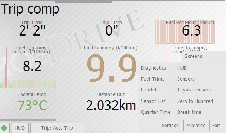
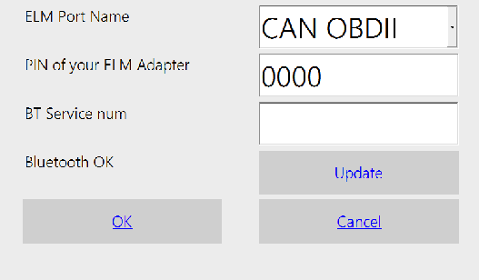
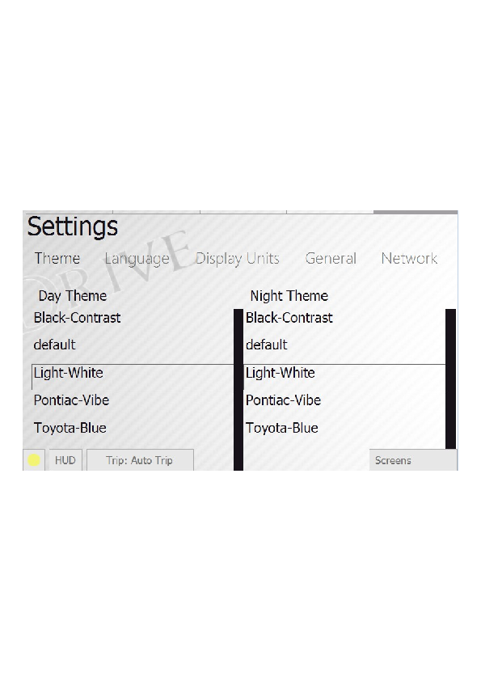
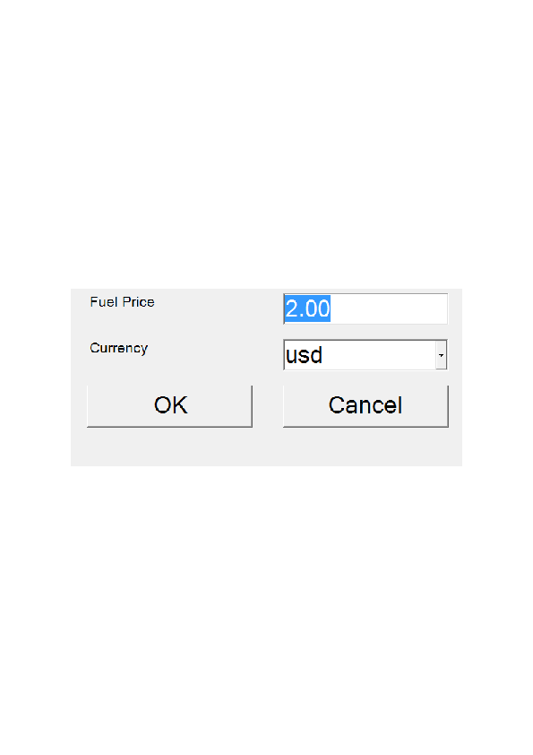
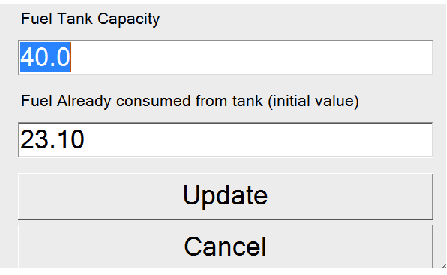
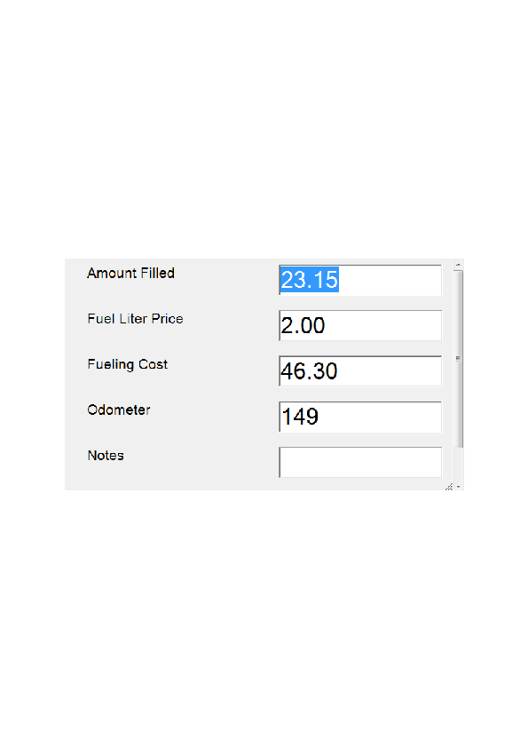
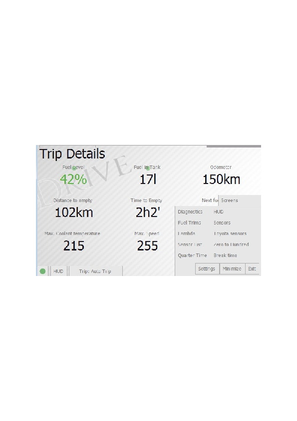
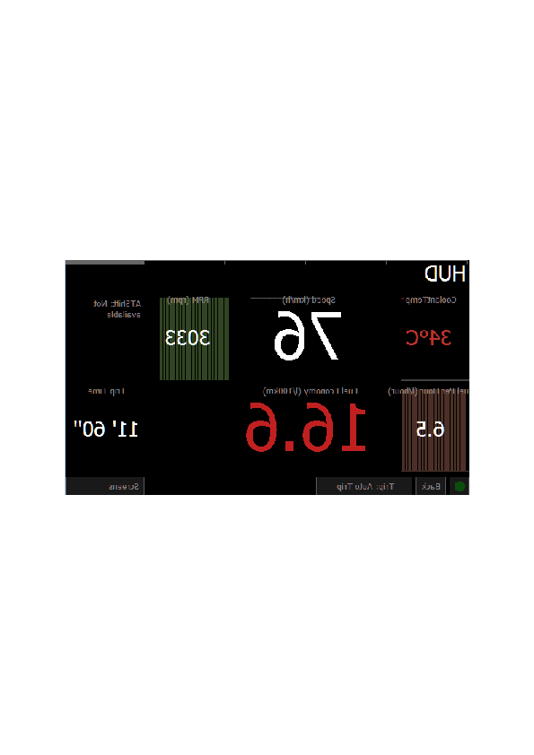
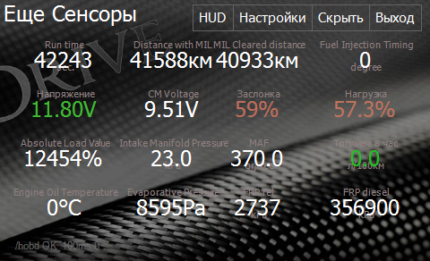

[English](../README.md) | [Russian](../README-ru.md)

[hobdrive.com](http://hobdrive.com/) | [support@hobdrive.com](mailto:support@hobdrive.com)

# HobDrive User's Manual

HobDrive is an onboard computer and diagnostic platform for your vehicle. It works through an OBD-II adapter and the device's GPS/sensors. This version of the manual focuses on modern mobile platforms: Android and iOS, including CarPlay.

## Table of Contents
{:.no_toc}
* TOC
{:toc}

## How This Documentation Is Organized

This manual now serves as an **overview layer**: it explains the basic setup flow and the purpose of the main screens.

More detailed technical material has been moved into separate knowledge base articles:

- Connection, profiles, compatibility: [Ready-made vehicle profiles](profiles.md), [Problematic ELM327 adapters](bad-elms.md), [Diagnostics for ABS/SRS and specific ECUs](custom-ecus.md).
- Consumption and calibration: [Fuel calculation methods and coefficients](fuel-methods.md), [Fuel consumption: questions and answers](fuel-questions.md), [Speed discrepancy](speed-diff.md), [Voltage correction](voltage.md).
- Screens and interface setup: [Layouts, skins, and sensor placement](layouts.md), [Layout language specification](LAYOUT_SPEC.md), [Dynamic expressions](dynamic-expr.md), [Dynamic expressions: core syntax](dynamic-expr-core.md).
- Data, reports, support: [Backups and settings migration](backups.md), [Trip statistics](statistics.md), [How to report a problem](problems.md), [Licensing](licensing.md).
- iOS/CarPlay: [Automated launch via Shortcuts](carplay-shortcut.md).

If you are setting up HobDrive for the first time, read this manual top to bottom and use the linked articles for deeper detail where needed.

## What HobDrive Does Today

HobDrive combines the following in one app:

- Real-time display of current vehicle and trip parameters.
- ECU diagnostics, reading and clearing fault codes.
- Fuel consumption, refueling, cost of ownership, and driving efficiency analysis.
- Customizable screens, user sensors, themes, and DashKits.
- Data backups and background cloud uploads.
- Extra modes: HUD, GPS graphs, acceleration screen, and engine hours.

## Supported Platforms

- Android: widgets, advanced interface settings, cloud sync, and DashKits.
- iOS: Bluetooth LE and Wi-Fi adapter support, updated screens, and CarPlay mirroring.

Note: older Windows/WinCE/WinMobile platforms and their related instructions are no longer supported and are not covered in this manual.

## Quick Start

### 1. Connect the ELM327 Adapter

Open: **Screens -> Settings -> ELM Connection Parameters**.

Connection options:

- **Bluetooth**: select the adapter from the list, or choose BTLE4. On Android/iOS the adapter usually needs to be paired in the system settings first.
- **Wi-Fi**: connect to the adapter's Wi-Fi network and enter an address in the form `ip:port`.
- **USB** (Android, if supported by the device and adapter): select the detected USB adapter.
- **Simulator**: for GPS-based testing without a real vehicle.

More about adapter quality and compatibility: [Problematic ELM327 adapters](bad-elms.md).

### 2. Check the Connection Status

In the status indicator:

- **Green**: connection to the adapter and vehicle is active.
- **Yellow**: the adapter is found and responding, but there is a problem communicating with the vehicle.
- **Red**: problem communicating with the adapter.

This makes troubleshooting faster because you can see whether the issue is on the adapter side or the vehicle side.

### 3. Select the Vehicle Profile

Open: **Settings -> Vehicle Parameters**.

Recommended order:

1. Try **Load from Template**.
2. If no template exists, configure the profile manually.
3. When the setup works, share the profile through **Share**.

More: [Ready-made vehicle profiles](profiles.md), [Diagnostics for ABS/SRS and specific ECUs](custom-ecus.md).

## Interface Basics

HobDrive has a set of main screens and additional screens.

Navigation works through:

- swipes between screens,
- the top quick navigation bar,
- the **Screens** menu.

A long press on a sensor opens extended information about its calculation and source data.

Opening the **Screens** panel gives access to additional controls:

- Temporarily hide the app (Hide)
- Exit the app
- Activate Settings tab
- Choose and activate additional screens

## Settings Screen

Key sections:

- ELM connection parameters
- Vehicle parameters
- System settings
- Sensor appearance settings
- Network / Appearance / Language / Units / About

### Vehicle Parameters

On this screen you can configure your vehicle type and connection parameters. For starters, if a ready-made profile exists for your model (**"Load from Template"**), use it. Only try manual configuration if no template is available.

Detailed article on profiles and templates: [Ready-made vehicle profiles](profiles.md).

**Main profile parameters:**

- **Name**: your vehicle profile name.
- **Copy / Delete**: commands to clone the current profile, assign a new name, or delete it. You cannot delete the last profile.
- **Load from Template**: choose from ready-made and tested profiles by model.
- **Share**: upload your current profile to our site (after moderation it will be available to other users).
- **Type**: vehicle class and ELM adapter connection method. **Standard** works for most OBD2 vehicles. For some manufacturers HobDrive supports special connection modes. Some models (like Toyota, Ford) offer more sensors in these modes. Some models only work with their specific profile (like VAZ Enero, Mikass, Bosch ECU, Nissan Custom, etc.).
- **Init string template, init string**: allow you to specify additional ELM commands for configuring the adapter-to-vehicle connection. The template list includes typical init commands for right-hand-drive vehicles and vehicles with non-standard OBD2 compatibility. For most standard OBD2 vehicles you can leave this empty.

**Fuel calculation method:**

Several fuel calculation variants are available. If unsure which one your vehicle supports, try them sequentially starting with the first one and monitor the "fuel per hour" sensor at idle.

- **MAF Sensor** (default for most gas engines): fuel consumption calculated by MAF (Mass Air Flow).
- **MAP Sensor**: consumption calculated by MAP sensor (Manifold Absolute Pressure). Requires calibration.
- **Injector Pulse Sensor**: consumption from available injector pulse sensor on many Toyota and some other vehicles. Requires calibration.
- **Engine Load Sensor (diesel)**: consumption from engine load sensor. Provides rough approximation, used only for **diesel** vehicles. Requires calibration.
- **Built-in Sensor**: consumption from the vehicle's internal hourly consumption sensor (present on vehicles with Enero, Mikass ECU).

For Toyota with injector sensor, if this variant shows consumption, it is preferable to others. For diesel vehicles adequate readings are provided only by the "Engine Load" method.

Each method has its own calibration parameters (see the "Calibration and accuracy" section).

Detailed algorithms and method selection examples: [Fuel calculation methods and calibration coefficients](fuel-methods.md), [Fuel consumption: principles and common questions](fuel-questions.md).

**Calibration and correction parameters:**

- **Speed correction**: corrects speed and distance readings (distance is calculated from speed!). Necessary if you have non-standard tires or if speedometer readings are inaccurate. Default is `1`.
- **Odometer (distance) correction**: separate coefficient to align distance with dashboard odometer readings. Allows correcting distance independently from speed. Default is `1`.
- **Tank volume**: used when estimating fuel level in the tank. Always specified in liters. Default is 40 liters.
- **Weight**: total vehicle weight in kilograms. Used only in estimated power and efficiency calculations. Default is 1300 kg.

**Driving and engine behavior parameters:**

- **Maximum idle speed**: the speed at which the car is considered stopped or in traffic. Default is 5 km/h.
- **Warm engine temperature**: the temperature at which the engine is considered warmed up. Used in warm engine and idle fuel readings. Default is 60°C.
- **Trip reset interval**: time period in seconds after which ignition-on is treated as a new trip and Auto Trip is reset. Default is 600 seconds (10 minutes).

**Precise fuel correction parameters:**

- **Engine braking fuel correction**: enables more accurate fuel consumption calculation using engine braking state. In this state the ECU stops fuel injection. Default is off. _Note_: not every vehicle reports this state correctly.
- **LTFT fuel correction**: HobDrive uses LTFT (long-term fuel trim) to correct fuel consumption. This can be used on some vehicles with MAF/MAP methods and on Toyota Prius for bio-ethanol adjustments. Default is off.
- **Lambda fuel correction**: HobDrive uses the Lambda value (air-fuel ratio) to improve consumption accuracy. Relevant for MAF/MAP methods. Default is off.

**Display parameters:**

- **Max antifreeze temperature**: the temperature above which HobDrive will issue an audio and visual overheating warning. Default is 95°C.
- **Max fuel trim**: the maximum long-term fuel trim value above which HobDrive will issue a warning about mixture inefficiency. Default is 11%.

**Calibration tip:** if trip statistics consistently differ from refueling-based consumption, first align distance readings (speed/odometer), then adjust the fuel coefficients.

See also: [Speed discrepancy](speed-diff.md).

### Sensor and Screen Settings

Current capabilities include:

- A convenient sensor picker with search and current selection display.
- Setting the number of sensors and display parameters per screen.
- Reordering the main screens and selecting screens that should always stay active.
- Setting the gear indicator style, either Roman or Arabic numerals.
- Showing or hiding date and time.

### Appearance

Supported options include:

- light and dark themes,
- multiple background images in a single theme,
- advanced readability controls such as text/value outlines that can be turned off.

## Main and Extra Screens

### Main Readings

This is the screen with current vehicle state while driving. All sensors are read sequentially, and reading speed depends on the performance of the ELM adapter and device. A 1-2 second delay in readings may be normal.

**Main sensors:**

- **Speed**: the current vehicle speed. Readings come from vehicle sensors and should match the speedometer. They may differ from GPS speed. For correction, see the calibration section.
- **Acceleration**: instantaneous acceleration in meters per second squared, showing acceleration or deceleration intensity.
- **RPM**: current engine speed.
- **Fuel level**: estimated fuel level in the tank. Requires initial calibration; see the Fuel Details screen.
- **Fuel economy**: fuel economy in liters per 100 km for the current trip. This is the main vehicle efficiency metric.
- **Voltage**: the vehicle electrical system voltage. Can be used to judge alternator performance or battery discharge.
- **Antifreeze temperature**: current coolant and engine temperature. This is the main parameter for judging engine warm-up.
- **Intake temperature**: air temperature at the intake. Usually close to ambient temperature.
- **Ambient temperature**: outside air temperature. May be unavailable on some vehicles.

All sensor values are transmitted by the vehicle ECU and may not match real-world readings. Different sensors have different update rates. Sensors with background graphs show the current minimum and maximum observed values.

**Status panel controls:**

Tapping the status popup panel in the lower-left corner shows:

- Detailed OBD2 and GPS connection status.
- A **Reconnect** button for forcing a new connection attempt.
- A **Fast Reading Mode** option that disables calculated data and focuses on reading visible data at maximum speed, useful for diagnostics.

### Trip Computer

This screen shows the main values for the current trip or selected time interval, letting you evaluate both overall efficiency and instantaneous consumption values.

**Main metrics:**

- **Trip Time**: time spent in the vehicle with ignition on.
- **Idle Time**: time spent in traffic, at lights, or stopped with the engine running. Movement under 5 km/h is also treated as idling.
- **Fuel per hour**: instantaneous fuel consumption per unit of time, in liters. Typical idle values are 0.5-1.5 liters per hour. This helps monitor engine state and the effect of extra loads such as air conditioning.
- **Instant fuel economy**: fuel economy for the last few seconds. Useful for observing efficiency changes while driving.
- **Fuel economy**: average consumption for the current trip or selected interval, in liters per 100 km. This is the main measure of overall vehicle efficiency.
- **Short-term fuel economy**: fuel economy over the last few minutes. Useful for short-term driving analysis.
- **Distance run**: total distance for the trip. See the calibration section if it differs from the dashboard odometer.
- **Fuel consumed**: total fuel used during the selected interval, in liters.

**Time interval selection:**

Tapping the **Trip** button shows available tracking intervals. When a new interval is selected, all values update to reflect stored data for that interval.

- **Auto Trip**: current trip. Selected automatically once the minimum ignition-off/ignition-on interval is reached, 10 minutes by default.
- **Day**: aggregated data for today. Reset at midnight.
- **Week**: aggregated data for the current week. Reset at Sunday midnight.
- **Month**: aggregated data for the current month.
- **All time**: all aggregated data.
- **Fill up**: data for the current fueling period. HobDrive resets this when you enter a new fueling record.
- **Trip A, Trip B**: data for two manually managed trips.

Manual reset is possible for **Auto Trip** and **Trip A / Trip B** modes.

### Fuel Consumption Details

This screen provides detailed information about fuel consumption:

- Fuel consumed while idling (in traffic, at lights)
- Fuel economy excluding idling
- Cost of idle time
- Cost of fuel consumed for the trip
- Fuel consumed during engine warm-up to 60°C
- Fuel consumed on a warmed-up engine
- Fuel cost per kilometer

Sensors highlighted in green can be fine-tuned for higher accuracy. Tapping the price sensor opens a screen where you can set the current fuel price per liter and currency.

### Fuel Details

This screen shows detailed information about fuel in the tank and tank calibration.

The current **estimated fuel level** and **estimated fuel volume** in the tank are calculated from fueling records and consumption data.

Tapping one of the fuel level sensors opens the tank calibration dialog. On first use you must enter your tank volume and an approximate amount of fuel already consumed.

HobDrive then automatically decreases the estimated fuel amount. To keep it accurate, you need to enter fueling records regularly.

HobDrive does not use the raw ECU sensor value directly. Instead, it shows the calculated value based on entered fuel data and consumption.

Additional values calculated on this screen include:

- **Mileage on remaining fuel**
- **Continuous driving time on remaining fuel**
- **Next fueling**: approximate time to next refueling based on weekly average consumption
- **Maximum temperature and speed**: the maximum observed value
- **Average speed**: calculated for the current selected interval including all idle time

Some cars transmit the real fuel level from the ECU. In HobDrive this sensor is called **ECUFuelLevel**. HobDrive displays the calculated value instead, based on entered data and fuel consumption.

### Refueling and Events

This screen is used to analyze refueling and event data saved by HobDrive.

The table contains the following fields:

- **Category**: event category. Tapping a category filters displayed records.
- **Cost**: amount spent on the event or refueling.
- **Odometer**: odometer reading at the time of entry.
- **Fueled**: for refueling records — amount of fuel added in liters.
- **Instant consumption, total consumption**: two calculated fields showing estimated fuel economy. Instant — consumption since the last refueling (accurate for full-tank refuels). Total — average consumption across all previous refuelings.
- **Tags, notes** — arbitrary data you can add to the record.
- **Date** — event date.

The last row shows summary totals: total distance, total cost, average consumption.

Sorting, filtering, and record editing are available.

**Keeping records:**

Data is entered through the **Actions** panel:

- **New refuel**: at each refuel, select this action and enter fuel volume, cost, odometer reading, and notes.  HobDrive can compare its distance estimate with your actual odometer. You can choose how to correct it: automatically, manually in a dialog, or only fix the odometer without adjusting consumption.

- **New record**: enter an arbitrary vehicle maintenance record.

- **Missed trip**: allows correction of calculated data by adding an unrecorded trip (for example, if you forgot to start HobDrive).  Enter your current odometer reading, and HobDrive will estimate fuel consumed (you can adjust). On vehicles with ECU fuel level sensors these values are entered automatically.

Using refueling records, HobDrive lets you estimate fuel costs, total cost of ownership, and cost per kilometer.

### GPS and Motion

The GPS screen has graphs and improved direction display.

**Acceleration Screen**: separate screen showing acceleration data with analysis from the device's G-sensor and direction determination.

**Power Screen**: calculation improved based on current parameters.

### Engine Hours

The Engine Hours screen shows the total engine running time and is useful for maintenance planning (every N engine hours).

### Diagnostics and Extra Screens

In addition to main screens, HobDrive provides extended diagnostic information.

**Diagnostics Screen**: screen for diagnosing various warnings, engine errors, and their descriptions.

When activated, fault codes are read:

- **Active codes**: require immediate attention and diagnosis.
- **Pending codes**: potential errors in the future.

The **Clear Errors** button allows clearing codes if necessary. _Note_: clearing does not solve the underlying problem. Freeze-frame codes can be useful for diagnostics at a service center.

## Customizing Sensor Appearance

Activation of customization mode happens through **Screens → Settings → Sensor Appearance Settings**.

When this mode is active, tapping any sensor on any screen opens a configuration dialog.

In the dialog you can configure:

- widget type (text, linear indicator, circular indicator, graph)
- display range
- desired colors
- other visual parameters.

Each parameter has a description (you can tap the information icon for details).

Advanced customization via layout files: [Layouts, skins, and sensor placement](layouts.md), [Layout language specification](LAYOUT_SPEC.md), [Dynamic expressions](dynamic-expr.md).

**Fuel Trim Screen**:

Fuel trims STFT (short-term) and LTFT (long-term) are ECU parameters that determine how efficiently the vehicle uses the fuel-air mixture.

On older or dirty engines their absolute value can be large (20% or more) and may trigger error codes. Fuel trims within a few percent indicate normal engine operation.

**Lambda Sensors Screen**:

Shows readings from oxygen sensors (not all four may be present depending on the vehicle).

**Extra Sensors, Toyota Sensors, Sensor List Screens**:

Additional sensors, mostly useful for professional diagnostics.

The sensor list screen lets you select any sensor and start reading its value.

## HUD Mode

HUD mode hides unnecessary interface elements and prepares the image for projection onto the windshield. Use it primarily as a supplementary mode that doesn't distract from driving.

## Data Management, Backups, and Cloud

In the **Data Management** dialog you can access:

- backup creation
- restoration
- background cloud upload
- upload frequency settings
- deletion of old data

Recommendation: enable regular backups, especially before switching devices or testing new DashKits.

For details on files, migration, and restoration: [How to migrate settings or make a backup](backups.md).

For cloud and local statistics details: [Trip statistics and records](statistics.md).

## DashKits, Themes, and Extensibility

HobDrive supports customizing appearance and screen logic through DashKits.

What you can do:

- connect ready-made panels and themes
- select skins in the DashKits dialog
- use multiple isolated sets of custom overrides
- add your own screens and styling for specific scenarios

For advanced users additional layout capabilities are available: conditional output (`if`), sensor filters, element visibility control, graphic decorators, and rendering stage parameters.

For advanced customization see:

- [Layouts, skins, and sensor placement](layouts.md)
- [HobDrive Layout Language specification](LAYOUT_SPEC.md)
- [Dynamic expressions in configuration files](dynamic-expr.md)
- [Dynamic expressions: core syntax](dynamic-expr-core.md)
- [ECUXML format specification](ecuxml_spec.md)

## Android: Widgets

Android supports widgets that display in the app style and are customizable for your choice of sensors/parameters. This is convenient for quick viewing of key data without opening the app.

## iOS and CarPlay

iOS is in full active development in HobDrive:

- Bluetooth LE and Wi-Fi adapter support
- connection stability improvements
- updated screens and system scenario handling
- CarPlay mirroring support

Recommendation for iOS: after system updates recheck Bluetooth/location permissions and adapter availability in system settings.

Step-by-step instructions for CarPlay auto-launch: [Automated launch via Shortcuts](carplay-shortcut.md).

## Calibration and Calculation Accuracy

### Basic Calibration Algorithm

1. Enter at least 2-3 refuelings with accurate liters and odometer readings.
2. On the "All Refuelings" screen see the calculated "tank-based" consumption.
3. Roughly compare this value with the consumption shown by HobDrive on the "Trip Computer" screen for a long interval (e.g., "Month" or "All time").
4. Adjust calibration parameters of the chosen method (see the coefficients section below).

This manual covers only the basic calibration algorithm. Full technical details with formulas, AFR/VE, MAP/MAF/Injector/EngineLoad coefficients, and calculation examples are in separate articles:

- [Fuel calculation methods and calibration coefficients](fuel-methods.md)
- [Fuel consumption: principles and common questions](fuel-questions.md)
- [Speed discrepancy](speed-diff.md)

### Important Number Format

For decimal parameters use a period as the decimal separator.

## Common Problems

### No Connection to Vehicle

- Check that the adapter is visible to the system and the correct connection type is selected.
- Check the status color: red (adapter) or yellow (vehicle).
- For unreliable adapters increase the ELM communication delay.

Detailed analysis of low-quality adapters: [Problematic ELM327 adapters](bad-elms.md).

### Incorrect Consumption/Distance

- Check the fuel calculation method.
- Check the speed and odometer correction coefficients.
- Compare statistics with actual refuelings.

For details see: [Fuel calculation methods](fuel-methods.md), [Fuel consumption: questions and answers](fuel-questions.md), [Speed discrepancy](speed-diff.md).

### Interface Looks Wrong After Update

- Check the selected theme/skin/DashKit.
- Disable the problematic custom set and check behavior on the standard theme.

If the problem persists, file a report: [How to report a problem](problems.md).

## Section for Future Extensions

This section is reserved for manual development. Recommended future chapters:

- Detailed guide to creating a custom DashKit with examples.
- Catalog of recommended custom screens by scenario (city, highway, diagnostics).
- Separate best practices for CarPlay and Android widgets.
- Extended section on cloud analytics and data sharing between devices.

## Important Safety Warning

A vehicle is a source of increased danger. Do not configure complex parameters or analyze screens in detail while driving. Always do configuration at rest.
