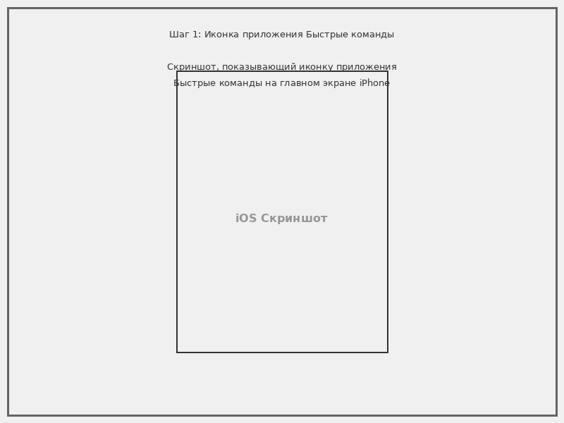
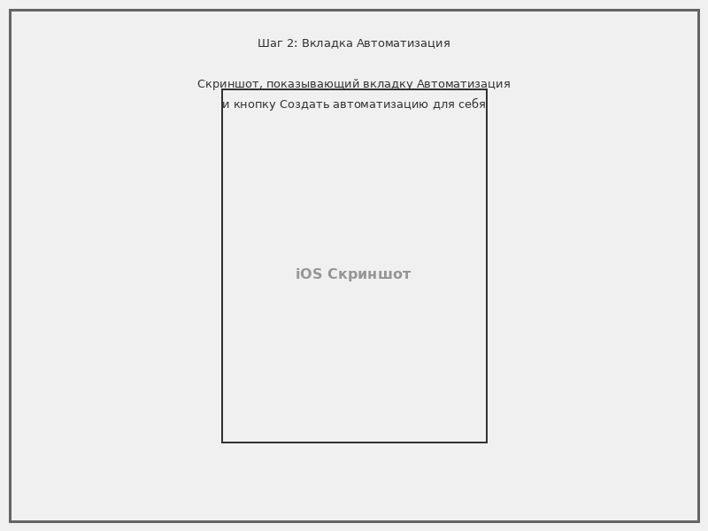
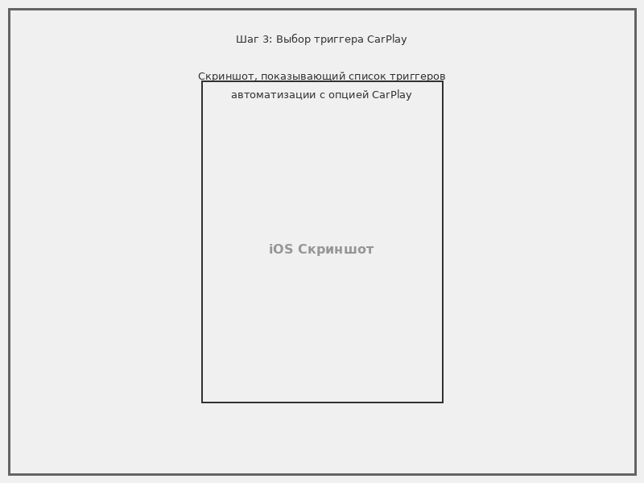
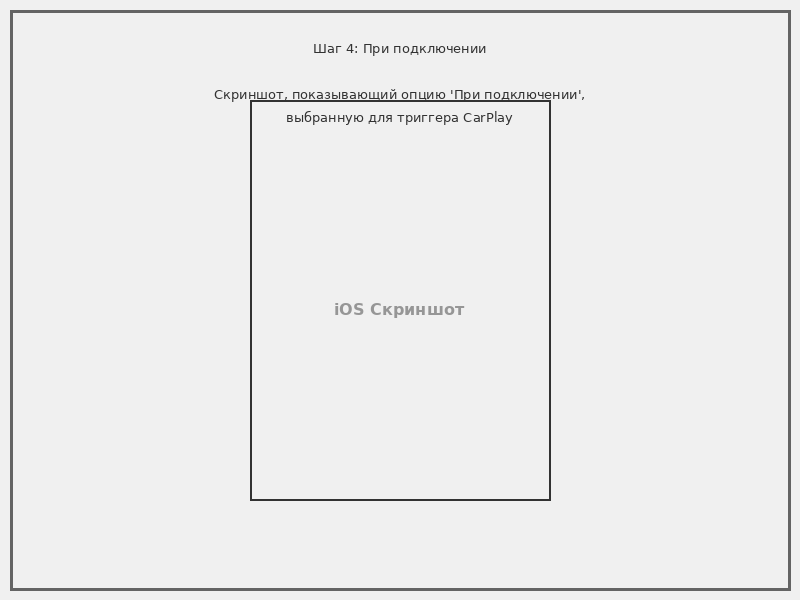
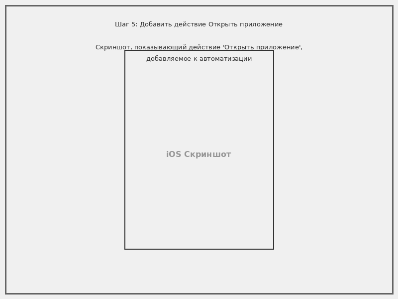
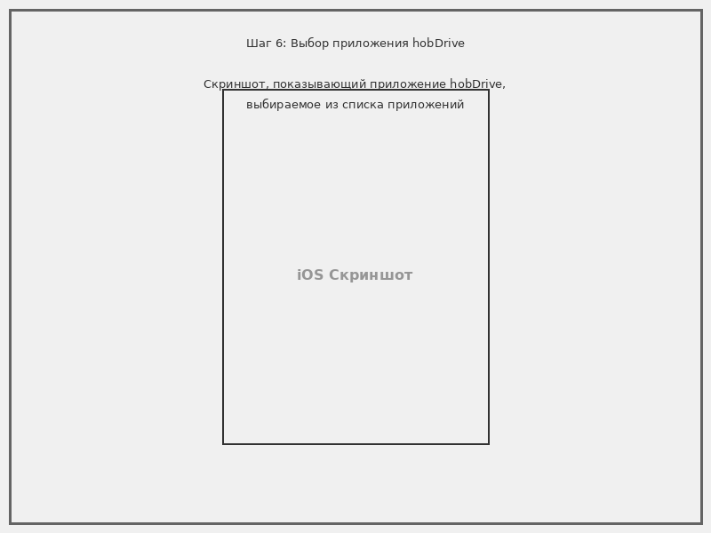
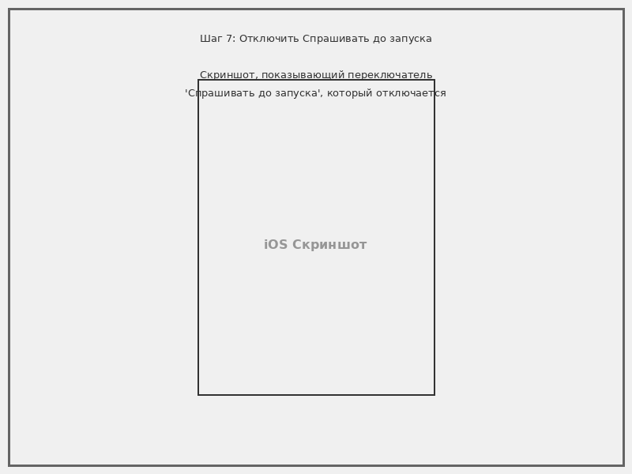
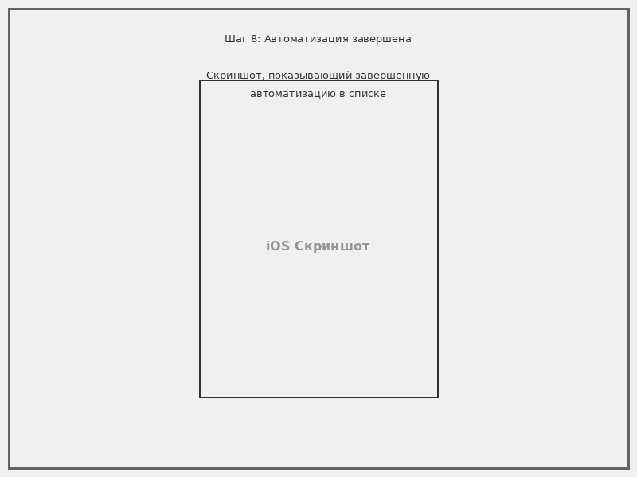

# Автоматический запуск hobDrive при подключении к CarPlay с помощью Быстрых команд iOS

Это руководство поможет вам настроить автоматический запуск приложения hobDrive при подключении iPhone к CarPlay с помощью приложения «Быстрые команды» (Shortcuts).

## Содержание
{:.no_toc}
* TOC
{:toc}

## Обзор

Приложение «Быстрые команды» iOS позволяет создавать автоматизации, которые срабатывают при определенных событиях на вашем устройстве. Настроив автоматизацию подключения к CarPlay, вы можете гарантировать, что hobDrive будет автоматически запускаться всякий раз, когда вы подключаетесь к системе CarPlay вашего автомобиля, делая процесс вождения удобным и бесшовным.

### Требования

- iPhone с iOS 13.1 или новее
- Автомобиль с поддержкой CarPlay или дополнительная CarPlay система
- Установленное приложение hobDrive на вашем iPhone
- Приложение «Быстрые команды» Apple (предустановлено на iOS 13+)

## Настройка автоматизации

Следуйте этим пошаговым инструкциям для создания автоматизации:

### Шаг 1: Откройте приложение «Быстрые команды»

Найдите и нажмите на приложение **Быстрые команды** на главном экране вашего iPhone. Значок выглядит как два перекрывающихся квадрата со скругленными углами.

Если вы не можете найти приложение «Быстрые команды», вы можете загрузить его из App Store (оно бесплатное и создано Apple).

### Шаг 2: Перейдите в раздел «Автоматизация»

1. Нажмите на вкладку **Автоматизация** внизу экрана
2. Если это ваша первая автоматизация, вы увидите экран с объяснением возможностей автоматизаций
3. Нажмите кнопку **Создать автоматизацию для себя** (или кнопку **+**, если у вас уже есть другие автоматизации)

### Шаг 3: Выберите триггер CarPlay

Прокрутите список триггеров автоматизации и выберите **CarPlay**.

Этот триггер будет активироваться всякий раз, когда ваш iPhone подключается к системе CarPlay или отключается от нее.

### Шаг 4: Настройте условия запуска

Вы увидите два варианта:

- **При подключении** - запускать автоматизацию при подключении к CarPlay
- **При отключении** - запускать автоматизацию при отключении от CarPlay

Выберите **При подключении**, нажав на этот вариант. Рядом с вашим выбором появится галочка.

Нажмите **Далее** в правом верхнем углу, чтобы продолжить.

### Шаг 5: Добавьте действие «Открыть приложение»

Теперь вам нужно указать автоматизации, что делать при подключении к CarPlay.

1. Нажмите **Добавить действие** или используйте поле поиска
2. В поле поиска введите «Открыть приложение»
3. Выберите действие **Открыть приложение** из результатов

### Шаг 6: Выберите приложение hobDrive

1. Нажмите на слово **Приложение** в блоке действия (оно будет отображаться как синяя ссылка)
2. Прокрутите список установленных приложений или используйте поле поиска, чтобы найти **hobDrive**
3. Нажмите **hobDrive**, чтобы выбрать его

Блок действия должен теперь показывать «Открыть hobDrive».

### Шаг 7: Отключите запрос перед запуском

По умолчанию iOS будет запрашивать ваше подтверждение перед выполнением автоматизации. Чтобы сделать её по-настоящему автоматической:

1. Нажмите **Далее** в правом верхнем углу
2. Вы увидите экран с итоговой информацией и переключателем **Спрашивать до запуска**
3. **ВЫКЛЮЧИТЕ** переключатель «Спрашивать до запуска»

Появится диалоговое окно с предупреждением о том, что автоматизация будет выполняться без вашего подтверждения. Нажмите **Не спрашивать**, чтобы подтвердить.

### Шаг 8: Завершите настройку

Нажмите **Готово** в правом верхнем углу, чтобы сохранить вашу автоматизацию.

Ваша автоматизация теперь активна и будет автоматически запускать hobDrive всякий раз, когда вы подключаетесь к CarPlay!

## Тестирование автоматизации

Чтобы убедиться, что ваша автоматизация работает корректно:

1. Убедитесь, что приложение hobDrive установлено и настроено
2. Если вы уже подключены к CarPlay, отключите ваш iPhone
3. Закройте приложение hobDrive, если оно запущено
4. Подключите ваш iPhone к CarPlay
5. Приложение hobDrive должно автоматически запуститься в течение нескольких секунд

## Устранение неполадок

### Автоматизация не запускается

- **Проверьте, что автоматизация включена**: Откройте «Быстрые команды» > вкладка «Автоматизация» и убедитесь, что переключатель рядом с вашей автоматизацией CarPlay включен (зеленый)
- **Проверьте, что «Спрашивать до запуска» отключено**: Отредактируйте автоматизацию и убедитесь, что этот переключатель выключен
- **Проверьте версию iOS**: Убедитесь, что у вас установлена iOS 13.1 или новее
- **Перезагрузите iPhone**: Иногда перезагрузка помогает решить проблемы с автоматизацией

### hobDrive не открывается

- **Проверьте имя приложения**: Убедитесь, что вы выбрали правильное приложение hobDrive в действии
- **Проверьте, что приложение установлено**: Убедитесь, что hobDrive правильно установлен и может быть открыт вручную
- **Пересоздайте автоматизацию**: Удалите автоматизацию и создайте её заново, следуя инструкциям выше

### Автоматизация запрашивает подтверждение

- **Отключите «Спрашивать до запуска»**: Отредактируйте автоматизацию и выключите переключатель «Спрашивать до запуска»
- **Подтвердите предупреждение**: При отключении убедитесь, что вы нажали «Не спрашивать» в диалоге подтверждения

## Дополнительные советы

### Добавление задержки

Если вы сталкиваетесь с проблемами из-за слишком быстрого запуска приложения (до полного подключения к CarPlay), вы можете добавить небольшую задержку:

1. Отредактируйте вашу автоматизацию
2. Перед действием «Открыть приложение» нажмите кнопку **+**
3. Найдите и добавьте действие «Ждать»
4. Установите время ожидания от 2 до 5 секунд
5. Теперь автоматизация будет ждать перед открытием hobDrive

### Множественные действия

Вы можете добавить больше действий к вашей автоматизации, например:

- Установка уровня громкости
- Включение режима «Не беспокоить во время вождения»
- Запуск определенного плейлиста
- Регулировка яркости экрана

Просто нажмите кнопку **+** между действиями и найдите то, что хотите добавить.

### Редактирование или удаление автоматизации

Чтобы изменить или удалить автоматизацию:

1. Откройте приложение «Быстрые команды»
2. Перейдите на вкладку **Автоматизация**
3. Нажмите на вашу автоматизацию CarPlay
4. Для редактирования: Внесите изменения и нажмите **Готово**
5. Для удаления: Прокрутите вниз и нажмите **Удалить автоматизацию**

## Заключение

Настройка этой автоматизации делает использование hobDrive с CarPlay простым и удобным. После настройки вам никогда не придется вручную запускать приложение при подключении к автомобилю — оно будет готово и ждет вас автоматически.

Для получения дополнительной помощи по функциям и настройкам hobDrive, пожалуйста, обратитесь к [Руководству пользователя](user-manual.md) или свяжитесь с [support@hobdrive.com](mailto:support@hobdrive.com).
