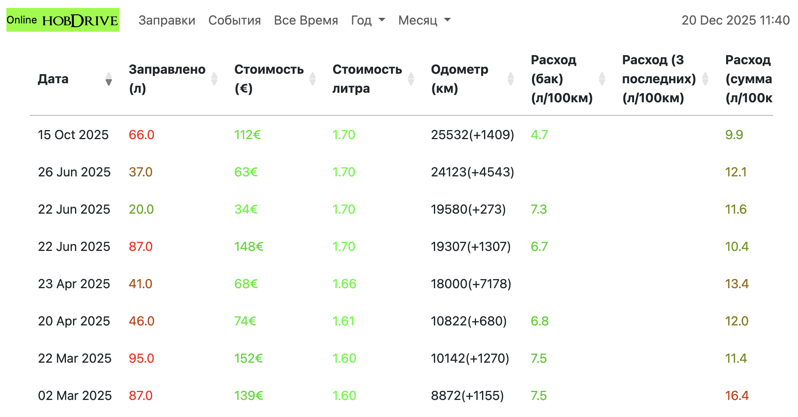
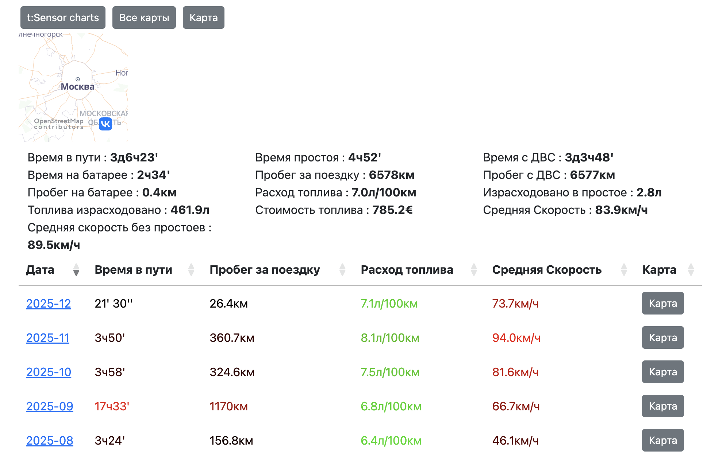
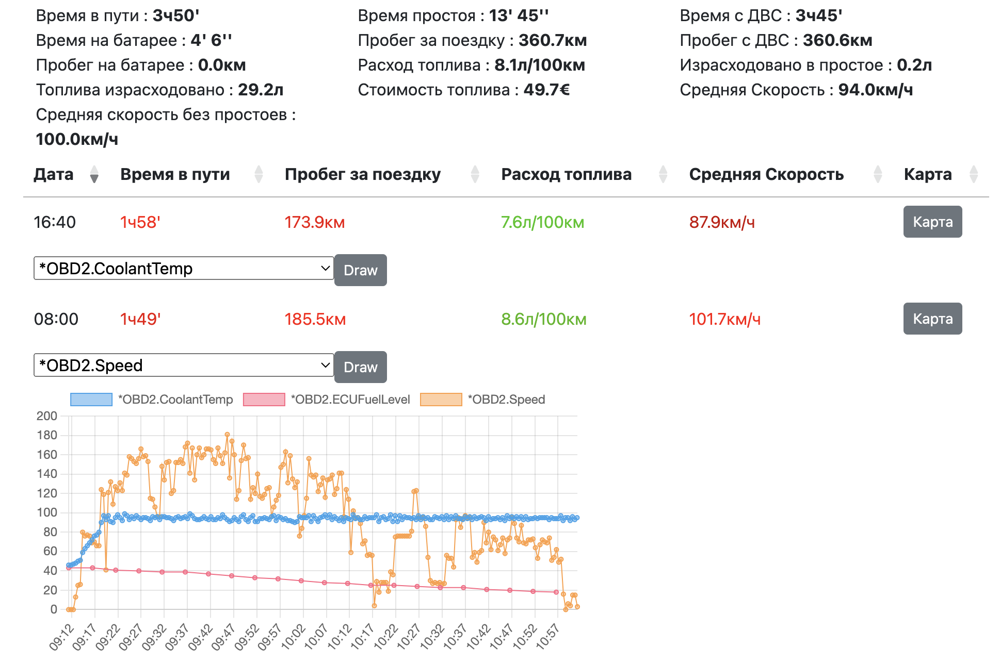

# Статистика поездок и записей

хобдрайв умеет генерировать и отображать статистику по всем вашим прошлым поездкам, с разделением по датам и разным интервалам.

Для генерации статистики выбрать: Действия - Обновить статистику.

Генерация на медленных устройствах может занять много времени.
Для отображения уже созданной статистики выберите: Действия - Открыть статистику.

## Статистика в облаке

Хобдрайв может выгружать данные в облако и держать актуальную версию вашей статистики в облаке.

В облачной статистике вы можете выбирать какие датчики записывать и с какой частотой

## Чтение статистики дома (на компьютере)

На всех платформах файлы со статистикой лежат в папке программы (андроид - на sd карте в папке hobdrive), в подпапке track_gen.
Можно скопировать все содержимое этой папки на компьютер и открыть в браузере файл output_alltime.html - вся статистика будет доступна для просмотра на компьютере.

## Корректировка и исправление

К сожалению на данный момент не реализованы исправления и редактирование записей статистики.

Из часто встречающихся проблем - исправление дат - можно сделать вручную.

В файлах user.events поля дат выглядят как

    "date":"63708138682290"

Чтобы перевести такую дату в читаемую форму, можно воспользоваться следующей Excel формулой:

    =(C3/1000-62135596800)/86400 + DATE(1970;1;1)

Где C3 - ячейка со значением  63708138682290

Конечный формат ячейки надо выставить в Дату

Для русского Excel функция называется ДАТА, а не DATE

    =(C3/1000-62135596800)/86400 + ДАТА (1970;1;1)

Для обратного перевода, из Excel даты в формат программы:

    =((C7-DATE(1970;1;1))*86400 + 62135596800)* 1000

или

    =((C7-ДАТА(1970;1;1))*86400 + 62135596800)* 1000