[English Index](../README.md) | [Индекс](../README-ru.md) 

[hobdrive.ru](http://hobdrive.ru/) | [support@hobdrive.com](mailto:support@hobdrive.com)

# Руководство пользователя HobDrive

HobDrive - это бортовой компьютер и диагностическая платформа для автомобиля, работающая через OBD-II адаптер и GPS/датчики устройства. Текущая версия руководства ориентирована на современные мобильные платформы: Android и iOS (включая CarPlay).

## Содержание
{:.no_toc}
* TOC
{:toc}

## Что умеет HobDrive сегодня

HobDrive объединяет в одном приложении:

- Отображение текущих параметров автомобиля и поездки в реальном времени.
- Диагностику ECU, чтение и сброс кодов ошибок.
- Аналитику расхода, заправок, стоимости владения и эффективности движения.
- Настраиваемые экраны, пользовательские сенсоры, темы и DashKits.
- Резервное копирование данных и фоновую выгрузку в облако.
- Дополнительные режимы: HUD, GPS-экран с графиками, экран ускорения, моточасы.

## Поддерживаемые платформы

- Android: виджеты, расширенные настройки интерфейса, облачную синхронизацию и DashKits.
- iOS: поддержка Bluetooth LE и Wi-Fi адаптеров, обновленные экраны и дублирующий экран CarPlay.

Примечание: старые платформы Windows/WinCE/WinMobile и связанные с ними инструкции более не поддерживаются и не описаны в этом руководстве.

## Быстрый старт

### 1. Подключите ELM327 адаптер

Откройте: **Экраны -> Настройки -> Параметры ELM соединения**.

Варианты подключения:

- **Bluetooth**: выберите адаптер из списка, или выберите BTLE4. На Android/iOS адаптер обычно нужно сначала спарить в системных настройках.
- **Wi-Fi**: подключитесь к Wi-Fi сети адаптера и укажите адрес в формате `ip:port`.
- **USB** (Android, если поддерживается устройством и адаптером): выберите обнаруженный USB-адаптер.
- **Симулятор**: для тестирования на основе GPS без реального автомобиля.

### 2. Проверьте статус связи

В индикаторе соединения:

- **Зеленый**: связь с адаптером и автомобилем активна.
- **Желтый**: адаптер найден, отвечает, но есть проблема связи именно с автомобилем.
- **Красный**: проблема связи с адаптером.

Эта индикация полезна для быстрой диагностики: теперь можно отдельно понять, где именно возникла проблема.

### 3. Выберите профиль автомобиля

Откройте: **Настройки -> Параметры автомобиля**.

Рекомендуемый порядок:

1. Попробуйте **Загрузить из шаблона**.
2. Если шаблона нет, настройте профиль вручную.
3. При удачной настройке отправьте профиль через **Поделиться**.

## Основы интерфейса

В приложении есть набор основных экранов и дополнительные экраны.

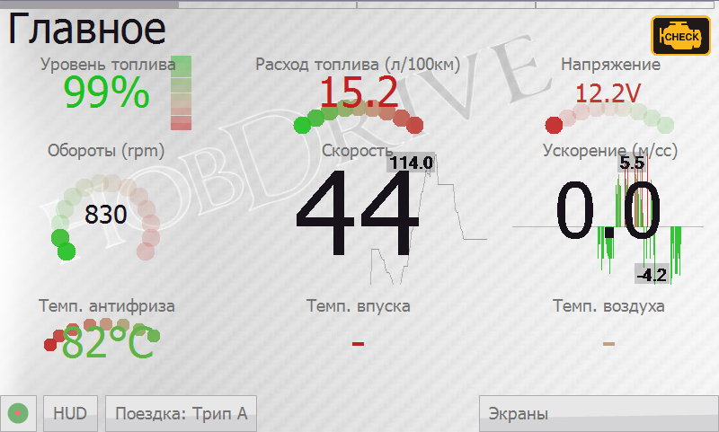

Навигация выполняется:

- свайпами между экранами,
- через верхнюю полосу быстрой навигации,
- через меню **Экраны**.

Долгое нажатие на сенсор открывает расширенную информацию о его расчете и исходных данных.

Активация свитка «Экраны» открывает доступ к дополнительным элементам управления:

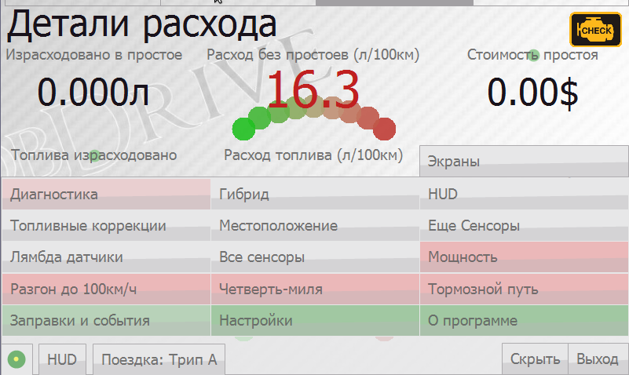

- Временное скрытие приложения (Скрыть)
- Выход из приложения
- Активация вкладки «Настройки»
- Выбор и активация дополнительных экранов
 
## Экран «Настройки»

Ключевые разделы:

- Параметры ELM соединения
- Параметры автомобиля
- Системные настройки
- Настройка вида сенсоров
- Сеть / Оформление / Язык / Величины / О программе

### Параметры автомобиля

На этом экране вы можете настроить тип автомобиля и параметры подключения. Для начала, если для вашей модели есть готовый профиль (**«Загрузить из шаблона»**), используйте его. И только при его отсутствии пробуйте настроить параметры вручную.

**Основные параметры профиля:**

- **Имя**: Название профиля вашего автомобиля.
- **Скопировать / Удалить**: Команды, позволяющие клонировать текущий профиль, задать ему новое имя, либо удалить. Последний профиль удалять нельзя.
- **Загрузить из Шаблона**: Выбрать один из готовых и протестированных профилей по моделям.
- **Поделиться**: Загрузить ваш текущий профиль на наш сайт (после обработки он будет доступен другим пользователям).
- **Тип**: Класс автомобиля и способ соединения с ELM адаптером. **Стандартный (Standard)** — для большинства OBD2 автомобилей. Для некоторых производителей HobDrive поддерживает специальные режимы подключения. Некоторые модели (например Toyota, Ford) при этом предлагают больше датчиков. Некоторые модели могут работать только со своим специфичным профилем (например ВАЗ Январь, Микас, ЭБУ Бош, Nissan Custom и др.).
- **Шаблон строки инициализации, строка инициализации**: Позволяют задать дополнительные ELM команды для настройки связи адаптера с автомобилем. В списке шаблонов присутствуют типичные команды инициализации для праворульных автомобилей и некоторых автомобилей, не полностью OBD2 совместимых. Для большинства OBD2 совместимых автомобилей этот параметр можно оставить пустым.

**Метод расчета топлива:**

Доступно несколько вариантов расчета топлива. Если вы не уверены какой метод поддерживает ваш автомобиль, выбирайте последовательно начиная с первого и контролируйте показания датчика «топлива в час» на холостом ходу.

- **MAF Датчик** (по умолчанию для большинства бензиновых автомобилей): Расчёт топлива ведётся по MAF (Mass Air Flow, ДМРВ, Датчик массового расхода воздуха).
- **MAP Датчик**: Подсчёт расхода по MAP датчику (Manifold Absolute Pressure, давление на впускном коллекторе). Требует калибровки.
- **Датчик Форсунки**: Подсчёт расхода по доступному на многих автомобилях Toyota (и некоторых других) датчику импульса форсунки. Требует калибровки.
- **Датчик нагрузки на двигатель (дизель)**: Подсчёт расхода топлива по датчику нагрузки на двигатель. Дает грубое приближение, используется только для **дизельных** автомобилей. Требует калибровки.
- **Встроенный датчик**: Подсчёт расхода по внутреннему датчику часового расхода автомобиля (присутствует например на автомобилях с ЭБУ Январь, Микас).

Для Toyota с датчиком форсунки, если этот вариант показывает расход, он предпочтительнее других. Для дизельных автомобилей адекватные показания рассчитывает только метод «Нагрузки на двигатель».

Каждый метод имеет свои калибровочные параметры (см. раздел "Калибровка и точность расчетов").

**Параметры коррекции и калибровки:**

- **Коррекция скорости**: Позволяет скорректировать показания скорости и пробега (пробег рассчитывается на основании скорости!). Необходим если у вас стоит неразмерная резина либо показания спидометра ошибочные. По умолчанию — «1».
- **Коррекция одометра (пробега)**: Отдельный коэффициент для выравнивания пробега с показаниями приборной панели. Позволяет корректировать пробег независимо от скорости. По умолчанию — «1».
- **Объем бака**: Используется при вычислении оценочного уровня топлива в баке. Всегда указывается в литрах. По умолчанию — 40л.
- **Вес**: Общий вес автомобиля в килограммах. Используется только в оценочных расчетах мощности и эффективности. По умолчанию — 1300кг.

**Параметры движения и работы двигателя:**

- **Максимальная скорость простоя**: Значение скорости, при котором считается что автомобиль стоит/находится в пробке. По умолчанию — «5 км/ч».
- **Температура прогретого двигателя**: Температура, при которой двигатель считается прогретым. Используется в показаниях датчиков пробега на холодном двигателе и «расходе на горячую». По умолчанию — «60°C».
- **Интервал для сброса поездки**: Интервал времени в секундах, при котором считается что включение зажигания приводит к новой поездке и сбросу значений расчётного интервала «Авто-Трип». По умолчанию — «600 сек» (10 минут).

**Коррекции для точных расчетов:**

- **Коррекция расхода при торможении двигателем**: Активирует повышенную точность расчёта расхода, используя информацию о состоянии «торможения двигателем». В этом состоянии ECU прекращает подачу топлива в цилиндры. По умолчанию — выключено. _Внимание_: не на всех автомобилях это состояние корректно считывается.
- **Коррекция расхода по LTFT (долговременной топливной коррекции)**: Хобдрайв использует LTFT для корректировки расхода. Может использоваться на некоторых автомобилях с методами MAF/MAP, а также на Toyota Prius для корректировки расхода при использовании био-этанола. По умолчанию — выключено.
- **Коррекция расхода по значению Lambda**: Хобдрайв использует значение Lambda (коэффициент топливно-воздушной смеси). Может улучшить точность подсчета расхода. Актуально для методов MAF/MAP. По умолчанию — выключено.

**Параметры отображения:**

- **Макс. Температура Антифриза**: Значение температуры, после которого HobDrive выдаст звуковое и визуальное предупреждение о перегреве. По умолчанию — 95°C.
- **Макс. Топливная Коррекция**: Максимальное значение долговременной топливной коррекции, после которого HobDrive выдаст предупреждение о неэффективности смеси. По умолчанию — 11%.

**Совет по калибровке:** Если расход по статистике стабильно отличается от расхода по заправкам, сначала выровняйте пробег (скорость/одометр), затем корректируйте топливные коэффициенты.

### Настройки экрана и сенсоров

Актуальные возможности:

- Удобный выбор сенсора с поиском и отображением текущего выбора.
- Настройка количества сенсоров и параметров отображения для экранов.
- Перестановка порядка главных экранов и выбор экранов, которые должны быть всегда активны.
- Настройка индикатора передачи (римские или арабские цифры).
- Параметры видимости даты/времени.

### Оформление

Поддерживаются:

- светлые и темные темы,
- несколько фоновых изображений в одной теме,
- расширенные параметры читаемости (например, контуры текста/значений с возможностью отключения).

## Основные и дополнительные экраны

### Основные показания

Экран текущего состояния автомобиля в движении. Все датчики (сенсоры) считываются последовательно, скорость обновления может зависеть от производительности ELM-адаптера и устройства. Задержка в чтении показаний может достигать 1-2 секунд.

**Основные сенсоры:**

- **Скорость**: Текущая скорость движения автомобиля. Показания снимаются с датчиков автомобиля и должны совпадать с показаниями спидометра. Может отличаться от реальной скорости по GPS. Для коррекции см. раздел калибровки.
- **Ускорение**: Мгновенное ускорение в метрах на секунду в квадрате, показывает интенсивность разгона или замедления.
- **Обороты**: Текущие обороты двигателя (RPM).
- **Уровень топлива**: Оценочный уровень топлива в баке. Требует начальной калибровки (см. экран «Детали топлива»).
- **Расход топлива**: Топливная экономичность в литрах на 100км за текущую поездку. Основной параметр эффективности автомобиля.
- **Напряжение**: Напряжение в бортовой сети автомобиля. Может использоваться для оценки работы генератора или уровня разрядки аккумулятора.
- **Температура антифриза**: Текущая температура антифриза (и двигателя). Основной параметр для оценки степени прогретости двигателя.
- **Температура впуска**: Температура воздуха на впуске в камеры сгорания. Обычно близка к температуре окружающего воздуха.
- **Температура воздуха**: Температура окружающей среды. Может быть недоступна на некоторых автомобилях.

Значения всех датчиков передаются ECU автомобиля и могут не совпадать с реальными показаниями. Различные датчики имеют разный период обновления. На датчиках с фоновым графиком можно видеть текущие минимальное и максимальное достигнутые значения.

**Управление через панель статуса:**

Нажав на всплывающую панель статуса (круг слева внизу), вы увидите:

- Детальный статус OBD2 и GPS соединений.
- Кнопку «Переподключиться» — для принудительной попытки подключения.
- Опцию «Режим быстрого чтения» — отключает вычисление расчетных данных и фокусируется на скорости опроса видимых данных, используется для диагностики.

### Бортовой компьютер

Экран описывает основные показатели текущей поездки либо выбранного интервала времени. Позволяет оценить как совокупную эффективность и стоимость пробега, так и мгновенные показатели расхода.

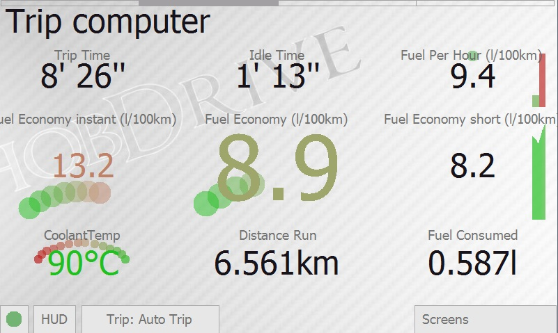

**Основные метрики:**

- **Время в пути**: Время проведенное в автомобиле с включенным зажиганием.
- **Время простоя**: Время стояния в пробках, на светофорах с работающим двигателем. Простоем считается движение с очень маленькой скоростью (значение по умолчанию — 5 км/ч).
- **Топлива в час**: Мгновенный расход топлива в единицу времени в литрах. Обычные показания для холостого хода — от 0.5 до 1.5 литров в час. Позволяет контролировать режим работы двигателя и влияние дополнительных источников нагрузки (например, кондиционер).
- **Мгновенный расход**: Топливная экономичность (в литрах на 100км) за последние несколько секунд. Позволяет оценить экономичность в динамике.
- **Расход топлива**: Общий расход за поездку (выбранный интервал времени) в литрах на 100км. Основной параметр оценки совокупной эффективности.
- **Кратковременный расход**: Топливная экономичность за последние несколько минут. Позволяет проследить эффективность движения в краткосрочном интервале.
- **Пробег за поездку**: Общий пробег за поездку. См. раздел калибровки для выравнивания с приборной панелью.
- **Топлива израсходовано**: Общее количество топлива в литрах за поездку.

**Выбор интервала времени:**

При нажатии на кнопку «Поездка» HobDrive отобразит доступные отслеживаемые интервалы времени. При смене активного интервала все данные на экранах изменятся.

- **Авто Трип**: Текущая поездка. Определяется автоматически как только интервал между включениями зажигания превысит предустановленное значение (10мин. по умолчанию).
- **День**: Накопленные показания за сегодняшний день. Сбрасываются в полночь.
- **Неделя**: Накопленные показания за неделю. Сбрасываются в полночь каждого воскресенья.
- **Месяц**: Накопленные показания за месяц.
- **Все время**: Накопленные показания за все время работы HobDrive.
- **Заправка**: Накопленные показания за текущую заправку. HobDrive сбрасывает интервал при вводе новой записи о заправке.
- **Трип А, Трип Б**: Накопленные показания для двух поездок, управляемых и сбрасываемых по вашему желанию.

Вручную можно сбрасывать накопленные показания для «Авто поездки» и для поездок «Трип А, Б».

### Детали расхода

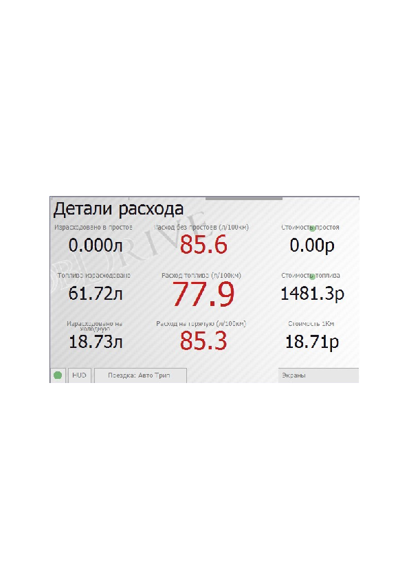

Экран показывает детальную информацию по расходу топлива:

- Расход топлива в простоях (пробках, светофорах),
- Топливная экономичность без учета простоев,
- Сумма, потраченная на простой в пробках,
- Сумма, потраченная на текущую поездку,
- Количество топлива, израсходованного на прогрев двигателя (до температуры 60°C),
- Расход топлива только на прогретом двигателе,
- Стоимость топлива на 1 километр пробега.

Сенсоры с зеленым индикатором означают возможность дополнительной настройки. При нажатии на показания стоимости откроется экран с настройкой текущей стоимости литра топлива и используемой валюты.

### Детали топлива

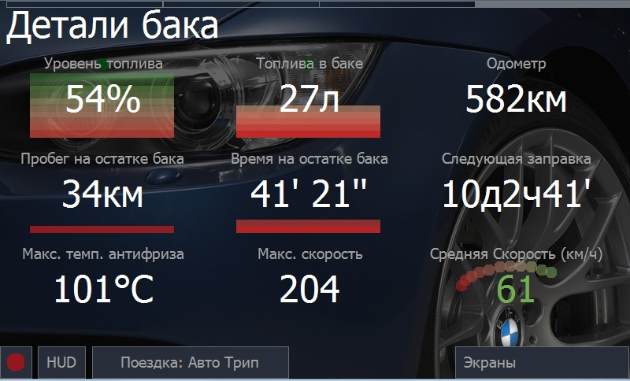

Экран показывает детальную информацию по уровню топлива и калибровке бака.

Текущий **оценочный уровень топлива** и **оценочное количество топлива** в баке вычисляются на основе информации о введенных заправках и показаниях расхода.

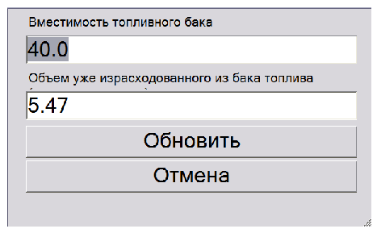

При нажатии на один из сенсоров уровня топлива откроется диалог калибровки топливного бака. При первом использовании необходимо ввести объем вашего бака и примерное количество уже потраченного топлива.

Затем HobDrive сам уменьшает расчетное количество топлива в баке. Для поддержания его в актуальном состоянии необходимо вести записи о заправках.

Дополнительно на экране рассчитываются:

- **Пробег на остатке** топлива в баке,
- **Время непрерывного движения** на остатке,
- **Следующая заправка** — примерное время следующей заправки на основе средненедельных трат,
- **Максимальные температура и скорость** — значение максимальной наблюдаемой величины,
- **Средняя скорость** — вычисляется за текущий выбранный интервал времени с учетом всех простоев.

Некоторые машины передают от ЭБУ реальный показатель уровня топлива (сенсор **ECUFuelLevel**). В HobDrive этот показатель перекрывается расчетным, основанным на введенных данных и расходе.

### Заправки и события

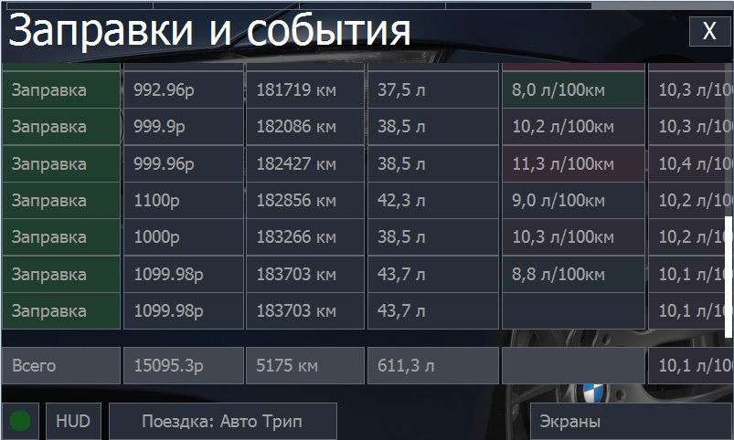

Экран служит для анализа информации по заправкам и событиям, сохраненных HobDrive.

В отображаемой таблице присутствуют следующие поля:

- **Категория**: категория события. При нажатии на любую из категорий, происходит фильтрация отображаемых записей.
- **Стоимость**: сумма, потраченная на событие или заправку.
- **Одометр**: показание одометра при вводе записи.
- **Заправлено**: Для записей по заправкам — количество залитых литров.
- **Расход мгновенный, суммарный**: Два вычисляемых поля, показывающих оценочный расход топлива. Мгновенный — расход с последней заправки (корректен при заправках «до полного бака»). Суммарный — совокупный расход за все предыдущие заправки.
- **Тэги, заметки** — произвольные данные, которые вы можете добавлять к записи.
- **Дата** — дата события.

Последней записью отображается строка с суммарными цифрами: общий пробег, общая сумма, суммарный расход.

Доступны сортировка, фильтры и редактирование записей.

**Ведение записей:**

Данные вводятся через свиток «Действия»:

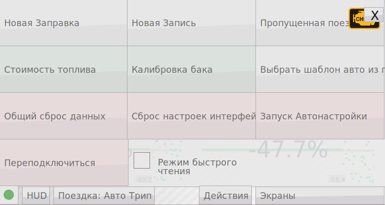

- **Новая заправка**: При каждой заправке выбрав это действие, введите объем залитого топлива, стоимость, показания одометра и заметки. 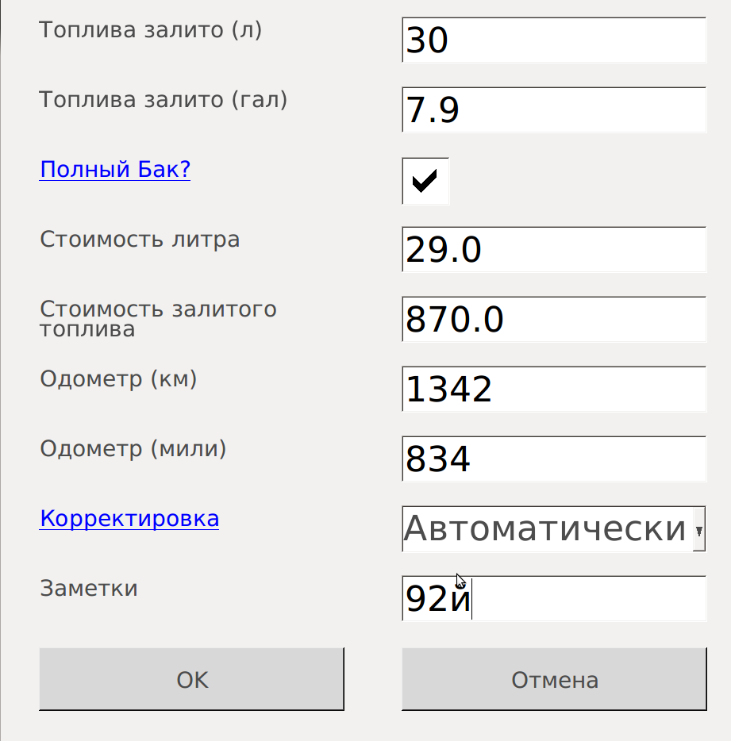 HobDrive может сравнить свои оценочные показания одометра с реальными. Вы можете выбрать способ корректировки: автоматически, в диалоге вручную, или только исправить значение одометра без корректировки расхода.

- **Новая запись**: Введите произвольную запись об обслуживании автомобиля.

- **Пропущенная поездка**: Позволяет внести исправление в расчетные данные, добавив неучтенную поездку (например, когда вы забыли включить HobDrive). 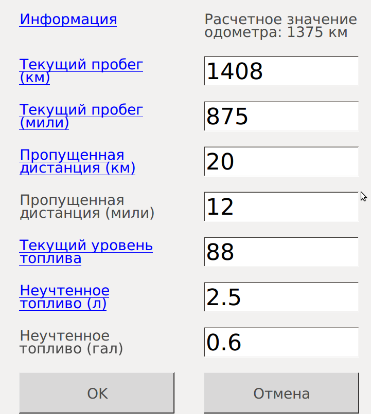 Введите текущее показание одометра, HobDrive рассчитает примерный объем израсходованного топлива (вы можете скорректировать). В автомобилях с ЭБУ датчиком уровня топлива эти значения будут введены автоматически.

Используя записи о заправках, HobDrive позволяет оценить ваши расходы на топливо, совокупную стоимость владения и стоимость километра пробега.

### GPS и движение

На GPS-экране доступны графики и улучшенное отображение направления движения.

**Экран Ускорения**: Отдельный экран данных ускорения с анализом данных G-сенсора устройства и определением направления.

**Экран Мощности**: Улучшен рассчет на основе актуальных параметров.

### Моточасы

Экран EngineHours показывает суммарное время работы двигателя и полезен для планирования обслуживания (каждые N моточасов).

### Диагностика и дополнительные экраны

Помимо основных экранов, HobDrive предоставляет расширенную диагностическую информацию.

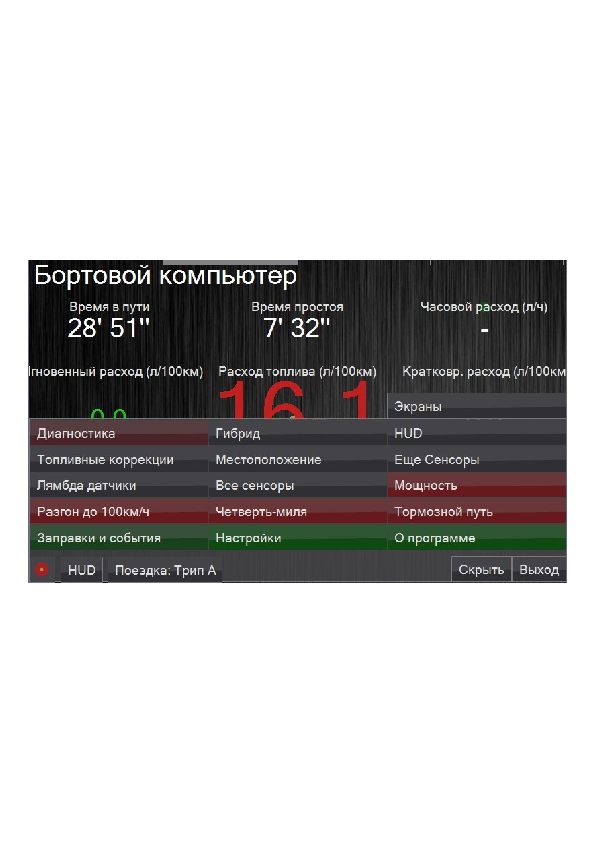

**Экран Диагностика**: Экран для диагностики различных предупреждений, ошибок двигателя и их описаний.

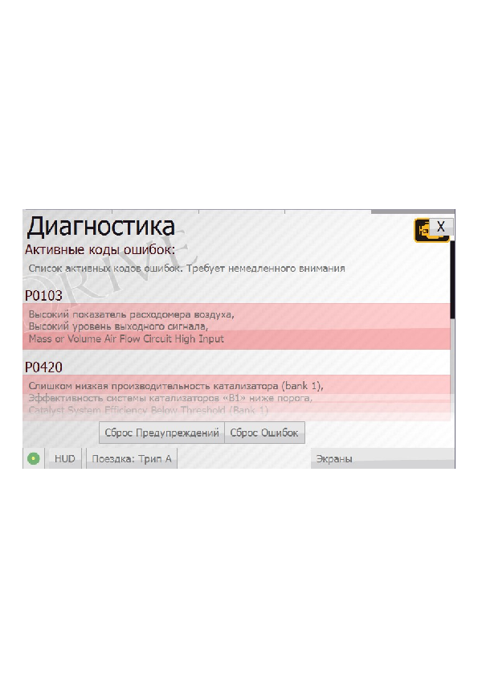

При активации происходит считывание кодов неисправностей:

- **Активные коды**: требуют немедленного внимания и диагностики.
- **Ожидаемые коды**: потенциальные ошибки в будущем.

Кнопка «Сброс ошибок» позволяет сбросить коды если то необходимо. _Внимание_: сброс не решает саму проблему. Коды freeze-frame могут быть полезны для диагностики в сервисе.

## Настройка внешнего вида сенсоров

Активация режима настройки происходит через «Экраны → Настройки → Настройка вида сенсоров».

При активации этого режима нажатие на любом сенсоре на любом экране открывает диалог конфигурации.

В диалоге настраиваются:

- тип виджета (текстовый, линейный индикатор, круговой индикатор, график),
- диапазон типирования,
- должные цвета,
- другие визуальные параметры.

Каждый из параметров имеет описание (вы можете нажать на юточку при длительном нажатии).

**Экран Топливные коррекции**:

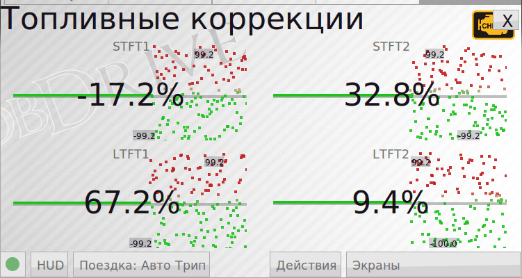

Топливные коррекции STFT (краткосрочная) и LTFT (долгосрочная) — это параметры ЭБУ, определяющие эффективность автомобиля в использовании топливно-воздушной смеси.

На старых или загрязненных двигателях их абсолютная величина может достигать больших значений (20% и больше) и может спровоцировать коды ошибок. Топливные коррекции в пределах нескольких процентов означают нормальную работу двигателя.

**Экран Лямбда датчики**:

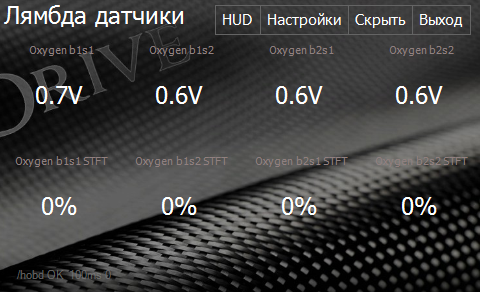

Показывает показания датчиков кислорода (не все четыре могут присутствовать данрава в зависимости от автомобиля).

**Экран Еще сенсоры, сенсоры Toyota, список сенсоров**:

Дополнительные сенсоры, в основном интересные для профессиональной диагностики.

Экран со списком всех датчиков позволяет выбрать любой и начать чтение его значения.

## HUD режим

HUD скрывает лишние элементы интерфейса и подготавливает изображение для проекции на стекло. Используйте в первую очередь как вспомогательный режим, не отвлекающий от дороги.

## Управление данными, резервные копии и облако

В диалоге **Управление данными** доступны:

- создание резервной копии,
- восстановление,
- фоновая выгрузка в облако,
- настройка периодичности выгрузки,
- удаление старых данных.

Рекомендация: включите регулярный бэкап, особенно перед сменой устройства или перед тестированием новых DashKits.

## DashKits, темы и расширяемость

HobDrive поддерживает настройку внешнего вида и логики экранов через DashKits.

Что можно делать:

- подключать готовые панели и темы,
- выбирать скины в диалоге DashKits,
- использовать несколько изолированных наборов пользовательских переопределений,
- добавлять собственные экраны и оформление под конкретный сценарий.

Для опытных пользователей доступны дополнительные возможности раскладок: условный вывод (`if`), фильтры сенсоров, управление видимостью элементов, графические декораторы, параметры стадий отрисовки.

## Android: виджеты

В Android поддерживаются виджеты, которые отображаются в стиле приложения и настраиваются под нужные сенсоры/параметры. Это удобно для быстрого просмотра ключевых данных без открытия приложения.

## iOS и CarPlay

iOS находится в полноценном рабочем контуре HobDrive:

- поддержка Wi-Fi и Bluetooth LE адаптеров,
- улучшения стабильности подключения,
- обновленные экраны и обработка системных сценариев,
- поддержка дублирующего экрана в CarPlay.

Рекомендация для iOS: после обновлений системы проверяйте повторно разрешения Bluetooth/геолокации и доступность адаптера в системных настройках.

## Калибровка и точность расчетов

### Базовый алгоритм калибровки

1. Введите минимум 2-3 заправки с точными литрами и одометром.
2. На экране «Все заправки» видны рассчеты расхода «по баку» (за четверть ресурса, так сказать).
3. Грубо сравните этот показатель с расходом, который показывает HobDrive на экране «Бортовой компьютер» на длинном интервале (например, «Месяц» или «Все время»).
4. Корректируйте калибровочные параметры выбранного метода (см. раздел коэффициентов ниже).

### Коэффициенты для метода MAF

- **Коэффициент топливно-воздушной смеси (AFR)**: Коэффициент, означающий отношение топлива к воздуху. Неэтилированный бензин: 14.7:1, Пропан: 15.5:1, Природный газ: 17.2:1, Дизель: 14.6:1, Этанол: 9.0:1

### Коэффициенты для метода MAP

- **AFR**: аналогично MAF
- **Объем двигателя** (литрах). По умолчанию: 1.8л
- **Объемная эффективность (VE)**: Корректировочная константа. По умолчанию: 95%

### Коэффициенты для метода на датчике форсунки

- **Число цилиндров**: Не цилиндрам. По умолчанию: 4
- **Производительность форсунки** (мл/мин). Осторожно: исторически дается половина реальной производительности. По умолчанию: 134.23

### Коэффициенты для метода нагрузки двигателя

- **Коэффициент расхода по нагрузке**: Глобальный корректирующий. По умолчанию: 1
- **Кривая коэффициента по нагрузке**: Набор чисел (разделенных запятой) где каждое относится к коэффициенту расхода при определённом RPM. Например: 0.025, 0.025, 0.10, 0.20, 0.3, 0.4, 0.3, 0.3, 0.3, 0.3

### Пример расчёта

Дано: реальный расход 12 л/100км, HobDrive показывает 11 л/100км.

Для MAF метода: новый AFR = 14.7 × (12/11) ≈ 16.0

Для MAP: новый VE = 95 × (12/11) ≈ 104%

Для Injector: Производительность = 134.23 × (12/11) ≈ 146.4

### Важный формат чисел

Для десятичных параметров используйте точку как разделитель дробной части.

## Типичные проблемы

### Нет подключения к машине

- Проверьте, что адаптер виден в системе и выбран верный тип подключения.
- Посмотрите цвет статуса: красный (адаптер) или желтый (авто).
- Для нестабильных адаптеров увеличьте задержку общения с ELM.

### Неверный расход/пробег

- Проверьте метод расчета топлива.
- Проверьте коэффициенты скорости и одометра.
- Сверьте статистику с фактическими заправками.

### После обновления «поехал» интерфейс

- Проверьте выбранные тему/скин/DashKit.
- Отключите проблемный кастомный набор и проверьте поведение на стандартной теме.

## Раздел для будущих расширений

Этот раздел зарезервирован для развития руководства. Рекомендуемые будущие главы:

- Подробный гайд по созданию собственного DashKit с примерами.
- Каталог рекомендуемых пользовательских экранов по сценариям (город, трасса, диагностика).
- Отдельные best practices для CarPlay и Android-виджетов.
- Расширенный раздел по облачной аналитике и обмену данными между устройствами.

## Важное предупреждение по безопасности

Автомобиль является источником повышенной опасности. Не настраивайте сложные параметры и не анализируйте детально экраны во время движения. Выполняйте настройку на стоянке.
