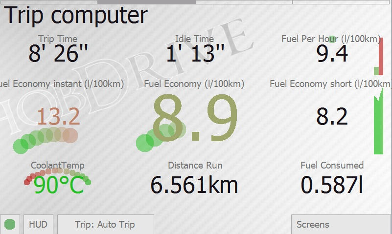
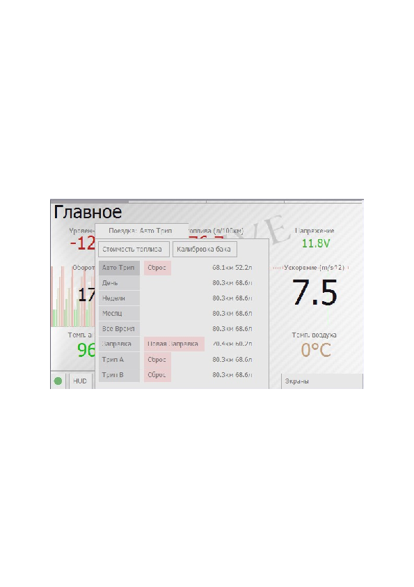
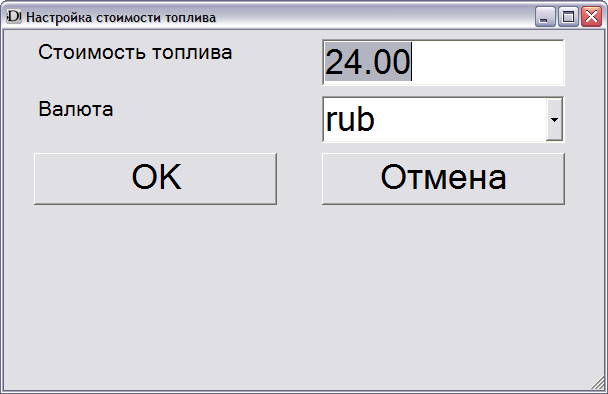
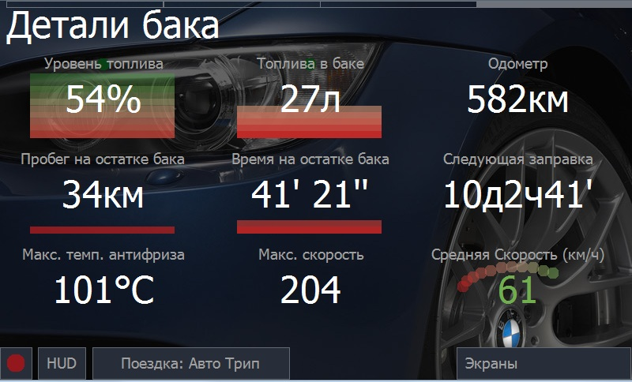
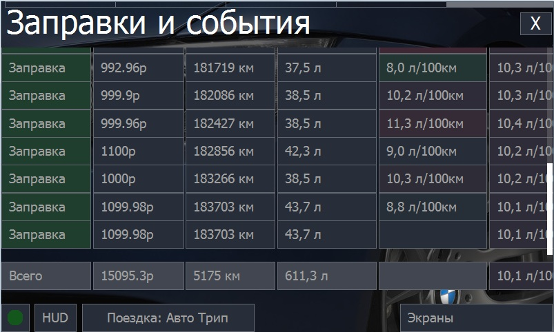
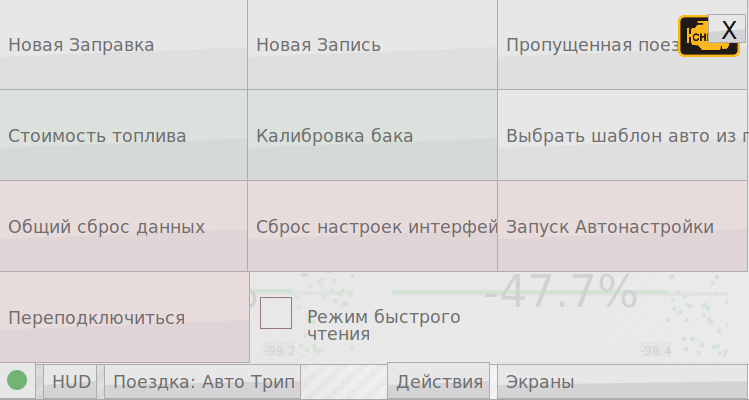
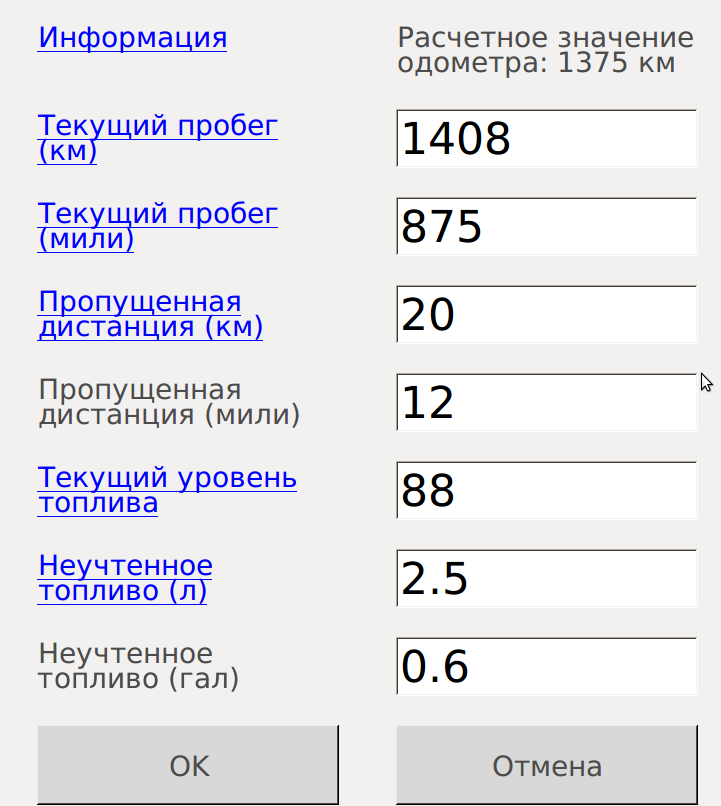
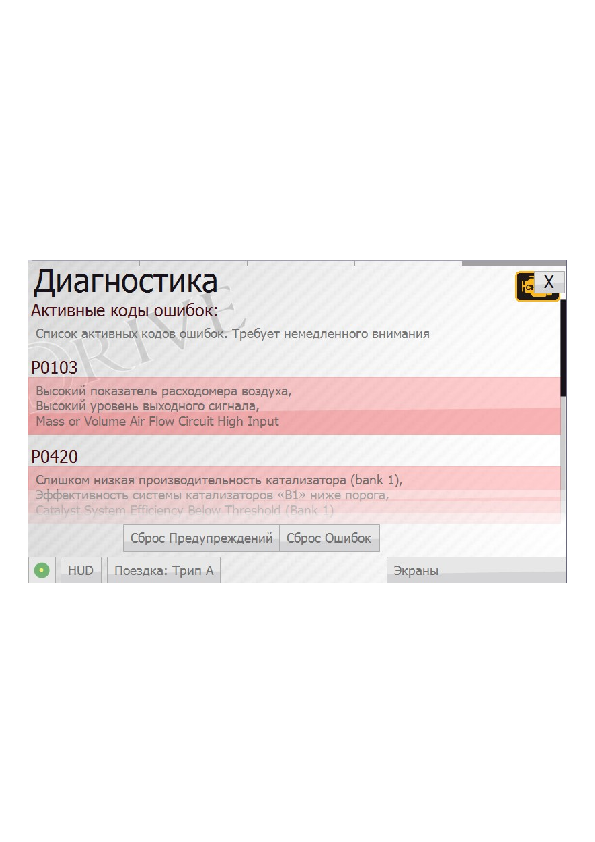
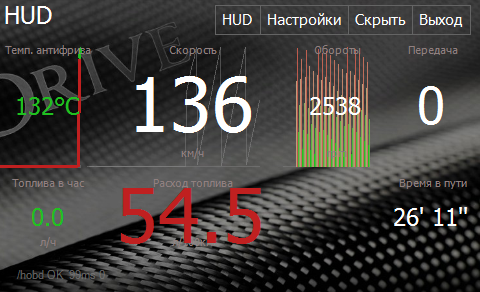
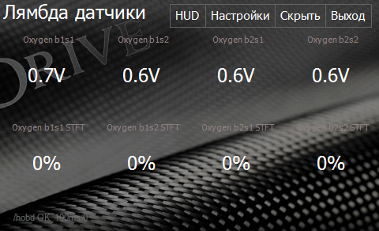

[http://hobdrive.com](http://hobdrive.com/)  
<http://хобдрайв.рф>  
[support@hobdrive.com](mailto:support@hobdrive.com)

# Руководство пользователя

ХобДрайв - это программный комплекс, взаимодействующий с автомобилем посредством OBD-II и GPS адаптеров, и реализующий функциональный и гибкий Бортовой компьютер на основе мобильных и встроенных устройств. Хобдрайв работает на системах с Windows, Android, iOS.

## Содержание

1. [Введение в функции](#введение-в-функции)
2. [Основы интерфейса](#основы-интерфейса)
3. [Начало работы](#начало-работы)
   - [Соединение с автомобилем](#соединение-с-автомобилем)
   - [Экран «Настройки»](#экран-настройки)
   - [Экран «Параметры Автомобиля»](#экран-параметры-автомобиля)
   - [Экран «Системные настройки»](#экран-системные-настройки)
     - [Закладка «Версия и обновления»](#закладка-версия-и-обновления)
     - [Закладка «Оформление»](#закладка-оформление)
     - [Закладка «Язык»](#закладка-язык)
     - [Закладка «Величины»](#закладка-величины)
4. [Использование](#использование)
   - [Экран «Основные показания»](#экран-основные-показания)
   - [Экран «Бортовой Компьютер»](#экран-бортовой-компьютер)
   - [Экран «Детали Расхода»](#экран-детали-расхода)
   - [Экран «Детали Топлива»](#экран-детали-топлива)
   - [Дополнительные экраны](#дополнительные-экраны)
     - [Экран «Заправки и события»](#экран-заправки-и-события)
     - [Ведение записей по автомобилю](#ведение-записей-по-автомобилю)
     - [Экран «Диагностика»](#экран-диагностика)
     - [Экран «HUD»](#экран-hud)
     - [Экран «Топливные коррекции»](#экран-топливные-коррекции)
     - [Экран «Еще сенсоры»](#экран-еще-сенсоры)
     - [Экран «Лямбда датчики»](#экран-лямбда-датчики)
     - [Экран «Сенсоры Toyota»](#экран-сенсоры-toyota)
     - [Экран «Список сенсоров»](#экран-список-сенсоров)
     - [Разгон до 100км/ч](#разгон-до-100кмч)
     - [Четверть мили](#четверть-мили)
     - [Тормозной путь](#тормозной-путь)
5. [Настройка внешнего вида сенсоров](#настройка-внешнего-вида-сенсоров)
6. [Калибровка параметров](#калибровка-параметров)
   - [Настройка коэффициентов](#настройка-коэффициентов)
7. [«Бета» функции](#бета-функции)
8. [Типичные проблемы](#типичные-проблемы)
9. [Аппаратные требования (Windows)](#аппаратные-требования-windows)
10. [Аппаратные требования (Android)](#аппаратные-требования-android)
11. [Дополнительные требования](#дополнительные-требования)
12. [Особенности установки и настройки](#особенности-установки-и-настройки)
    - [Установка на персональный компьютер (carputer, car pc)](#установка-на-персональный-компьютер-carputer-car-pc)

##

# Введение в функции 

Хобдрайв, это:

- Мощный, гибкий и функциональный графический интерфейс, превосходящий классические бортовые компьютеры по удобству и возможностям.
- Возможность полной интеграции в существующую мультимедиа систему автомобиля.
- Единое устройство отображения всей информации - без дополнительных датчиков, панелей и экранов.
- Уникальные функции анализа и сбора статистики.

## Основы интерфейса 

Главный экран бортового компьютера:

Сверху на экране располагаются:

- Название
- Полоса быстрой навигации между экранами

Снизу:

- Всплывающая панель статуса соединения
- Кнопка HUD (Проекция на лобовое стекло)
- Панель текущей поездки и информации
- Панель с дополнительными экранами

ХобДрайв управляется с сенсорного экрана нажатиями на элементы управления либо нажатием и прокруткой (сдвигом) элементов для перелистывания экранов и просмотра информации выходящей за границы текущего экрана.

Смена между четырьмя основными экранами производится различными способами:

- Перелистыванием (нажатием, удержанием и сдвигом)
- Нажатием на соответствующую область в полосе быстрой навигации
- Клавишами джойстика (если есть)

Активация свитка «Экраны» открывает доступ к дополнительным элементам управления:

- Временное скрытие приложения (Скрыть)
- Выход из приложения
- Активация вкладки «Настройки»
- Выбор и активация дополнительных экранов

При длительном нажатии и удержании на любом из сенсоров открывается информационное окно с детальной информацией и описанием датчика.

## Начало работы 

### Соединение с автомобилем 

Перед началом использования ХобДрайв необходимо настроить для соединения с вашим автомобилем.

При первом запуске ХобДрайв предложит вам выбрать адрес (порт) вашего ELM OBD-II адаптера.

Вы можете активировать этот экран позже, выбрав  
«Экраны» →«Настройки» → «Параметры ELM соединения»

**ELM327-USB**

Если у вас USB-ELM адаптер, вам необходимо узнать и выбрать номер COM порта, который ему назначен. При подключении ELM адаптера этот порт появляется, при отключении адаптера - пропадает.

**ELM327-Bluetooth**

Если у вас Bluetooth-ELM адаптер, вы должны выбрать его имя из списка. В диалоге ввода PIN кода вы можете ввести PIN код для соединения с вашим адаптером (указан в документации к адаптеру).

На некоторых навигаторах нужно предварительно добавить устройство ELM адаптера в список доверенных (trusted) в системном менеджере bluetooth.

На Android платформе вам необходимо сначала «спарить» ELM327 адаптер с вашим устройством - только тогда оно появится в списке подключения.

**ELM327-WiFi**

Для подключения WiFi ELM адаптера вам нужно настроить wifi сеть в соответствии с руководством адаптера, и затем ввести адрес адаптера в форме:

**Android:**

192.168.56.1:1234

**Windows:**

tcp://192.168.56.1:1234

После выбора вашего устройства и закрытия диалога, хобдрайв начнет подключение.

Статус должен смениться на Желтый (в деталях соединения появиться сообщение INIT - инициализация), а затем Зеленый OK - сигнализирующий об успешном соединении с автомобилем.

Красный статус и сообщение ERROR в статусной строке означает проблемы соединения с адаптером либо автомобилем. См. Секцию «Типичные проблемы».

**Windows:**

Если статус Bluetooth отображает «fail» - это может означать что ваше устройство не поддерживает полноценный bluetooth стек, необходимый хобдрайву. Либо BT стек не включён (и вам нужно включить его вручную в системном менеджере).

На некоторых устройствах с widcomm стеком необходимо сначала «спарить» смартфон/навигатор с ELM адаптером, а уже затем подключаться к нему из диалога настройки хобдрайв-а.

Дополнительный параметр «Задержка в общении с ELM» используется с проблемными ELM адаптерами, которые не могут работать на высокой скорости и часто «обрывают» соединение. Подберите минимальную задержку, при которой обрывов не происходит.

### Экран «Настройки» 

После успешного соединения вы можете дополнительно настроить хобДрайв, активировав экран «Настройки».

В вашем распоряжении следующие закладки:

- Параметры ELM соединения
- Параметры Автомобиля
- Системные настройки
- Настройка вида сенсоров
- «Сеть», «Оформление», «Язык», «Величины», «О программе»

### Экран «Параметры Автомобиля» 

На этом экране вы можете более точно настроить тип автомобиля, с которым работает хобДрайв.

Хобдрайв поддерживает довольно много параметров подключения, позволяющих тонко настроить работу бортового компьютера.

Для начала, если для вашей модели есть готовый профиль (**«Загрузить из Шаблона»**), используйте его. И только при его отсутствии пробуйте настроить параметры вручную.

- **Имя:** Название профиля вашего автомобиля.
- **Скопировать**, **Удалить**: команды, позволяющие клонировать текущий профиль, задать ему новое имя, либо удалить. Последний профиль удалять нельзя.
- **Загрузить из Шаблона**: выбрать один из готовых и протестированных профилей по моделям.
- **Поделиться**: Загрузить ваш текущий профиль на наш сайт (после обработки он будет доступен другим пользователям)
- **Тип**: Класс автомобиля и способ соединения с ELM адаптером. **Стандартный (Standard) -** для большинства OBD2 автомобилей. Для некоторых производителей хобдрайв поддерживает специальные режимы подключения. Некоторые модели (например Toyota, Ford) при этом предлагают больше датчиков. Некоторые модели могут работать только со своим специфичным профилем (например ВАЗ Январь, Микас, ЭБУ Бош, Nissan Custom и др.)
- **Шаблон строки инициализации, строка инициализации**: позволяют задать дополнительные ELM команды для настройки связи адаптера с автомобилем. В Списке шаблонов присутствуют типичные команды инициализации для праворульных автомобилей, и некоторых автомобилей, не полностью OBD2 совместимых. Для большинства OBD2 совместимых автомобилей этот параметр можно оставить пустым.
- **Метод расчета топлива:** Способ расчёта топлива, используемый в вашем автомобиле. Доступно несколько вариантов:

- **MAF Датчик:** Это вариант по умолчанию для большинства современных бензиновых автомобилей. Расчёт топлива в этом варианте ведётся по MAF (Mass Air Flow, ДМРВ, Датчик массового расхода воздуха).
- **MAP Датчик:** Подсчёт расхода по MAP датчику (Manifold Absolute Pressure, Давление на впускном коллекторе). Требует калибровки (см. Калибровка параметров)
- **Датчик Форсунки:** Подсчёт расхода по доступному на многих автомобилях Toyota (и некоторых других) датчику Импульса Форсунки. Требует калибровки (см. Калибровка параметров)
- **Датчик нагрузки на двигатель (дизель):** Подсчёт расхода топлива по датчику нагрузки на двигатель. Дает грубое приближение данных о расходе, используется только для **дизельных** автомобилей. Требует калибровки (см. Калибровка параметров).
- **Встроенный датчик**: Подсчёт расхода по внутреннему датчику часового расхода автомобиля (присутствует например на автомобилях с ЭБУ Январь, Микас).

В случае, если вы не уверены какой метод поддерживает ваш автомобиль, выбирайте последовательно начиная с первого и контролируйте показания датчика «топлива в час» на холостом ходу.

В случае если у вас автомобиль Toyota и вариант «**Датчик Форсунки**» показывает расход топлива, предпочтительнее использовать именно его.

Для дизельных автомобилей адекватные показания рассчитывает только метод «**Нагрузки на двигатель**»

У каждого метода расчёта расхода существуют свои калибровочные параметры. Пустые поля означают значения по умолчанию, но для более точного расчёта их необходимо калибровать (см. Калибровка параметров).

Все последующие параметры - необязательны и могут использоваться для более точной подстройки работы хобдрайва:

- **Вес:** общий вес автомобиля в килограммах. Используется только в оценочных расчетах мощности и эффективности. По умолчанию - 1300кг.
- **Объем бака**: Используется при вычислении оценочного уровня топлива в баке. Всегда указывается в литрах. По умолчанию 40л.
- **Коэффициент коррекции скорости**: Позволяет скорректировать показания скорости и пробега (пробег и одометр рассчитываются на основании скорости!).  
    Необходим если у вас стоит неразмерная резина либо показания спидометра ошибочные. Одометр автомобиля так же может давать неверные данные. Если есть возможность, лучше замерить и пробег и правильность показаний скорости по GPS.  
    По умолчанию «1».

**Пример:** если показывает 57, а реально едет 60, то параметр Коррекция Скорости нужно выставить в 1.05. Но одометр может тоже ошибаться (например считать что вы едете когда вы на самом деле буксуете в сугробе). Если есть возможность лучше замерить пробег по GPS. Правильность показаний скорости тоже можно проверить через GPS.

Расхождения с реальностью в пределах 1% допустимы, но возможны расхождения до 10%. Это может быть если у вас например стоит неразмерная резина. Хобдрайв не может считать пробег и расход, когда не подключен к машине. Если хобдрайв у вас запускается с задержкой, или бывают частые случаи сброса подключения (из за аппаратных проблем например) - то расхождения в показании одометров будут накапливаться.

На статистике это практически не сказывается, т.к. при каждой новой заправке вы синхронизируете показания.

- **Максимальная скорость простоя**: Значение скорости, при котором считается что автомобиль стоит/находится в пробке.  
    По умолчанию «5 км\\ч».
- **Температура прогретого двигателя**: Температура, при которой двигатель считается прогретым. Используется в показаниях датчиков пробега на холодном двигателе и «расходе на горячую».  
    По умолчанию «60°C».
- **Интервал для сброса поездки**: Интервал времени в секундах, при котором считается что включение зажигания приводит к новой поездке и сбросу значений расчётного интервала «Авто-Трип».  
    По умолчанию «600 сек» (10 минут).
- **Коррекция расхода при торможении двигателем**: Вы можете активировать повышенную точность расчёта расхода, используя информацию о состоянии «торможения двигателем». В этом состоянии ECU автомобиля прекращает подачу топлива в цилиндры в связи с возникшими внешними условиями (резкое замедление, переключение на пониженную передачу, сброс газа).  
    При возникновении такого состояния, значение датчика «Расход топлива в час» станет «0».  
    Вы можете узнать количество скорректированного этим способом топлива, нажав в любой момент на сенсор «Топлива в час».

_Внимание_: не на всех автомобилях это состояние корректно считывается - вам необходимо экспериментально убедиться в корректности его работы. На некоторых моделях этот индикатор используется для указания на состояние резкого разгона (kickdown) - в таком случае рекомендуется выключать параметр.  
По умолчанию выключено.

- **Коррекция расхода по значению топливной коррекции:  
    **Хобдрайв использует сенсор LTFT - долговременной топливной коррекции для корректировки расхода топлива. Может использоваться лишь на некоторых автомобилях, с методами MAF/MAP. Может использоваться на Toyota Prius и аналогичных для корректировки расхода при использовании био-этанола.  
    По умолчанию выключено.
- **Коррекция расхода по значению Лямбда:** Хобдрайв использует значение Lambda - коэффициента топливно-воздушной смеси, выбранного автомобилем. Он может отличаться от эталонного AFR. Использование параметра может привести к улучшению точности подсчета расхода. Актуально для методов MAF/MAP.  
    По умолчанию выключено.
- **Скорость Простоя (Мгновенный расход)**: Скорость, которая считается простоем при расчёте значений мгновенного и кратковременного расходов. Позволяет сгладить показания этих датчиков. По умолчанию 5 км/ч
- **Сбрасывать мгновенный расход при остановке**: Если установлено, значение мгновенного и кратковременного расходов начнут считаться с чистого листа после каждой остановки/начала движения автомобиля. Позволяет более правдоподобно оценить мгновенные затраты на разгон/торможение.
- **Макс. Температура Антифриза**: Значение температуры, после которого хобдрайв выдаст звуковое и визуальное предупреждение о перегреве. По умолчанию - 95 градусов
- **Макс. Топливная Коррекция**: Максимальное значение параметра долговременной топливной коррекции, после которого хобдрайв выдаст предупреждение о неэффективности смеси. По умолчанию - 11%.

### Экран «Системные настройки» 

Экран позволяет настроить различные системные параметры.

Нажатие на описание любого из параметров откроет окно со справочной информацией по параметру.

Изменение некоторые из параметров требует перезагрузки хобДрайв-а.

### Закладка «Версия и обновления» 

Конфигурация функции автообновления программы.

При включенном автообновлении хобДрайв раз в неделю проверяет наличие новой версии (функция зависит от лицензии).

При включенной опции «Бета Канал» программа будет проверять возможное наличие бета-версий, и так же предлагать обновиться. Обновляться до бета версий рекомендуется только опытным пользователям.

### Закладка «Оформление» 

Выбор визуального оформления.

Стили разделены на вариант для дневного и ночного использования. Переключение между стилями происходит автоматически в заданные интервалы времени (по умолчанию - 7ч утра и 20ч вечера).

Светлая тема предпочтительнее в использовании в яркий солнечный день для уменьшения бликов и увеличения читабельности.

Тёмные темы предпочтительны в сумерках.

Ночью при длительных поездках рекомендуется использовать тёмные темы в режиме HUD. При проекции на стекло автомобиля раздражение от подсветки устройства минимально. Так же проекция на стекло позволяет меньше отвлекаться от дорожной обстановки.

При смене оформления возможна небольшая задержка в функционировании хобДрайв-а.

### Закладка «Язык» 

Выбор языка пользовательского интерфейса. При смене языка возможна небольшая задержка.

Внимание: В системе Android Язык определяется автоматически

### Закладка «Величины» 

Выбор метрических или американских единиц изменения.

## Использование 

Вы можете переключаться между различными экранами с наборами данных о поездке, выбирать анализируемый интервал времени (подсчет по другим интервалам при этом так же продолжится).

**Внимание! Автомобиль это источник повышенной опасности.** Будьте осторожны и не отвлекайтесь в движении на работу с программой и на детальный анализ данных. Мы не несем ответственность за любые происшествия или увечья, полученные по причине пользования этой программой.

Все накопленные данные в программе сохраняются - вы всегда сможете детально посмотреть их после поездки, остановившись.

Хобдрайв помимо отображения данных, постоянно следит за состоянием двигателя и предупреждает о возможных неисправностях. При возникновении проблемы вы услышите предупреждающий звуковой сигнал и визуальный индикатор. См. Раздел «Диагностика» для более подробного описания.

### Экран «Основные показания» 

Экран с датчиками, описывающими текущее состояние автомобиля в движении.

Все датчики (сенсоры) считываются последовательно, скорость обновления может зависеть от производительности вашего ELM-адаптера и устройства на котором запущен хобДрайв. Задержка в чтении показаний может достигать 1-2 секунд.

Нажав на всплывающую панель статуса (круг слева внизу), вы увидите:

- Детальный статус OBD2 и GSP соединений.
- Кнопку «Переподключиться» - для принудительной попытки подключения
- Опцию «Режим быстрого чтения». Когда опция включена, хобдрайв отключает вычисление расчетных данных (расход, пробег, и т. д.) и обновляет с максимальной скоростью только те данные, которые видны на текущем экране. Режим может использоваться для диагностики, когда важна скорость опроса датчиков.

Значения всех датчиков автомобиля передаются ECU (управляющим процессором) автомобиля. Они могут не совпадать с реальными или вообще быть некорректными (не поддерживаться автомобилем). Это не является ошибкой приложения и обусловлено особенностями реализации ECU вашего автомобиля.

Различные датчики имеют разный период обновления. Например RPM (обороты двигателя) обновляются максимально часто, а температура антифриза - с периодичность около 10сек.

Описание сенсоров:

- **Скорость:** Текущая скорость движения автомобиля. Показания снимаются с датчиков автомобиля и должны совпадать с показаниями спидометра. Выводимое значение скорости может отличаться от реальной скорости, измеренной по GPS ввиду погрешности в самом автомобиле. Для коррекции показаний спидометра см. раздел Калибровка параметров.
- **Ускорение:** мгновенное ускорение, показывает на сколько сильно вы ускоряетесь или замедляете движение. Выражается в метрах на секунду в квадрате.
- **Обороты:** Текущие обороты двигателя.
- **Уровень топлива:** Оценочный уровень топлива в баке. Для использования необходима начальная калибровка бака. См. Экран «Детали Топлива».
- **Расход топлива:** Топливная экономичность в литрах на 100км. Считается за текущую поездку или выбранный интервал времени (см. экран «Бортовой Компьютер»). Основной параметр, характеризующий эффективность вашего автомобиля.
- **Напряжение:** Напряжение в бортовой сети автомобиля. Может использоваться для оценки эффективности работы генератора или оценки уровня разрядки аккумулятора. Может отличаться от реального напряжения на аккумуляторе, т. к. реально показывает напряжение в цепи OBD-II разъема.
- **Температура Антифриза:** текущая температура антифриза (и двигателя). Основной параметр для оценки степени прогретости двигателя.
- **Температура Впуска:** температура воздуха на впуске в камеры сгорания. Обычно близка к температуре окружающего воздуха, но может отличатся от нее в ту или другую сторону в зависимости от режима работы.
- **Температура воздуха:** Температура окружающей среды. Может быть недоступна на некоторых автомобилях.

Различные датчики используют наиболее подходящее оформление для графического отображения своего состояния. На датчиках с фоновым графиком (скорость например), вы можете видеть пару небольших подписей - это текущие минимальное и максимальное достигнутые значения.

### Экран «Бортовой Компьютер» 

Экран описывает основные показатели текущей поездки либо выбранного интервала времени. Позволяет оценить как совокупную эффективность и стоимость пробега, так и мгновенные показатели расхода. Большинство показателей отображаются для выбранного интервала поездки (по умолчанию - текущая поездка).

- **Время в пути:** Время проведенное в автомобиле с включенным зажиганием.
- **Время простоя:** Время стояния в пробках, на светофорах с работающим двигателем. Простоем считается и движение с очень маленькой скоростью (значение по умолчанию - 5 км/ч)
- **Топлива в час:** мгновенный расход топлива в единицу времени в литрах. Обычные показания для холостого хода - от 0.5 до 1.5 литров в час, в зависимости от двигателя. Позволяет контролировать режим работы двигателя, влияние дополнительных источников нагрузки на расход (например влияние кондиционера).
- **Мгновенный расход:** топливная экономичность (в литрах на 100км) за последние несколько секунд. Позволяет оценить экономичность вашего автомобиля в динамике. Может сильно отличатся от заявленной топливной экономичности автомобиля.
- **Расход топлива:** Общий расход за поездку (выбранный интервал времени). Основной параметр, по которому можно оценить совокупную эффективность и экономичность вашего автомобиля. Выражается в литрах на 100км. Вычисляется как (израсходованное топливо) % (пройденное расстояние) \* 100.
- **Кратковременный расход:** топливная экономичность за последние несколько минут. Позволяет проследить эффективность вашего движения в краткосрочном интервале времени. Может отличаться от совокупного расхода в зависимости от стиля движения в последние минуты.
- **Температура антифриза:** Датчик дублируется с экрана «Главное», как один из важных.
- **Пробег за поездку:** Общий пробег за поездку (текущий анализируемый интервал времени). См. Раздел Калибровка параметров для информации по настройке этого показателя (в случае несовпадения с наблюдаемым по встроенному одометру).
- **Топлива израсходовано:** Общее количество топлива в литрах, израсходованное за поездку (текущий анализируемый интервал времени).

При нажатии на кнопку «Поездка» хобДрайв отобразит доступные отслеживаемые интервалы времени. При смене активного интервала, все данные сенсоров на экранах изменятся и будут отображать значения, накопленные для выбранного интервала.

- **Авто Трип:** Текущая поездка. Определяется автоматически как только интервал между включениями зажигания превысит предустановленное значение (10мин. по умолчанию).
- **День:** Накопленные показания за сегодняшний день. Сбрасываются в полночь. Позволяют оценить ваши расходы за день.
- **Неделя:** Накопленные показания за неделю. Сбрасываются в полночь каждого воскресенья. Позволяют оценить ваши расходы за текущую неделю.
- **Месяц:** Накопленные показания за месяц.
- **Все время:** Накопленные показания за все время работы хобДрайв-а.
- **Заправка:** Накопленные Показания за текущую заправку. хобДрайв сбрасывает интервал «Заправка» при вводе новой записи о заправке по нажатию на кнопку «Новая заправка». См. Экран «Детали Топлива».
- **Трип А, Трип Б:** Накопленные показания для двух поездок, управляемых и сбрасываемых по вашему желанию.

Вручную можно сбрасывать накопленные показания для «Авто поездки» и для поездок «Трип А, Б».

### Экран «Детали Расхода» 

Экран показывает детальную информацию по расходу топлива.

В том числе:

- Расход топлива в простоях (пробках, светофорах),
- Топливная экономичность без учета простоев (пробок, светофоров)
- Сумма, потраченная на простой в пробках
- Сумма, потраченная на текущую поездку
- Количество топлива, израсходованного на прогрев двигателя (до температуры 60 градусов)
- Расход топлива только на прогретом двигателе
- Стоимость бензина на 1 километр пробега

Сенсоры с зеленым индикатором означают возможность дополнительной их настройки. При нажатии на показания стоимости откроется экран с настройкой текущей стоимости литра топлива и используемой для отображения валюты. Вы можете выбрать название валюты из списка, либо ввести свое собственное.

### Экран «Детали Топлива» 

Экран показывает детальную информацию по уровню топлива.

Текущий **оценочный уровень топлива** и **оценочное количество топлива** в баке вычисляются на основе информации о введенных заправках и показаниях расхода.

При нажатии на один из сенсоров уровня топлива откроется диалог калибровки топливного бака. При первом использовании программы необходимо ввести объем вашего бака, и (примерное) количество уже потраченного топлива.

В дальнейшем хобдрайв будет сам уменьшать расчетное количество топлива в баке. Для поддержания его в актуальном состоянии, необходимо вести записи о заправках.

Дополнительно на экране рассчитываются оценочный **пробег на остатке** топлива в баке и **время непрерывного движения** на остатке топлива.

Параметр «**Следующая заправка**» оценивает примерное время следующей заправки. Оценка делается на основе средненедельных трат и текущего уровня топлива.

Параметры **Максимальной температуры и скорости** хранят значение максимальной наблюдаемой соответствующей величины.

Параметр **Средняя скорость** вычисляется за текущий выбранный интервал времени, с учетом всех простоев.

Некоторые машины передают от ЭБУ реальный показатель уровня топлива. Сенсор называется **ECUFuelLevel.**

В хобдрайве "реальный" показатель не используется, а перекрывается расчетным, на основе вручную введенных данных и данных расхода топлива.

Вы можете вывести показания родного датчика уровня топлива: в файле default-landscape.layout, поменяйте FuelLevel на **ECUFuelLevel**. Если этот датчик ничего не показывает у вас, значит ваш авто не поддерживает отображение реального уровня топлива в баке.

### Дополнительные экраны 

Помимо описанных выше основных, хобДрайв предоставляет расширенную диагностическую информацию об автомобиле в дополнительных экранах.

Для их вызова необходимо выбрать свиток «Экраны» и в списке выбрать нужный экран:

### Экран «Заправки и события» 

Экран служит для анализа информации по заправкам и событиям, сохраненных хобдрайв-ом.

В отображаемой таблице присутствуют следующие поля:

- **Категория**: категория события. При нажатии на любую из категорий, происходит фильтрация отображаемых записей (отображается только одна выбранная категория)
- **Стоимость**: сумма, потраченная на событие или заправку.
- **Одометр**: показание одометра при вводе записи
- **Заправлено**: Для записей по заправкам - количество залитых литров
- **Расход мгновенный, суммарный**: Два вычисляемых поля, показывающих оценочный расход топлива. Мгновенный - это расход топлива с последней заправки. Корректно вычисляется лишь при заправках «до полного бака». Суммарный - это совокупный расход за все предыдущие заправки.
- **Тэги, заметки** - произвольные данные, которые вы можете добавлять к записи.
- **Дата** - дата события.

Последней записью отображается строка с суммарными цифрами: общий пробег, общая сумма потраченных денег, суммарный расход топлива по заправкам.

Данные по заправкам и записям техобслуживания вводятся в соответствующих экранах, активируемых из свитка «Действия»:

### Ведение записей по автомобилю 

При каждой заправке, выбрав «Действия» → «Новая заправка», в диалоге необходимо ввести данные о залитом топливе:

- Количество залитого топлива
- Стоимость литра топлива
- Общая стоимость топлива (обновляется автоматически)
- Показания одометра
- Заметки (название заправки, комментарий и т. д.)
- Способ корректировки показаний одометра.

Хобдрайв может сравнить собственные оценочные значения одометра и реальные показания с вашего автомобиля (введенные вами).

Хобдрайв использует разницу между одометрами чтобы компенсировать время, которое он не работал и за которое потерял показания. Он может сделать это Автоматически или «В Диалоге» по ручному вводу пропущенной поездки. Вариант «Исправить» - только лишь корректировка значения одометра без ввода потерянного топлива/пробега. Это может понадобиться если например на вашем автомобиле наблюдается расхождение показаний скорости/пробега у хобдрайва и ЭБУ. В этом случае хобдрайв так же предложит вам внести корректирующий коэффициент для скорости.

Ввод пропущенных поездок позволяет компенсировать неучтенные хобдрайвом данные и точнее расчитать реальный расход топлива.

Используя записи о заправках, хобдрайв позволяет оценить ваши расходы на топливо по заправкам, оценить совокупную стоимость владения автомобилем, совокупную стоимость километра пробега, и т.д.

При нажатии кнопки «Новая запись», вы сможете ввести произвольную запись об обслуживании автомобиля.

Действие «Пропущенная поездка» позволяет вам внести исправление в расчетные данные программы, добавив неучтенную по каким либо причинам поездку (например когда вы забыли включить хобдрайв).

В диалоге вам необходимо самостоятельно ввести текущее показание одометра. После этого хобдрайв рассчитает примерный объем израсходованного топлива (вы можете самостоятельно его скорректировать). При сохранении эти данные добавятся к вашим текущим расчетным данным.

В автомобилях с работающим через ЭБУ датчиком уровня топлива хобдрайв сам введет это значение в диалоге.

Если ваш автомобиль отдает показания «настоящего» одометра, эти данные так же будут автоматически введены в поля, вам останется лишь проверить их.

### Экран «Диагностика» 

Экран служит для диагностики различных предупреждений, ошибок двигателя и их описания.

При активации происходит считывание кодов неисправностей:

Активные коды ошибок требуют немедленного внимания и диагностики.

Ожидаемые коды ошибок это потенциальные ошибки, которые возможно будут активированы позже.

Кнопка «Сброс Ошибок» позволяет сбросить текущие коды ошибок. Удостоверьтесь что вам не нужна эта информация, так как вместе с ней сотрутся данные "Freeze Frame", которые возможно будут полезны при детальной диагностике в сервисе.

Учтите так же, что сброс ошибки не решает саму проблему, поэтому вполне вероятно возникновение ошибки вновь.

На некоторых автомобилях чтобы окончательно сбросить ошибку необходимо после сброса выключить зажигание, а затем опять включить.

### Экран «HUD» 

Специальная раскладка датчиков, описанных в основных экранах для использования в режиме проекции на стекло.

Сам режим проекции на стекло (зеркальный режим, режим HUD), активируется при нажатии на кнопку «HUD».

В этом режиме скрываются все лишние элементы интерфейса, отключается фоновая картинка.

Если после этого расположить ваш смартфон или навигационное устройство на панели автомобиля, отраженный свет будет виден на лобовом стекле автомобиля.

Режим намного повышает комфорт при дальних ночных поездок, так как даже в ночном оформлении, экран устройства обычно очень ярко светит в темноте и отвлекает глаза от дороги.

На многих машинах отражение просто на лобовом стекле «двоится» или «троится» - но глаза к этому быстро привыкают и за счет размытости дают комфортное фоновое восприятие информации, без необходимости отвлекаться от дороги.

Для возврата в нормальное состояние, необходимо нажать на кнопку «Back».

### Экран «Топливные коррекции» 

Топливные коррекции STFT и LTFT это параметры автомобиля, определяющие его эффективность в использовании топливо-воздушной смеси.

На старых или загрязненных двигателях их абсолютная величина может достигать больших значений (20 и больше процентов). Это может спровоцировать возникновение кодов ошибок.

Топливные коррекции в пределах нескольких процентов означают нормальную работу двигателя.

### Экран «Еще сенсоры» 

Экран показывает дополнительные сенсоры, в основном интересные для профессиональной диагностики.

### 

### Экран «Лямбда датчики» 

Показывает показания датчиков кислорода (не все четыре могут присутствовать - в зависимости от автомобиля).

### Экран «Сенсоры Toyota» 

Экран показывает основные сенсоры двигателей Toyota.

### Экран «Список сенсоров» 

Экран со списком всех доступных в системе сенсоров.

Нажатие на любой из сенсоров активирует чтение его значения. Еще одно нажатие - деактивирует его.

### Разгон до 100км/ч 

Экран, позволяющий замерить эффективность автомобиля при разгоне до 100 км/ч.

Замер начинается автоматически при начале движения автомобиля.

В зависимости от скорости обновления датчиков движения, конечный результат может быть не совсем точный.

### Четверть мили 

Замер времени движения стандартного расстояния в четверть мили (402м).

### 

### Тормозной путь 

Замер времени и тормозного пути с определённой скорости. Позволяет оценить как эффективность тормозной системы, так и экспериментировать со стилями торможения при опасных дорожных условиях.

## 

## Настройка внешнего вида сенсоров 

Активация режима настройки производится через  
«Экраны» → «Настройки» → «Настройка вида сенсоров».

При активации этого режима, нажатие на любом сенсоре на любом экране приводит к появлению диалога конфигурации.

В диалоге настраивается тип виджета (текстовый, линейный индикатор, круговой индикатор, график) и его различные параметры.

Каждый из параметров имеет описание, активируемое при нажатии на его метку (слева). Типовые значения параметров можно выбрать из выпадающих списков, либо же ввести вручную собственное.

## Калибровка параметров 

Калибровочные коэффициенты необходимы для более точного подсчёта расхода топлива.

Может оказаться так что используемый по умолчанию метод имеет существенные погрешности.

Калибровать расход можно следующими способами: Смотрите средний расход посчитанный хобдрайвом за поездку, сравниваете его с вашим реальным расходом.

Реальный расход можно посчитать по методу полного бака:

• Заливаете полный бак до "отстреливания" пистолета,

• Сбрасываете счетчик одометра.

• Выезжаете весь, или хотя-бы половину бака

• На той же заправке опять заливаете до "отстреливания".

• Средний расход = объем залитого топлива / показания одометра \* 100

Если вы вводите заправки в хобдрайв, он сам вам посчитает средний расход с бака (после двух-трех заправок) - найти это можно на экране "События и заправки".

После этого корректируете параметры.

Например для MAP метода нужно калибровать объемную эффективность (VE).

**Пример:** хобдрайв показывает, что 40 литров израсходовано за поездку, хотя в реальности израсходовано 32 литра. Старое значение VE = 95, новое значение VE = 95 \* 32/40 = 76.

Еще один быстрый способ подбора корректирующего коэффициента - посмотреть расход в литрах/час на прогретом движке на холостых оборотах. У многих бензиновых двигателей он должен быть равен половине объема. Например, хобд показывает- 1 литр в час если у вас двигатель 1.6л, то расход на холостых должен быть 0.8 литра в час. Новое значение VE = 95 \* 0,8/1 = 76.

Возможно стоит так же откалибровать скорость - т.к. по ней рассчитывается пробег, а значит и расход зависит.

**Внимание!** Все нецелочисленные параметры вводятся с точкой как разделяющим целую и дробную часть знаком.

Коэффициенты для метода «**MAF Sensor**»

- **Коэффициент Топливо-воздушной смеси (AFR):** Основная константа, означающая отношение количества топлива к количеству воздуха, попавшего в камеры сгорания.  
    Значение по умолчанию: «14.7»

Примеры для различных топлив:

Воздух :Топливо (AFR)

Неэтилированный бензин 14,7:1

Пропан (сжиженный газ) 15,5:1

Метан (сжатый газ) 17,2:1

Дизельное топливо 14,6:1

Метанол (метиловый спирт) 6,4:1

Этанол (этиловый спирт) 9,0:1

Коэффициенты для метода «**MAP Sensor**»

- **Коэффициент Топливо-воздушной смеси (AFR)** - Аналогичен предыдущему описанию.
- **Объем двигателя**: Объем двигателя в литрах.  
    Значение по умолчанию: «1.8» литра.
- **Объемная эффективность (Volumetric Efficiency VE)**: Корректировочная константа для оценки эффективности использования попавшего в камеры сгорания двигателя.  
    Значение по умолчанию: «95» процентов.

Коэффициенты для метода «**Injector Sensor**»

- **Число цилиндров**: Число цилиндров в двигателе.  
    Значение по умолчанию: «4» цилиндра.
- **Производительность форсунки**: Количество топлива в мл/мин, впрыскиваемого одной форсункой. Исторически указывается половина реальной производительности.  
    Значение по умолчанию: «134.23» мл/мин (для реальной производительности 268 мл/мин).

Коэффициенты для метода «**EngineLoad Sensor**»

- **Коэффициент расхода по нагрузке**: Глобальный корректирующий коэффициент.  
    Значение по умолчанию: «1»
- **Кривая коэффициента по нагрузке:** Используется для детальной подстройки расчёта расхода. Значение состоит из группы чисел, разделённых запятой. Каждое число означает коэффициент расхода при определённом RPM (от 0rpm до 10000rpm). Шаг rpm определяется количеством чисел в строке (для десяти чисел, шаг RPM будет 1000).  
    Значение по умолчанию:  
    «0.025, 0.025, 0.10, 0.20, 0.3, 0.4, 0.3, 0.3, 0.3, 0.3»  
    Каждое число - множитель расхода при определённом RPM.  
    Например при RPM 2000 и датчике нагрузке 40% расход в час будет: 0.10\*40 = 4 л\\час

### Настройка коэффициентов 

Самый простой способ подстройки коэффициентов и точной калибровки расхода - это сравнение показаний хобдрайв-а с реальным расходом по баку.

Для подсчёта реального расхода с бака, нужно вносить записи о заправках, с указанием точного количества залитых литров и одометра. После двух заправок хобдрайв сможет посчитать реальный расход с бака. Вы сможете увидеть его на экране "События и заправки". Если данных достаточно и значения расхода адекватны, их можно использовать для калибровки.

Полученное значение нужно сравнить с показаниями расхода на экране «Бортовой компьютер» за относительно длинный интервал: "заправка", "месяц", "все время", и основываясь на расхождениях скорректировать ваш параметр (AFR, VE, либо "производительность форсунки").

Например, при реальном показании расхода в 12 л/100км хобдрайв показывает расход за месяц в 11 л/100км.

Это значит что при использовании метода MAF, вам нужно умножить текущий AFR на (12/11 = 1.09). При использовании MAP вам нужно аналогично умножить текущий VE на 1.09. При использовании Injector корректируется производительность форсунки (умножается на 1.09).

При использовании EngineLoad в простейшем случае вам надо аналогично менять «Коэффициент расхода по нагрузке».

## «Бета» функции 

Часть функционала хобДрайв находится в тестировании и активной разработке. Вы можете экспериментировать с нею (без каких либо гарантий с нашей стороны).

**Логирование в файл показаний сенсоров.**  
Настраивается через файл «user.track».  
Содержимое файла может быть взято из конфигурации по умолчанию - «default.track».

В файле перечисляются сенсоры с которых ведётся запись. По умолчанию запись ведётся лишь с кумулятивных датчиков.  
 Данные записываются в папку "track" в двоичном формате. Их можно преобразовать в формат excel таблиц утилитой «track2csv.exe»:  
[**https://github.com/cail/hobd/raw/master/lib/Track2CSV.exe**](https://github.com/cail/hobd/raw/master/lib/Track2CSV.exe)

Вам нужно запустить эту программу с параметром полного пути к папке "track":

- В explorer перетащите папку "track" из папки "hobdrive" на иконку программы track2csv.exe
- После работы программа преобразует все лог файлы в папке track в формат csv - который можно открыть в Excel или другой электронной таблице.

## Типичные проблемы 

- **Хобдрайв не может подключиться к автомобилю**

Следует различать проблемы подключения к ELM адаптеру (индикатор горит сразу красным, с соответствующим сообщением об ошибоке), и проблемы подключения адаптера к автомобилю (в этом случае обычно выдаются сообщения: BUS INIT ERROR, UNABLE TO CONNECT).

Причины невозможности подключения к адаптеру следует искать в неправильно введенном/не введенном пин коде адаптера, аппаратных проблемах адаптера или устройства.

При невозможности подключения к автомобилю: проверьте что он OBD2 совместим. Если ваш автомобиль не OBD2, он или его ЭБУ должны быть явно указаны в списке поддерживаемых хобдрайвом (например Toyota JDM - праворульные тойоты, Delphi mt20u - Cherry Tiggo, Yanvar,Bosch - для автомобилей ВАЗ, и т.д.)

- **Нестабильная работа, частые отключения**

Для usb адаптеров, работающих от мобильных устройств типичная проблема - нехватка питания.

Bluetooth ELM адаптеры, работающие через USB-BT Донгл, часто страдают от низкого качества последних.

## Аппаратные требования (Windows) 

- Операционные системы: WindowsCE, WindowsMobile, Windows xp/vista/7
- Окружение .net3.5
- 64Mb оперативной памяти
- 500MHz центральный процессор
- Cенсорный экран с разрешением от 320x240
- OBD-II ELM327 совместимый Bluetooth/USB/Serial адаптер
- Bluetooth чипсет (или USB-Bluetooth адаптер) со стандартным Microsoft bluetooth стеком (для Bluetooth ELM327 адаптеров)
- USB-Serial драйвер виртуального COM порта (для USB ELM327 адаптеров)

## Аппаратные требования (Android) 

- Android 4.x и выше
- 512Mb оперативной памяти
- Bluetooth или WiFi

## Дополнительные требования 

- Доступ в сеть Интернет: загрузка обновлений[\[1\]](#footnote-1), отправка накопленной статистики во внешний веб-сервис[\[2\]](#footnote-2).
- GPS модуль: трэкинг позиции, траектории поездки[\[3\]](#footnote-3).

## Особенности установки и настройки 

Установка на Windows Mobile смартфоны или PocketPC производится стандартным способом - через CAB файл.

Установка на Android системы - через магазины приложений или напрямую APK файлом.

### Установка на персональный компьютер (carputer, car pc) 

Для работы hobDrive на персональном компьютере (карпьютере, тачпаде, и т.д.), единственное требование - установленный свежий .net framework. Обычно на современных Windows он уже установлен по умолчанию. На Linux системах необходимо установить окружение «mono» и запускать хобдрайв командой «mono hobdrive.exe»

Последовательный порт требуется для подключения OBD-II адаптера на основе USB/COM.

Сопоставление Bluetooth связи с виртуальным COM портом не обязательно, т.к. hobDrive может работать с Bluetooth устройствами напрямую.

- Доступно в зависимости от формы лицензирования [↑](#footnote-ref-1)

- Недоступно - в закрытом тестировании [↑](#footnote-ref-2)

- Недоступно - в разработке [↑](#footnote-ref-3)